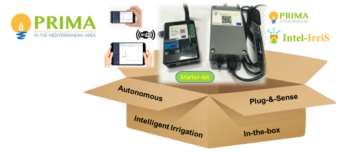

The Intel-IrriS Device is, among the two main components of the system, the most specific of the project. 

Installed in the field, it periodically gathers the measurements from the ground sensors and transmits the values to the gateway using LoRa radio frames. 

The casing is waterproof and shelters the core microprocessor, on an Arduino board, the radio chip, the batteries (two AA alkaline, or 3 AAA NiMh, with or without a solar pannel), all the connectors and the On/Off switch. 

2.i. Device's hardware
======================
Different versions of the device exist with different hardware parts. Two development took place during the project, the Off-the-shelf Waziup design and the DIY UPPA/IRD design. And different versions have been made available at different times of the project.

Let's focus on PCBs, radio chipsets, antennas, solar panels, and other chosen components.

## 1. The PCBs
### a. WaziSense v2.0, Waziup design

More info:
[WaziSense Intro](../../../../resources/Boards/WaziSense/index.md); 
[WaziSense User Manual](../../../../resources/Boards/WaziSense/user_manual.md)

### b. UPPA PCB v2, UPPA's design

More info:
[UPPA PCB v2](https://github.com/CongducPham/PRIMA-Intel-IrriS/blob/main/PCBs/README.md#pcb-v2)

### c. UPPA PCB RAK3172 v1, UPPA's design

More info:
[UPPA PCB RAK3172 v1](https://github.com/CongducPham/PRIMA-Intel-IrriS/blob/main/PCBs/README.md#pcb-rak3172-v1)

### d. IRD PCBA v4.1, IRD/UPPA's design

More info:
[IRD PCBA v4.1](https://github.com/CongducPham/PRIMA-Intel-IrriS/blob/main/PCBs/README.md#pcba-ird-v41)

## 2. The radio chipsets and antennas
The take-away message here is that the allowed frequency band for the LoRa radio communications differs according to local regulations. The band is centered around: 
   1. In Europe: 868 MHz;
   2. In most of the African Countries, e.g. Algeria: 433 Mhz; 
   3. In other regions: 915MHz;
   4. Traffic is usually allowed on the Wi-Fi band: 2.4 GHz.

### a. Radio chipsets
In Intel-IrriS, we chose two radio modules that are common and easy to find on the market:
- The RFM95W (868MHz);

- The RFM96W (433MHz).

Different versions are available on the market, with different features, most are compatible with the PCBs.
Note that in this pictures, the same type of Integrated Circuit (IC) is used: RF96. 
I took from the datasheets the following tables summarizing frequency compatibilities:
- for ICs:

| IC Number | Frequency Range | Spreading Factor | Bandwidth | Effective Bitrate | Estimated Sensitivity |
| --------- | --------------- | --- |--------------- |--------------- |--------------- |
| RF96 | 137 - 1020 MHz | 6 - 12 | 7.8 - 500 kHz | .018 - 37.5 kbps | -111 to -148 dBm |
| RF97 | 137 - 1020 MHz | 6 - 9 | 7.8 - 500 kHz | 0.11 - 37.5 kbps | -111 to -139 dBm |
| RF98 | 137 - 525 MHz | 6- 12 | 7.8 - 500 kHz | .018 - 37.5 kbps | -111 to -148 dBm |

- for LoRa chipsets:

| Chipset Number | Frequency Band | Spreading Factor | Bandwidth | Effective Bitrate | Estimated Sensitivity |
| --------- | --------------- | --- |--------------- |--------------- |--------------- |
| RFM95W | 868\915 MHz | 6 - 12 | 125 - 500 kHz | .293 - 37.5 kbps | -111 to -136 dBm |
| RFM96W/98W | 433\470 MHz | 6 - 12 | 62.5 - 500 kHz | .1465 - 37.5 kbps | -112 to -140 dBm |
| RFM98W | 169MHz | 6 - 12 | 31.25 - 125 kHz | 73.24- 9375 bps | -118 to -143 dBm |

### b. LoRa antennae
The antenna model will also depend on the frequency band. The default type for Intel-IrriS devices are simple whip (monopole) antennae. We adopted the following color convention: white antennae for 433 MHz; black antennae for 868 MHz.

The market provides other models, a tradeoff price vs range&sensitivity has to be chosen.
We made some comparisons tests:
[antenna-tests](https://github.com/CongducPham/PRIMA-Intel-IrriS/blob/main/Tutorials/Intel-Irris-antenna-test.pdf)

More info, more models, and market references for both chipsets and antennae here:
[hardware-parts](https://github.com/CongducPham/PRIMA-Intel-IrriS/blob/main/Tutorials/Intel-IrriS-low-cost-sensor-hardware-parts.pdf)

## 3. The solar panels
The Solar panel must fit the casing, Intel- IrriS selected this model: Mini solar panel 6 V 0.6 W 100 mA 60x90mm.
The PCBA has a circuit designed to make the device work with this solar panel and NiMh rechargeable batteries.
The WaziSense v2 however is designed for Li-ion or Li-Po 3.7v batteries. 

## 4. List of components
Most of the needed components are listed here:
[hardware-parts](https://github.com/CongducPham/PRIMA-Intel-IrriS/blob/main/Tutorials/Intel-IrriS-low-cost-sensor-hardware-parts.pdf)

Here a brief table summary:

||for PCBv2|for PCBA|for solar PCBA |
|-----|--------|----------|----|
|12-pin screw terminal block (green)|1^ or 2| - | - |
|2-pin or 4-pin screw terminal block (green) | 1 |-|- |
|12-pin female header | 2 |-|-|
|RFM95W (868&thinsp;MHz) or RFM96W (433&thinsp;MHz)| 1 |-|-|
|SMA female PCB connector for 1.6&thinsp;mm PCB| 1 |-|-|
|Arduino ProMini, 3.3&thinsp;V 8&thinsp;MHz with 1 6-pin 90° and 2 12-pin male headers | 1 |1|1|
|Pack of minimum 9 2.54&thinsp;mm male pin headers (1 4-pin, 1 3-pin, 1 2-pin) | -| 1 | 1 |
|ABS waterproof enclosure with screws and joint| 1 | 1| 1|
|2-AA battery holder|1|1|-|
|2 AA batteries 1.5&thinsp;V|1|1|-|
|3 AAA NiMh 1.2&thinsp;V rechargeable batteries|-|-|1|
|Mini solar panel 6&thinsp;V 0.6&thinsp;W 100&thinsp;mA 60x90&thinsp;mm|-|-|1|
|Female (F) or male (M) tipped breadboard/Dupont cables^^ | -| 1 FF | 2 FF + 2 MM |
|Switch with pre-soldered wires|1|1|1|
|Waterproof cap for the switch|1|1|1|
|Cable gland PG7 with nylon joint|1|1|1|
|3&thinsp;dBi 868&thinsp;MHz or 3&thinsp;dBi 433&thinsp;MHz antenna|1|1|1|
|Flat-face seal for outer antenna junction (6x11x0.8&thinsp;mm)|1|1|1|
|1 4.7&thinsp;kOhm*, 1 or 2** 10&thinsp;kOhm resistor(s) |1|-|-| 
| 10 heat-shrink tubes to isolate wires***|1|-|-|
| 1 or 2 two-paired screw terminals (dominos)**| 1 |1|1|
| 1 or 2 15&thinsp;cm chunks of 2-joint-wire for irometer tensiometer**| 1 |1|1|

^for devices with a capacitive sensor only, see 2.ii\
^^for solar PCBA devices, 2 jumper junctions can be used instead of the 2 FF jumper wires.\
*for devices with temperature sensors, see 2.ii\
** for devices with 1 or 2 watermark sensors, see 2.ii\
*** 2 tubes for each resistor's end wire

[comment]: # "|Nylon joint for pg7 (diameter 12.4)|1|1|1|"

For the device assembly, preparation and programming, you will also need: 
- 1 USB Serial FTDI breakout 3.3V (and USB connector to laptop);
- a solder station / soldering iron with thin solder wire;
- a tiny slotted (flat) screwdriver for the screw terminal blocks;
- a comon cruciform screwdriver;
- a drill for the plastic casing, with 7&thinsp;mm and 13&thinsp;mm bits for metal, and a step bit could ease;
- a flat cutter, a wire stripper/cutter, a needle-nose plier, etc.

[comment]: # "8-12&thinsp;mm drill bit for old gw case"

2.ii. Sensors
=============
We selected in Intel-IrriS three sensors:
- the *SEN0308 capacitive* soil sensor;
- the *WM200 Irrometer Watermark* water tension sensor;
- the *DS18B20 temperature sensor* for soil temperature.

We further detail them and why we chose them.

The three sensor types can be confirgured on the device, in the following combinations or *device type*:

||C|W|CT|WT|2WT|
|-|-|-|-|-|-|
|SEN0308|1|-|1|-|-|
|WM200|-|1|-|1|2|
|DS18B20|-|-|1|1|1|

The most common device type are C, WT and 2WT. 2WT is particularly helpfull to obtain information at two different depths in ground, giving insights of the water movements in the soil.

[comment]: # "you will need a resistor from 7kOhm to 14kOhm (we use 10kOhm)"

2.iii. Order it
===============
bla

2.iv. Build it
==============
bla

2.v. Device's software
======================
bla

2.vi. Device's debug
====================

bla

<youtube>wgfhedtyjhdt</youtube>

<quiz id="0261c201-7AAAAAAAAAAA171-60158676498c" type="single-choice" title="What frequency band is allowed for LoRa in EUrope?">
	<answer feedback="Nope.">433 Mhz</answer>
	<answer feedback="You got it!" right>868 MHz</answer>
	<answer feedback="Thats wrong!">Both 433 and 868 MHz</answer>
</quiz>