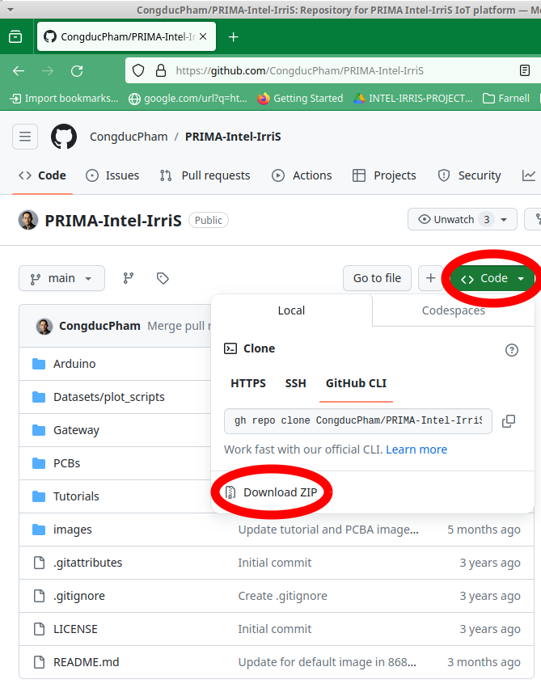
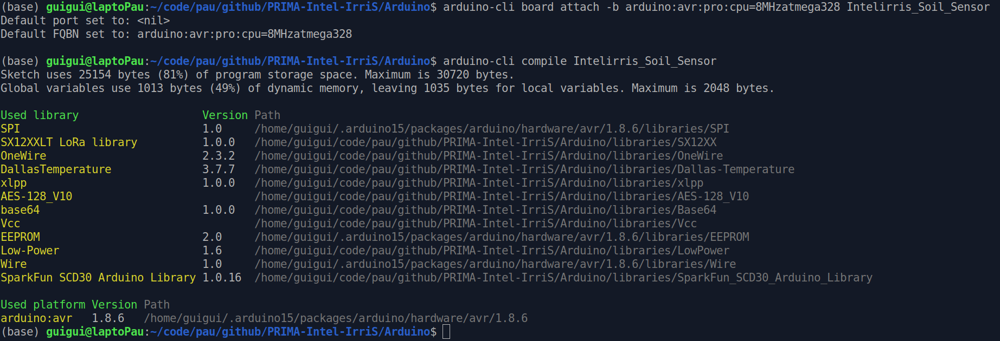
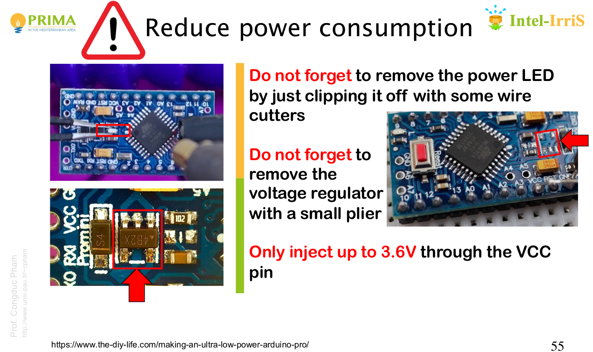

The Intel-IrriS Device is, among the two main components of the system, the most specific of the project. 

Installed in the field, powered by its own batteries, the Intel-IrriS Device works autonomously and periodically: every hour approximately, it gathers the measurements from the ground sensors (soil moisture and temperature) and transmits the values to the [gateway](../3_Gateway/_index.md) using LoRa radio frames. 

The casing is waterproof and shelters the core microprocessor, on an Arduino board, the radio chip, the batteries (whether two non-rechargeable AA alkaline batteries, or 3 AAA NiMh with or without a solar panel), all the connectors and the On/Off switch. 

2.i. Get the Device's components
================================
Different versions of the device exist with different hardware parts. Two developments took place during the project, the Off-the-shelf Waziup design and the DIY UPPA/IRD design. Different versions have been made available at different times of the project.

In this program, we will mainly focus on the most recently updated DIY PCB: the IRD PCBA v4.1. The development approach has been tackling every encountered obstacle both regarding the needed features and the technical challenges. We have simplified the assembly work, and we have included the possibility to autonomously work with a solar panel.

Let's focus on PCBs, radio chipsets, antennas, sensors solar panels, and the other chosen components.

## 1. Order The PCB
### IRD PCBA v4.1, IRD/UPPA's design [this is the current version]

More info:
[IRD PCBA v4.1](https://github.com/CongducPham/PRIMA-Intel-IrriS/blob/main/PCBs/README.md#pcba-ird-v41)

Watch our PDF tutorial, [here](https://github.com/CongducPham/PRIMA-Intel-IrriS/blob/main/Tutorials/Intel-Irris-PCB-update-PCBA.pdf), and our video tutorial:

[comment]: # "<youtube>ueNRfBzCXiU</youtube>"

## 2. Choose the radio chipsets and antennas
[comment]: # "The take-away message here is that "

Before choosing these elements, it is important to note that the allowed frequency band for the LoRa radio communications differs according to local regulations. The band is centered around: 
   1. In Europe: 868 MHz;
   2. In most of the African Countries, e.g. Algeria until recently: 433 Mhz; 
   3. In some other regions: 915MHz;
   4. Traffic is usually allowed on the Wi-Fi band: 2.4 GHz. But this goes with other limitations (range, interferences).

The radio chipset, the antenna, and the software are frequency dependent and must be chosen accordingly. 

### a. Radio chipsets
In Intel-IrriS, we chose two radio modules that are common and easy to find on the market:
- The RFM95W (868MHz);

- The RFM96W (433MHz).

Different versions are available on the market, with different features, most are compatible with the PCBs.
Note that in these pictures, the same Integrated Circuit (IC) is used: HopeRF RF96. 
I took from the datasheets the following tables summarizing frequency compatibilities:
- for ICs:

|Semtech IC| HopeRF IC clone | Frequency Range | Spreading Factor | Bandwidth | Effective Bitrate | Estimated Sensitivity |
| -- | --------- | --------------- | --- |--------------- |--------------- |--------------- |
|SX1276| RF96 | 137 - 1020&thinsp;MHz | 6 - 12 | 7.8 - 500&thinsp;kHz | .018 - 37.5&thinsp;kbps | -111 to -148&thinsp;dBm |
|SX1277| RF97 | 137 - 1020&thinsp;MHz | 6 - 9 | 7.8 - 500&thinsp;kHz | 0.11 - 37.5&thinsp;kbps | -111 to -139&thinsp;dBm |
|SX1278| RF98 | 137 - 525&thinsp;MHz | 6- 12 | 7.8 - 500&thinsp;kHz | .018 - 37.5&thinsp;kbps | -111 to -148&thinsp;dBm |

- for LoRa chipsets:

| Chipset Number | Frequency Band | Spreading Factor | Bandwidth | Effective Bitrate | Estimated Sensitivity |
| --------- | --------------- | --- |--------------- |--------------- |--------------- |
| RFM95W | 868/915&thinsp;MHz | 6 - 12 | 125 - 500&thinsp;kHz | .293 - 37.5&thinsp;kbps | -111 to -136&thinsp;dBm |
| RFM96W/98W | 433/470&thinsp;MHz | 6 - 12 | 62.5 - 500&thinsp;kHz | .1465 - 37.5&thinsp;kbps | -112 to -140&thinsp;dBm |
| RFM98W | 169&thinsp;MHz | 6 - 12 | 31.25 - 125&thinsp;kHz | 73.24- 9375&thinsp;bps | -118 to -143&thinsp;dBm |

*NB*: the RFM95 chipset contains an RF96 IC.

### b. LoRa antennae
The antenna model will also depend on the frequency band. The default type for Intel-IrriS devices are simple whip (monopole) antennae. We adopted the following color convention: white antennae for 433 MHz; black antennae for 868 MHz.

The market provides other models, a tradeoff price vs range&sensitivity has to be chosen.
We made some comparisons tests:
[antenna-tests](https://github.com/CongducPham/PRIMA-Intel-IrriS/blob/main/Tutorials/Intel-Irris-antenna-test.pdf)

More info, more models, and market references for both chipsets and antennae here:
[hardware-parts](https://github.com/CongducPham/PRIMA-Intel-IrriS/blob/main/Tutorials/Intel-IrriS-low-cost-sensor-hardware-parts.pdf)

## 3. Choose the sensors
We selected in Intel-IrriS three sensors:
- the *SEN0308 capacitive* soil sensor;
- the *WM200 Irrometer Watermark* water tension sensor;
- the *DS18B20 temperature sensor* for soil temperature.

We further detail them and why we chose them.

The three sensor types can be attached to and confirgured on the devices, in the following combinations or *device type*:

||C|W|CT|WT|2WT|
|-|-|-|-|-|-|
|SEN0308|1|-|1|-|-|
|WM200|-|1|-|1|2|
|DS18B20|-|-|1|1|1|

The most common device type are the Capacitive (C), the Watermark & Temperature (WT) and the 2 Watermarks & Temperature (2WT). 2WT is particularly helpful to obtain information at two different depths in ground, giving insights of the water movements in the soil.

### a. The *SEN0308 capacitive* soil sensor

The cost of capacitive sensors is relatively low (especially when compared to TDR, -time domain reflectometry, probes), which makes it possible to instrument field with a low budget or (if keeping the same budget) by increasing the sensor's density in a given field.
Moreover, their power consumption can be very low and some require low excitation voltages to operate (as low as 3 volts) which allows for a high autonomy with reasonable battery capacities. Finally, they are also relatively easy to install.

The disadvantage of the capacitive method is that the signal is difficult to interpret in the absence of additional information, on the sensor itself and the characteristics of the environment, i.e. soil characteristics (mainly clay content) and the concentration of dissolved minerals. This disadvantage has been compensated in Intel-IrriS by allowing the user and the system to provide contextual information, particularly on soil types, and by recommending a calibration before use. 

Two models of capacitive sensors built by the DFRobot company are commonly used at the moment: SEN0193 & SEN0308 which cost around 5 & 20 euros, respectively. Compared with the SEN0193 version, the SEN0308 sensor has increased waterproof performance; as it can still be used after being immersed in water according to DFRobot. With an increased plate length, the capacitive electrode plate has increased length (12cm approximately) to measure more accurately the soil moisture (in addition, the circuit performances are presented as optimized). Finally, the sensor has a wide input voltage (3.3&thinsp;V-5.5&thinsp;V) and is compatible with Arduino, ESP32, micro:bit, control board, Raspberry Pi and other common control boards.

A complete report about the capacitve measurement method and about this sensor model can be found here:
[Capcitive-KPIs-D3.6b](https://intel-irris.eu/wp-content/uploads/2023/09/D3.6b.pdf)

More info on this sensor can be found here:
[SEN0308-details](https://wiki.dfrobot.com/Waterproof_Capacitive_Soil_Moisture_Sensor_SKU_SEN0308)

### b. The *WM200 Irrometer Watermark* water tension sensor

Intel-IrriS chose this one because it is widespread, and relatively easy to connect to a board (e.g. Arduino). That is, it is less expensive than more sophisticated sensors using other physical processes, but the project can bring and use enough contextual information (soil temperature, soil type), and calibration before use, to overcome the variability and maintenance issues. 

A nice description and basic code example here:
[Watermark-WM200](../../../../resources/Sensors/Watermark/index.md); 

[comment]: # "you will need a resistor from 7kΩ to 14kΩ (we use 10kΩ)"

### c. The *DS18B20 temperature sensor* for soil temperature

In Intel-IrriS we use the waterproof version of this typical and effective temperature sensor. 

A nice description and basic code example here:
[DS18B20 temperature sensor](../../../../resources/Sensors/Temperature_DS18B20/index.md); 

## 4. Order all the parts

### a. The solar panels
The Solar panel must fit the casing, Intel-IrriS selected this model: Mini solar panel 6 V 0.6 W 100 mA 60x90mm.
The PCBA has a circuit designed to make the device work with this solar panel and NiMh rechargeable batteries.
The WaziSense v2 however is designed for Li-ion or Li-Po 3.7v batteries. 

Again, since the addition of a solar panel make the device's assembly more complex, costly, and slightly reduce its robustness and watertightness, it is not the default choice of implementation of Intel-IrriS.

### b. List of components
Most of the needed components are listed here:
[hardware-parts](https://github.com/CongducPham/PRIMA-Intel-IrriS/blob/main/Tutorials/Intel-IrriS-low-cost-sensor-hardware-parts.pdf)

Here a brief table summary for the PCBA, with and without a solar panel:

||for PCBA|for solar PCBA |
|-----|--------|----------|
|Arduino ProMini, 3.3&thinsp;V 8&thinsp;MHz with 1 6-pin 90° and 2 12-pin male headers | 1 |1|
|Pack of minimum 5 2.54&thinsp;mm male pin headers (1 3-pin, 1 2-pin) | 1 | 1 |
|ABS waterproof enclosure with screws and joint| 1 | 1|
|2-AA battery holder^|1|-|
|2 AA **Alkaline heavy duty** batteries 1.5&thinsp;V^|1|-|
|3 AAA NiMh 1.2&thinsp;V rechargeable batteries|-|1|
|Mini solar panel 6&thinsp;V 0.6&thinsp;W 100&thinsp;mA 60x90&thinsp;mm|-|1|
|Female (F) or male (M) tipped breadboard/Dupont cables^^ | 1 FF | 2 FF + 2 MM |
|Switch with pre-soldered wires|1|1|
|Waterproof cap for the switch|1|1|
|Cable gland PG7 with nylon joint|1|1|
|3&thinsp;dBi 868&thinsp;MHz or 3&thinsp;dBi 433&thinsp;MHz antenna|1|1|
|Flat-face seal for outer antenna junction (6x11x0.8&thinsp;mm)|1|1|
|DS18B20 for devices of type CT, WT, 2WT|1|1|
|SEN0308 for devices of type C, CT|1|1|
|WM200 for devices of type W, WT, 2WT|1 or 2**|1 or 2**|
|Two-paired screw terminals (dominos)| 1 or 2**|1 or 2**|
|15&thinsp;cm chunks of 2-joint-wire for irometer tensiometer| 1 or 2** |1 or 2**|

^you can equivalently use a non rechargeable 3.6V lithium battery with a 1-AA battery holder.\
^^for solar PCBA devices, 2 jumper junctions can be used instead of the 2 FF jumper wires.\
**2 for 2WT devices, otherwise 1.

[comment]: # "|Nylon joint for pg7 (diameter 12.4)|1|1|1|"

[comment]: # "This table confirms the fact that the PCBA, as compared with the PCBv2, has reduced the complexity of the assembly, and for a start, the ΩΩΩΩΩΩΩΩΩΩΩΩ"

For the device assembly, preparation and programming, you will also need: 
- 1 USB Serial FTDI breakout 3.3&thinsp;V (with 6-pin Female conector and an USB cable to laptop);
- a solder station / soldering iron with thin solder wire;
- a tiny slotted (flat) screwdriver for the screw terminal blocks;
- a comon cruciform screwdriver;
- a drill for the plastic casing, with 7&thinsp;mm and 13&thinsp;mm bits for metal, and a step bit could ease;
- a flat cutter, a wire stripper/cutter, a needle-nose plier, etc.

[comment]: # "8-12&thinsp;mm drill bit for old gw case"

During the project, we provided some links to online webs that had available in 2022, in Pau, France, Europe, the many other components required:
[hardware-parts](https://github.com/CongducPham/PRIMA-Intel-IrriS/blob/main/Tutorials/Intel-IrriS-low-cost-sensor-hardware-parts.pdf).
The provided web links to some vendors were only given as example. An actor willing to order the Intel-IrriS pieces should search from other vendors, available in her region, and catalog items or packs/offer that would allow to optimize cost at the time of ordering.

You could walk the following steps:
1. Parse this components table according to the chosen quantity and types of device, power supply, and to the sensors;
2. Summarize your list of required material, including the sensors, and according to your already available stock;
3. Find the best vendors and offers for your needed quantities and region;
4. Prepare combined orders of different pieces from the same vendors to reduce travel costs and delays;
5. Make the orders :)

[comment]: # "[here](../_index.md#4-list-of-components) or "

2.ii. Build the Device
==============

Now that you have all the pieces recieved, let's detail the following steps to put all together and build the device:

[comment]: # "2. Solder a 4-pin on H2 (if not already done);"
1. Drill the case for the cable gland, the switch, the antenna, (the solar panel);  
2. Install the case waterproof joint;
3. Install the switch and cable gland;
4. Connect the switch and the battery holder to the PCB;
5. Connect the sensors' wires to the PCB;
6. (Solder 2 MM wires to the solar panel and connect them to the PCB);
7. Connect H2 pins according to battery type;
8. Connect the antenna.

The following and last three steps should be done after next section (programming the Arduino): 

9. Place the Arduino and test a transmission using a serial connection;
10. Place the batteries in the holder and test;
11. Close the case.

[comment]: # "stick an Intel-IrriS tag on the case "

A complete bunch of detailed material has been made available all along the project, for this section two items are very important:

1. the [PCBv4-PCBA.pdf](https://github.com/CongducPham/PRIMA-Intel-IrriS/blob/main/Tutorials//Intel-Irris-IOT-platform-PCBv4-PCBA.pdf): the Tutorial slides on building the INTEL-IRRIS IoT platform. Part 1: soil sensor device. Focus on the latest IRD PCBv4.1. This tutorial has been updated to focus on the latest IRD PCBv4.1;

2. the [Intel-IrriS video 2](https://youtu.be/zcazzDbXvHk): the YouTube tutorial video showing how to build the outdoor LoRa IoT soil sensor device.  

[comment]: # ";  
The following dimensions are given for an IP65 box which dimension is 115 x 65 x 40&thinsp;mm.

**Choose** one side of the case for the cable gland and the switch. Leave the other for the SMA connector (antenna).
Use drilling bits for metal (not for wood nor concrete).

**Measure** and prepare the following distances from the flat side of the case, since its corners are rounded.

||from left edge:|from right edge:|from outside bottom edge:|drill bit:|
|--|--|--|--|--|
|SMA connector|-|27&thinsp;mm***|11&thinsp;mm***|7&thinsp;mm|
|Switch|-|20&thinsp;mm|9&thinsp;mm|7&thinsp;mm|
|Cable gland|-|41&thinsp;mm|9&thinsp;mm|13&thinsp;mm*|
|Solar panel|-|-|-|10 to 12&thinsp;mm**|

*it is recommended to use a step drill bit to first get a 12mm hole before using the 13mm drill bit.\
**in the center of the case's cover.\
***these dimensions have been updated for the latest PCBA and enable to place three AAA batteries with their holder under the PCB. The video [Intel-IrriS video 2](https://youtu.be/zcazzDbXvHk) mentions a 28 x 9&thinsp;mm dimension compatible with the older PCBv2, but also with the PCBA with 2 AA batteries.

**Remove** unwanted plastic part with a flat cutter and/or a small plier for instance, and smooth the inside part of the case to make the interface the most waterproof possible.

More info in the [PCBv4-PCBA.pdf](https://github.com/CongducPham/PRIMA-Intel-IrriS/blob/main/Tutorials//Intel-Irris-IOT-platform-PCBv4-PCBA.pdf) slides 35-43.

More info in the [Intel-IrriS video 2](https://youtu.be/zcazzDbXvHk):

[comment]: # "1:12 - 5:05"

## 2. Install the case waterproof joint;
Just place it in the case groove and adjust its size to the perimeter.

## 3. Install the switch and cable gland;
The joint (red arrow in figure) for the cable gland is optional but recommended. Do not close the cable gland with its hat, because it would bend its teeth, ensuring imperviousness, before passing cables through it.

The switch has a water-proof rubber cap which should be carefully tightened. The inner nut between the switch box and the case (green) allows to tighten the switch correctly. 

Check the switch is correctly placed. The pin closest to the cable gland is not connected, the switch is open when pointing away from the gland, closed (ON) when pointing to the cable gland.

More info in the [PCBv4-PCBA.pdf](https://github.com/CongducPham/PRIMA-Intel-IrriS/blob/main/Tutorials//Intel-Irris-IOT-platform-PCBv4-PCBA.pdf) slide 44.

More info in the [Intel-IrriS video 2](https://youtu.be/zcazzDbXvHk):

## 4. Connect the switch and the battery holder to the PCB;
Both battery holder and switch have their dedicated screwed connector on the PCB: 

## 5. Connect the sensors' wires to the PCB;
Pass the wire through the cable gland and screw or plug them to their dedicated slot on the PCB:

NB: connecting a watermark and a capacitive on the same device is out of the scope of Intel-IrriS; use two devices for this case.

For the watermarks, it is recommended to add a domino connector in order to be able to change the sensor without openning the case and unscrewing the cables inside.

More info in the [PCBv4-PCBA.pdf](https://github.com/CongducPham/PRIMA-Intel-IrriS/blob/main/Tutorials//Intel-Irris-IOT-platform-PCBv4-PCBA.pdf) slides 18-21.
## 6. (Solder 2 MM wires to the solar panel and connect them to the PCB);
This step is only necessary for devices with a Solar panel. The point to note here is that since the cover is drilled you need to renforce the protection against water by completely gluing the solar panel perimeter and center on it.

Follow the recommendations on [PCBv4-PCBA.pdf](https://github.com/CongducPham/PRIMA-Intel-IrriS/blob/main/Tutorials//Intel-Irris-IOT-platform-PCBv4-PCBA.pdf) slides 27-29.

## 7. Connect H2 pins according to battery type;
All explained in slide 26:

You can use two FF jumper wires instead of the jumpers for the case of the NiMh batteries. 

## 8. Connect the antenna.
**Screw** the antenna in all the way.

**Waterproof** the junction using flat silicon seals or silicon joint sealant.

More info in slides 45-47.

## 9. Place the Arduino and test a transmission using a serial connection;
See next section.

[comment]: # "slide 31 solder 3-pin header on the Arduino"

## 10. Place the batteries in the holder and test;
See next section.
## 11. Close the case.
Check that the switch, the antenna, and the cable gland are tightly screwed to the case;
Then just screw down the case cover. Make sure all the wires are inside the case so that they suffer no damage when closing the case. 

2.iii. Program the Device
======================
The software managing the device, orchestrating the measurements and the radio transmissions runs on the Atmega microcontroller on the Arduino Pro Mini.

The [Arduino.cc](arduino.cc) community eases the configuration process of the microcontroller, by providing the IDE (integrated development environment), the programming toolchain for all the CPUs and boards in the Arduino family, and plenty of online support.

## 1. Gather the material
Your Arduino usually comes with its 6-pin 90° header, and 2 12-pin male headers. The 6-pin header enables to connect to another board, an *FTDI32*, that creates and manages a Serial communication between the Arduino and a laptop, via USB.

You only need one FTDI32 to program all your boards. 
We tested two different models:
* from Sparkfun [here](https://www.sparkfun.com/products/9873);
* from chinese manufacturer HWA YEH [here](https://fr.aliexpress.com/item/32648254875.html): it can be set either at 5v or 3.3v, and it is much cheaper! 

For the Arduino-FTDI32 connexion, you will need a 6 pin FF adaptor, or 6 FF jumper wires. You can also solder a 6-pin Female long pin header to the FTDI32.

Better choose a short and robust USB cable between the FTDI32 and your laptop.

[comment]: # "One should choose a short USB cable in order not to lose the Serial sync."

## 2. Get the code

The Device's code is available with the other resource of Intel-IrriS on the Github repository: 

**Download** the Arduino folder. You can download all the project (182&thinsp;MiB) using the Github ZIP direct download:

Alternatively, you can download the Arduino folder alone (20&thinsp;MiB) using external tools, e.g. [download-directory](https://download-directory.github.io/?url=https%3A%2F%2Fgithub.com%2FCongducPham%2FPRIMA-Intel-IrriS%2Ftree%2Fmain%2FArduino).

**Extract** the obtained ZIP file.

## 3. Get the IDE

We recommend using the Arduino IDE available [here](https://www.arduino.cc/en/software): it includes the default libraries for the Arduino Pro Minis, a serial monitor, a code editor, it is multi-OS, and it has a broad community of practice.

**Download** and **install** the latest version for your OS.

### Command-line alternative
If you prefer your own text editor, your own serial monitor, but still want to benefit from the Arduino's toolchain, you could use the [Arduino CLI](https://github.com/arduino/arduino-cli) command line tool. I tested and enjoyed [version 0.35.3](https://arduino.github.io/arduino-cli/0.35/installation/) on Xubuntu, with [TIO](https://github.com/tio/tio) as a Serial tool.

[comment]: # "arduino-cli  Version: 0.35.3 Commit: 95cfd654 Date: 2024-02-19T13:24:24Z"

## 4. Set up the code and compile it

### Set up the libraries
The Arduino folder you downloaded and extracted contains a *libraries* sub-folder. In order to make the IDE find and use these libraries, you need to choose the Arduino folder as your sketchbook:\
**Go** to `File > Preferences` and **Browse** to choose the Arduino folder as your sketchbook location.\

Once done, the IDE will probably ask you to update these libraries:
\
**Don't do that**, since the Device's code has been validated with this specific version of the compagnion libraries, and is not guaranteed to work with new updates and changes that could be implied.

**Open** the `Arduino/Intelirris_Soil_Sensor.ino` sketch.

-------------------- 
In command-line, Arduino CLI checks the sub-folders for libraries, you just need to navigate to the Arduino folder.

### Choose the board and CPU
You need to **attach** your IDE's window to the Device's board type and CPU:
* `Tools > Boards > Arduino AVR Boards > Arduino Pro or Pro Mini`
* `Tools > Processor > ATmega328P (3.3V, 8 MHz)`

-------------------- 
In command-line, use the following command:\
`.../Arduino$ arduino-cli board attach -b arduino:avr:pro:cpu=8MHzatmega328 Intelirris_Soil_Sensor`

### Set up the code
The code is distributed on various C++ modules beside the main INO file. The project encompasses many options regarding different hardware, sensors, radio management, formats, etc. In the scope of Intel-IrriS and this program, you will need to adjust the following files:
* BoardSettings.h
	* **Check** that `#define IRD_PCB` is uncommented (Remove the `//` comment mark if necessary);
	* **Check** that `#define IRD_PCBA` is uncommented (Remove the `//` comment mark if necessary);
	* for devices with a solar panel, **Check** that `#define SOLAR_BAT` is uncommented (Remove the `//` comment mark if necessary).
* RadioSettings.h
	* **Check** that `#define SX127X` is the only uncommented option. The SX127X corresponds to the family of ICs of which the chosen chipsets include a member, or a clone from HopeRF manufacturer.
* Intelirris_Soil_Sensor.ino
	* **Choose** `#define EU868`, `#define EU433`, or the adequate row according to the frequency band you are going to use, as the only uncommented option. Choose this frequency regarding your regional setting and the device's hardware you gathered;
	* for devices with one or two watermarks (W, WT, 2WT types), **uncomment** `#define WITH_WATERMARK`;
	* for devices with two watermarks (2WT types), **uncomment** `#define TWO_WATERMARK`;
	* for devices with a temperature sensor (CT, WT, 2WT types), **uncomment** `#define SOIL_TEMP_SENSOR`.

The code is thought to be generic, i.e. the same for all the Intel-IrriS devices. However, when deploying several devices at the same location, one needs to distinguish their data. In order to identify the devices, the radio frames include a device's address.

Two default (generic) addresses are coded in  `Intelirris_Soil_Sensor.ino`: *26011DAA* for capacitive devices (C or CT), *26011DB1* for watermark devices (W, WT, or 2WT). 

You should **identify extra capacitive devices** using addresses *26011DAB*, *26011DAC*, ..., *26011DAF*. To do so, amend the `Intelirris_Soil_Sensor.ino` program:\
`unsigned char DevAddr[4] = {0x26, 0x01, 0x1D, 0xAA};`
should become for instance:\
`unsigned char DevAddr[4] = {0x26, 0x01, 0x1D, 0xAD};` for the third extra capacitive device.

You should **identify extra watermark devices** using addresses *26011DB2*, *26011DB3*, ..., *26011DBF*. To do so, amend the `Intelirris_Soil_Sensor.ino` program:\
`unsigned char DevAddr[4] = {0x26, 0x01, 0x1D, 0xB1};`
should become for instance:\
`unsigned char DevAddr[4] = {0x26, 0x01, 0x1D, 0xB8};` for the seventh extra watermark device.

[comment]: # "	* for devices without a watermark sensor, the default device address is . If you prepare a deployment involving several devices "

[comment]: # "unsigned char DevAddr[4] = {0x26, 0x01, 0x1D, 0xAA};"
[comment]: # "unsigned char DevAddr[4] = {0x26, 0x01, 0x1D, 0xB1};"
	

### Compile

This compilation step gathers the source code, links them, and produce a program file that is specific to the targeted microcontroller. 
This process involves a complex toolchain with plenty of parameters and linker and compiler pieces of programs such as GCC. All this is made gently user friendly by the Arduino Umbrella, and is quite certainly the plusvalue of Arduino.

In the IDE, the only thing you, the user, need to do, is to press the `Verify/Compile` (&#x2713;) button. 
If the compilation goes as expected, the IDE notificates a `Done compiling`. Otherwise, some error messages appear (in red), that should help resolving the (most commonly programming) issues.

-------------------- 
In command-line, use the following command:\
`.../Arduino$ arduino-cli compile Intelirris_Soil_Sensor
`

The program summarizes the libraries that have been used for the compilation and their version numbers, thus allowing you to check that your Arduino software setup acts as expected.

## 5. Start preparing your Arduino
**Solder** the 6-pin 90° header over the top side of the Arduino. At this point, you don't need to solder the two side headers yet, we are going to check that the Arduino behaves correctly.

Carefully **remove** the power LED and the voltage regulator to make the Arduino ultra-low-power. 

## 6. Check your Arduino
In order to check that your Arduino does not have any hardware issue, we recommend to try uploading the program on it using the FTDI32, and check its response on the serial port. If the device acts normally, then most of the possible hardware issues can be discarded.

### Upload
**Connect** the Arduino with the FTDI32. **Check** that both VCC pins are connected (there can be a mismatch in the header orientation).

**Plug** the FTDI32 to your laptop's USB interface. The Power LED of the FTDI32 lights up.

In the IDE, check that a new ungreyed option has appeared in the `Tools>Port` menu: `COM1`, `/dev/ttyUSB0` are some examples. **Select** the new option. **Check** that the Processor and Board settings have not been modified.

Any issue with this step ? => **Check** the OS-specific recommendations [here](https://learn.sparkfun.com/tutorials/how-to-install-ch340-drivers/all). For recent Ubuntu versions, the package `brltty` seems to prevent the use of the serial port for other applications. You could remove it using `sudo apt remove brltty`.

In the IDE, simply **press** the Upload button (=>). The FTDI32 lights start blinking. The IDE will indicate the correct finalization of the Upload.

-------------------- 
In command-line, check which Serial Port the Arduino is connected to using the following command:\
`.../Arduino$ arduino-cli board list`

Correspondingly, upload adapting the following command:\
`.../Arduino$ arduino-cli upload -p /dev/ttyUSB0 Intelirris_Soil_Sensor`

### Check the Serial ouput
In the IDE, just **open** the Serial Monitor by clicking its button on the top right corner.
The Arduino is set to 38400 baud.

-------------------- 
In command-line, you could use Tio like this and save the serial logs to a text file:\
`tio -b 38400 -l --log-file /home/guigui/temp_Arduino.log --timestamp --timestamp-format iso8601 /dev/ttyUSB0`

-------------------- 

If you see something similar, then that means your Arduino works and communicates. No device is responding, because the Arduino is not mounted. We will now connect it to the PCB. 

## 7. Finish preparing your Arduino
**Solder** the two 12-pin side headers over the bottom side of the Arduino. **Solder** also the 3-pin header there on pins GND, A6, A7, (mandatory for solar devices) and the 2-pin header on A4, A5. Use a breadboard as reference to be sure soldering such that the Arduino can be encased into the PCB's female headers.

## 8. Check your Device

Before you plug the Arduino onto the PCB, be **careful**:
- don't overpower your device using at the same time both the battery (switch on) and the USB (FTDI32 on);
- Never transmit without the antenna, you risk damaging the radio chipset.

You can read complementary info in the [PCBv4-PCBA.pdf](https://github.com/CongducPham/PRIMA-Intel-IrriS/blob/main/Tutorials//Intel-Irris-IOT-platform-PCBv4-PCBA.pdf) slides 48-61.

**Check** as previously the serial output (switch off or batteries removed from their holder). You should be able to see a value for each sensor of your device. 

`Sending \!WM1/3276.00/CB1/255.00/WM2/3276.00/CB2/255.00/ST/19.87`

`switch to power saving mode`

If you see these messages, your device is ready. **Close** the Serial Monitor and thus the Serial connection, remove the FTDI32, place the batteries in the holder, and switch on your device.

Normally, you should witness the radio transmission: indeed, during the transmission (around 1.3 seconds at 868&thinsp;MHz) the transmission LED is ON. 

Your device is ready to measure and send data every approximate hour, and sleep in the meantime to preserve batteries. 

[comment]: # "Il faut identifier les étapes que l'on va demander aux 'apprenants' de valider, et ce qu'ils faut qu'ils montrent ou vérifient. Par exemple: 'When flashing the ProMini with the INTEL-IRRIS code, what do you see in the Serial Monitor?'"

[comment]: # "déjà, qu'ils arrivent bien à récupérer le code du github, à configurer l'arduino IDE, à sélectionner le bon board, ..."

2.iv. Debug the Device
======================
Most of the issues we faced during the course of Intel-IrriS were addressed (as far as we know, and until new issues get detected).
Nonetheless, I list here the most recurrent issues and how to diagnose and solve them.

## Primary batteries (case without solar panel) 
Most issues are related with the capability of the batteries to powering the device on long-term. 
The cheapest AA batteries will work a few hours and then the device will stop. 
Indeed, the radio transmission is the power-hungriest step of the device's activity. When too little energy remains in the batteries, the voltage decreases during high power demand, below the minimum value tolerated by the microcontroller (around 2.7&thinsp;V), therefore the Arduino shuts down and reboots.

=> **Check** that your device behaves as expected when powered using the FTDI32 connector. See previous Section **Check your Device**;
=> **Check** that your batteries are "heavy duty" AA Alkaline (LR06).

Note that the voltage is not always a good indicator for the batteries' health. A battery can maintain nominal voltage until a high current demand, such as the radio transmission, makes it drop.

There is a debug mode for the voltage, using the capability of the processor to measure voltage itself:
**Compile and upload** the code having `#define TEST_LOW_BAT` uncommented (Remove the `//` comment mark if necessary).
In that case, the sleep time is reduced to 1 minute (this can be modified) to ease the debugging; the voltage at the end of the sleep period, during and after the transmission are reported, both on serial console and in the next radio frame.

## Device does not switch on
=> **Check** that you correctly connect the PCB's H2 header pins according to battery type.
=> **Check** with a volt-meter that the switch cabling is not inverted. There should be no tension between the switch screw terminal screws when switch is off.

## Code configuration mismatch
Check the code, following Section **Set up the code**. Does it match the sensor type and the version of PCB?
Does the chosen frequency band match the antenna and chipset?

## Bad sensor connexion
**Check** wires. Note that a dry watermark gives a default value of 3276.

## Other bugs
If you assume an issue may come from the batteries, you can have both battery powering and a serial connection via the FTDI32. From the 6 pins of the Arduino header, connect 5: **disconnect the VCC pin**. You can then analyze the Serial trace. 

[comment]: # "## range"

2.v. Learn more info
====================

## 1. PCB variants
### a. WaziSense v2.0, Waziup design

More info:
[WaziSense Intro](../../../../resources/Boards/WaziSense/index.md); 
[WaziSense User Manual](../../../../resources/Boards/WaziSense/user_manual.md)

### b. UPPA PCB v2, UPPA's design [this version is outdated]

More info:
[UPPA PCB v2](https://github.com/CongducPham/PRIMA-Intel-IrriS/blob/main/PCBs/README.md#pcb-v2)

#### List of additional components for this PCBv2

||for PCBv2|
|--------------|----|
|12-pin screw terminal block (green)|1^ or 2|
|2-pin or 4-pin screw terminal block (green) | 1 |
|12-pin female header | 2 |
|RFM95W (868&thinsp;MHz) or RFM96W (433&thinsp;MHz)| 1 |
|SMA female PCB connector for 1.6&thinsp;mm PCB| 1 |
|1 4.7&thinsp;kΩ*, 1 or 2** 10&thinsp;kΩ resistor(s) |1|
|10 heat-shrink tubes to isolate wires***|1|

^for devices type C (with a capacitive sensor only), see [2.i.3](#3-choose-the-sensors)\
*for devices with temperature sensors, see [2.i.3](#3-choose-the-sensors)\
**for devices with 1 or 2 watermark sensors, see [2.i.3](#3-choose-the-sensors)\
***2 tubes for each resistor's end wire.

[comment]: # "|Nylon joint for pg7 (diameter 12.4)|1|1|1|"

[comment]: # "This table confirms the fact that the PCBA, as compared with the PCBv2, has reduced the complexity of the assembly, and for a start, the ΩΩΩΩΩΩΩΩΩΩΩΩ"

### c. UPPA PCB RAK3172 v1, UPPA's design [this version is not the common one]

More info:
[UPPA PCB RAK3172 v1](https://github.com/CongducPham/PRIMA-Intel-IrriS/blob/main/PCBs/README.md#pcb-rak3172-v1)

### d. IRD PCB v4.1, IRD/UPPA's design [this is the raw (non assembled) current version]

More info:
[IRD PCBA v4.1](https://github.com/CongducPham/PRIMA-Intel-IrriS/blob/main/PCBs/README.md#pcb-ird-v41)

## 2. Power consumption studies
During Intel-IrriS we have been studying the power consumption of the different device types. Note that the current demand for the different activities of the device are very different (measure from sensors, less than 10&thinsp;mA; transmit, some 100&thinsp;mA; sleep, around 5&thinsp;&#181;A), thus making the study complex:
* short-circuit the Ampere-meter during high current draw to prevent it being damaged;
* isolate the Arduino activity from the others;
* real-time measurements for the device's activities lasting less than one second;
* necessary software debug logs to analyze the measurements.

Assuming a constant voltage 3.0&thinsp;V, we estimate a device would need no more than 450&thinsp;mAh to work during one year.

2.vi. Device's Quizz
=====================

[comment]: # "<youtube>wgfhedtyjhdt</youtube>"

<quiz id="AAAAA" type="single-choice" title="What is the main process of the Intel-IrriS Device?">
	<answer feedback="You got it!" right>Every hour, gather soil sensors' data and transmit them to a gateway</answer>
	<answer feedback="Nope.">Continuously gather soil sensors' data and transmit them every hour to a gateway</answer>
	<answer feedback="Nope... Well tried!"> Continuously gather soil sensors' data and transmit them every 6h to a gateway </answer>
	<answer feedback="Thats wrong!">Only when toggled by the user, gather soil sensors' data and transmit them to a gateway</answer>
	<answer feedback="Thats wrong too!">Every six hours, gather soil sensors' data and transmit them to a gateway</answer>
</quiz>

<quiz id="AAAAA" type="single-choice" title="Which radio technology is used by the Intel-IrriS Device?">
	<answer feedback="You got it!" right>LoRa</answer>
	<answer feedback="Nope.">None</answer>
	<answer feedback="Nope... Well tried!">Wi-Fi</answer>
	<answer feedback="Thats wrong!">Bluetooth</answer>
</quiz>

<quiz id="AAAAA" type="single-choice" title="The Intel-IrriS Device is not designed to run on...">
	<answer feedback="You got it!" right>Two non-rechargeable AA Alkaline batteries with solar panel</answer>
	<answer feedback="Nope.">Three rechargeable AAA NiMh batteries with solar panel</answer>
	<answer feedback="Nope... Well tried!">Two non-rechargeable AA Alkaline batteries without solar panel</answer>
	<answer feedback="Thats wrong!">Three rechargeable AAA NiMh batteries without solar panel</answer>
</quiz>

<quiz id="AAAAA" type="single-choice" title="The IRD PCBA v4.1 we focus on here has been designed to...">
	<answer feedback="You got it!" right>Make the Device's preparation easier, solve issues, and enable using a solar panel</answer>
	<answer feedback="Nope.">Improve the costs and delays of delivery</answer>
	<answer feedback="Nope... Well tried!">Improve the radio range and lifespan of the Device</answer>
	<answer feedback="Thats wrong!">Include new features and get comparable with Waziup design</answer>
</quiz>

<quiz id="AAAAA" type="single-choice" title="The IRD PCBA v4.1 can be ordered and obtained...">
	<answer feedback="Thats wrong!">Online from our website</answer>
	<answer feedback="You got it!" right>Online, from Asia, fully assembled or partially assembled</answer>
	<answer feedback="Nope.">Online, from Asia, fully assembled only (no flexible assembling)</answer>
	<answer feedback="Nope... Well tried!">Indirectly via European intermediaries only</answer>
</quiz>

[comment]: # "adjusted with only a specifically chosen subset of components assembled "

<quiz id="0261c201-7AAAAAAAAAAA171-60158676498c" type="single-choice" title="What frequency band is allowed for LoRa in Europe?">
	<answer feedback="Nope.">433&thinsp;Mhz</answer>
	<answer feedback="You got it!" right>868&thinsp;MHz</answer>
	<answer feedback="Thats wrong!">Both 433 and 868&thinsp;MHz</answer>
</quiz>

<quiz id="AAAAA" type="single-choice" title="When comparing the RFM95W and the RFM96W LoRa chipset...">
	<answer feedback="You got it!" right>They are designed for different frequency bands</answer>
	<answer feedback="Nope.">They are from different companies, Semtech and Hope RF</answer>
	<answer feedback="Nope... Well tried!">They are both designed for the 433&thinsp;MHz band</answer>
	<answer feedback="Thats wrong!">Their only difference is their IC</answer>
	<answer feedback="Thats wrong too!">They have exactly the same features</answer>
</quiz>

<quiz id="AAAAA" type="single-choice" title="In Intel-IrriS, the chosen antennas are...">
	<answer feedback="You got it!" right>Black for 868&thinsp;MHz and white for 433&thinsp;MHz</answer>
	<answer feedback="Nope.">Black for 443&thinsp;MHz and white for 868&thinsp;MHz</answer>
	<answer feedback="Nope... Well tried!">Black</answer>
	<answer feedback="Thats wrong!">Black for 868&thinsp;MHz</answer>
	<answer feedback="Thats wrong too!">Not given a specific color. </answer>
</quiz>

<quiz id="AAAAA" type="single-choice" title="A device of type 2WT:">
	<answer feedback="You got it!" right>Has 2 WM200 and 1 DS18B20 sensor</answer>
	<answer feedback="Nope.">Has 2 SEN0308 and 1 DS18B20 sensor</answer>
	<answer feedback="Nope... Well tried!">Has 2 WM200 and 1 SEN0308 sensor</answer>
	<answer feedback="Thats wrong!">Has 2 DS18B20 and 1 WM200 sensor</answer>
	<answer feedback="Thats wrong too!">Has 2 SEN0308 and 1 WM200 sensor</answer>
</quiz>

<quiz id="AAAAA" type="single-choice" title="the waterproof case needs a hole drilled for the antenna:">
	<answer feedback="You got it!" right>with a 7mm drill bit for metal</answer>
	<answer feedback="Nope.">with a 13mm drill bit for metal</answer>
	<answer feedback="Nope... Well tried!">with a 7mm drill bit for concrete</answer>
	<answer feedback="Thats wrong!">with a 13mm drill bit for wood</answer>
	<answer feedback="Thats wrong too!">with a 9mm drill bit for metal</answer>
</quiz>

<quiz id="AAAAA" type="single-choice" title="On a single Intel-IrriS PCB, you can connect and work with:">
	<answer feedback="You got it!" right>A solar panel, 2 watermark sensors and a temperature sensor</answer>
	<answer feedback="Nope.">A solar panel, a watermark sensor and a capacitive sensor</answer>
	<answer feedback="Nope... Well tried!">A temperature sensor, a watermark sensor and a capacitive sensor</answer>
	<answer feedback="Thats wrong!">2 capacitive sensors</answer>
	<answer feedback="Thats wrong too!">2 temperature sensors</answer>
</quiz>

<quiz id="AAAAA" type="single-choice" title="The PCBA could be powered:">
	<answer feedback="You got it!" right>using an FTDI32, switch off, with or without jumpers connecting pins on H2</answer>
	<answer feedback="Nope.">using Alkaline batteries and without connecting any pin of H2</answer>
	<answer feedback="Nope... Well tried!">using Alkaline batteries and connecting 2 pairs of adjacent pins of H2</answer>
	<answer feedback="Thats wrong!">using a solar panel and connecting the 2 external pins of H2</answer>
	<answer feedback="Thats wrong too!">using NiMh batteries and without connecting any pin of H2</answer>
</quiz>

<quiz id="AAAAA" type="single-choice" title="In order to programm a device for Intel-IrriS you must:">
	<answer feedback="You got it!" right>download the Arduino folder from Github and adjust the code to your specific device, then compile and upload the code using an FTDI32</answer>
	<answer feedback="Nope.">download the full folder from Github and adjust it to your specific device</answer>
	<answer feedback="Nope... Well tried!">download the code from the Intel-IrriS website, according to the targetted device type; you can directly copy the files to the device using USB</answer>
	<answer feedback="Thats wrong!">download the INO sketch from Github and adjust the code to your specific device, then compile and upload the code using an FTDI32</answer>
	<answer feedback="Thats wrong too!">download the Intelirris_Soil_Sensor folder from Github and adjust the code to your specific device, then compile and upload the code using an FTDI32</answer>
</quiz>

<quiz id="AAAAA" type="single-choice" title="You must specify different Device addresses in the INO sketch">
	<answer feedback="You got it!" right>when you have two or more devices of the same type on the same location, sharing the same frequency band.</answer>
	<answer feedback="Nope.">when you have a device with a capacitive sensor and another with a watermark sensor on the same location. </answer>
	<answer feedback="Nope... Well tried!">when you have more than one device on the same location.</answer>
	<answer feedback="Thats wrong!">always</answer>
	<answer feedback="Thats wrong too!">never</answer>
</quiz>

<quiz id="AAAAA" type="single-choice" title="In order to upload the programm on an Arduino">
	<answer feedback="You got it!" right>it needs to be detected on a given serial port whith OS-depending name</answer>
	<answer feedback="Nope.">it is always `COM1` </answer>
	<answer feedback="Nope... Well tried!">it is always automatically chosen by the IDE</answer>
	<answer feedback="Thats wrong!">you don't need a serial port</answer>
	<answer feedback="Thats wrong too!">the Arduino must be connected right after the upload</answer>
</quiz>

<quiz id="AAAAA" type="single-choice" title="It is completely safe for the components to">
	<answer feedback="You got it!" right>power the device with batteries, without the Arduino board</answer>
	<answer feedback="Nope.">power the device with batteries, and with the FTDI32</answer>
	<answer feedback="Nope... Well tried!">power the device with batteries, without an antenna</answer>
	<answer feedback="Thats wrong!">power the device with the FTDI32, without an antenna</answer>
	<answer feedback="Thats wrong too!">disconnect the USB powering the FTDI32 at any time</answer>
</quiz>

<quiz id="AAAAA" type="single-choice" title="On the Intel-IrriS Device">
	<answer feedback="You got it!" right>The LED on pin 13 on the Arduino is on during the radio transmissions (around 1 second)</answer>
	<answer feedback="Nope.">No LED are never on to reduce the energy consumption</answer>
	<answer feedback="Nope... Well tried!">The power LED on the Arduino is always on, it cannot be controlled by software</answer>
	<answer feedback="Thats wrong!">The LED on pin 13 on the Arduino has been removed to reduce the energy consumption</answer>
</quiz>

<quiz id="AAAAA" type="single-choice" title="What is the best tension that should be supplied to the Intel-IrriS device, assuming that enough current is supplied too?">
	<answer feedback="You got it!" right>3.3&thinsp;V</answer>
	<answer feedback="Nope.">3.6&thinsp;V</answer>
	<answer feedback="Nope... Well tried!">3.7&thinsp;V</answer>
	<answer feedback="Thats wrong!">5.0&thinsp;V</answer>
	<answer feedback="Thats wrong too!">5.1&thinsp;V</answer>
</quiz>

<quiz id="AAAAA" type="single-choice" title="">
	<answer feedback="You got it!" right></answer>
	<answer feedback="Nope."></answer>
	<answer feedback="Nope... Well tried!"></answer>
	<answer feedback="Thats wrong!"></answer>
	<answer feedback="Thats wrong too!"></answer>
</quiz>