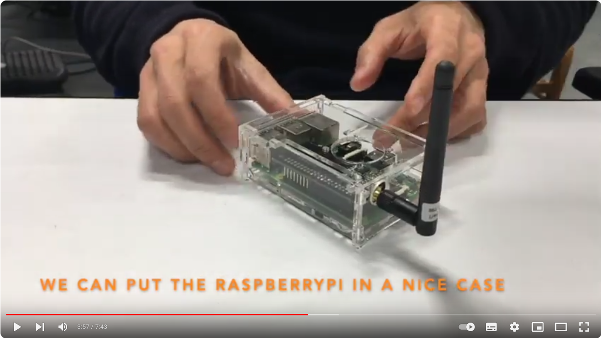

3.1. Generic wazigate
==

The [Gateway's slides](https://github.com/CongducPham/PRIMA-Intel-IrriS/blob/main/Tutorials/Intel-Irris-edge-gateway.pdf): the Tutorial slides on building/using the INTEL-IRRIS Gateway.

The [Outdoor Gateway's slides](https://github.com/CongducPham/PRIMA-Intel-IrriS/blob/main/Tutorials/Intel-Irris-gateway-outdoor.pdf): the Tutorial slides on building/using the outdoor INTEL-IRRIS Gateway.

[WaziGate-index](https://github.com/Waziup/learning-center-content/blob/main/content/en/resources/Gateways/WaziGate/index.md).\
[WaziGate-quick_start](https://github.com/Waziup/learning-center-content/blob/main/content/en/resources/WaziGate/quick_start.md).\
[WaziGate-user_manual](https://github.com/Waziup/learning-center-content/blob/main/content/en/resources/WaziGate/user_manual.md).\
[WaziGate-course](https://github.com/Waziup/learning-center-content/blob/main/content/en/courses/9.Waziup/2.wazigate).\
[WaziGate-casing](https://github.com/Waziup/learning-center-content/blob/main/content/en/courses/draft.10.Casing/).

3.2. Intel-IrriS specific soft and hard
==

Refer to the [Intel-IrriS Readme](https://github.com/CongducPham/PRIMA-Intel-IrriS/blob/main/README.md) and to the [Github Readme](https://github.com/CongducPham/PRIMA-Intel-IrriS/blob/main/Gateway/README.md).

Look at the [many gw scripts](https://github.com/CongducPham/PRIMA-Intel-IrriS/tree/main/Gateway/scripts).
		
## 1. IIWA
Available on port 5000: wazigate.local:5000

[Detailed setting guidelines](https://github.com/CongducPham/PRIMA-Intel-IrriS/blob/main/Tutorials/Intel-Irris-IIWA.pdf).

[comment]: # "drive comm challenge iiwa short tech description (6p)"
[comment]: # "drive starter-kit soil humidity indication"

[comment]: # "soft waziapp "
[comment]: # "drive deliv D2.1a waziapp.docx"
[comment]: # "drive deliv D2.1a"
[comment]: # "drive deliv D2.1b"

Look at [the code](https://github.com/Waziup/smart-irrigation-waziapp/tree/intelirris).
		

## 2. Home assistant
[Guidelines](https://intel-irris.eu/home-assistant-integration-in-intel-irris-wazigate).\
[More details](https://github.com/CongducPham/PRIMA-Intel-IrriS/blob/main/Gateway/homeassistant/README.md).

## 3. OLED

Look [here](https://github.com/CongducPham/PRIMA-Intel-IrriS/blob/main/Gateway/oled/README.md).

## 4. LoRa Chirpstack server
Available on port 8080: wazigate.local:8080
Admin default credentials (admin, admin)

Look for your gateway, watch realtime "live lorawan frames".

3.3. Set it up
==

## 1. Intel-IrriS image
Get it from the [Intel-IrriS web](intel-irris.eu/results)

## 2. Frequency setting
Don't forget to configure your gateway with the correct frequncy band! 
Follow/adjust the example [here](https://github.com/CongducPham/PRIMA-Intel-IrriS/tree/main/Gateway/boot#example-1-set-intel-irris-wazigate-in-433mhz-version).

## 3. Sync to Wazicloud waziup.io

See [Wazicloud-course](https://github.com/Waziup/learning-center-content/blob/main/content/en/courses//9.Waziup/3.WaziCloud/_index.md).\
See [WaziupAPI-course](https://github.com/Waziup/learning-center-content/blob/main/content/en/courses//9.Waziup/4.WaziupAPI/_index.md).

3.4. Gateway Quizz
==

