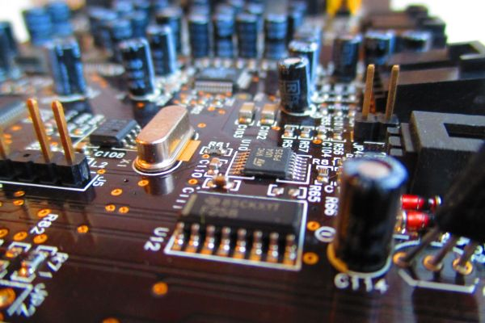

<!--  -->

In this part of the program, participants will delve into the fundamentals of electronic devices, microcontrollers, sensors, and actuators. The unit provides an insightful exploration of communication protocols, such as the Internet Protocol (IP) suite, and delves into wireless communication, featuring WiFi, Bluetooth, and LoRaWAN. This comprehensive course equips participants with essential knowledge to understand the intricacies of hardware components and communication technologies.

## The fundamentals

Let's start with something soft: [Introduction to IoT](/courses/aOJfma3yr1Q). 

**You need to click on the "Start Now" button in the courses below, so that the course is added to your courses.**
This is very important: if you don't do that, your course progress will not be registered in the program!

At the end of each course topics, **you need to click on the button "Mark as done" to register your progress.**
Please be honest! :)

<alert type='success'><b>Task 1:</b> Answer the questions in the questionaire at the end of the course.</alert>

PS. You can skip this one if you are already familiar with IoT!

## Electronics

Two courses await you on electronics:
- Basics of electronics for IoT
- Advanced electronics for IoT

<alert type='success'><b>Task 2:</b> 
Please do the exercices in the "Wiring and programming sensors" and the "Arduino programming" courses.
You need to take a photo of your prototype and upload it the corresponding Drive folder.
</alert>

Don't forget to click "Mark topic done" when you have finished.

## The WaziDev series

WaziDev, WaziSense and WaziAct are Sensing and Actuation development board for IoT applications. They transmits data up to 7Km using LoRaWAN. It is easily programmable and customizable, using Arduino technology.

Please go through the course on **WaziDev board series** below.

You can also find the documentation for the boards in the Lab.

<alert type='success'><b>Task 2:</b> Install the WaziDev and WaziSense. Go through all the instruction in [WaziDev](https://lab.waziup.io/resources/waziup/wazidev), and realize the "Blink a LED" and "Temperature and humidity sensor" exercices.</alert>

When done, please take a picture and upload it in the Drive folder.

## Boards and sensors

Once you have finished with the basic electronics, you can move on to the boards and sensors, with the following courses:
- Overview of boards and peripherals
- Arduino Programming

With those courses, you will have the basic knowledge to create and program your first IoT prototypes!

<alert type='success'><b>Task 3:</b> Please do the exercices in all three courses.</alert>

The exercices are:
- the questionnaire in the first course
- the Ultrasonic sensor exercice
- the LED blinking exercice
You need to take a photo of your prototype and upload it the corresponding Drive folder.

Don't forget to click "Mark topic done" when you have finished.
