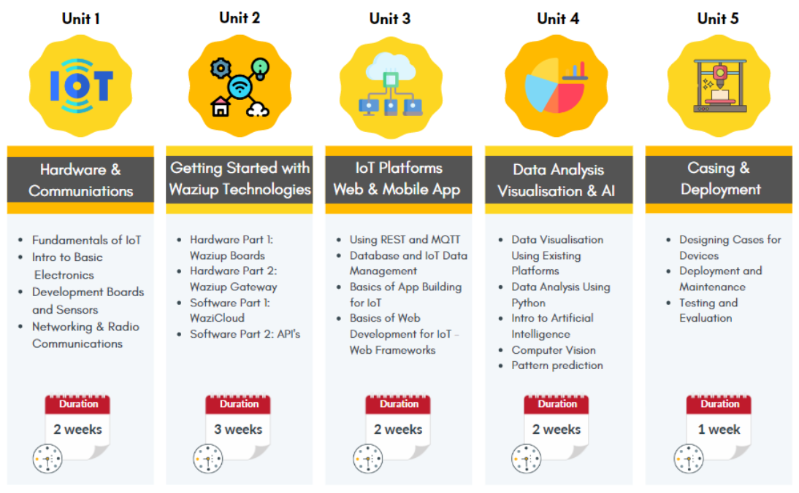

# Talent Program

The Talent Program is the capacity building arm of the HUBiquitous project.
The talent program objective is to improve the technical skills of the African tech-communities and enhance the employment and job opportunities among African TechHub communities.
The program duration is about three months, and is articulated in various modules covering all IoT knowledge, including  advanced topics like Machine Learning for IoT  and Big Data.

# Objectives

The objectives of the program are:
- Improve the technical skills of African local communities.
- Enhance employability skills of the youth.
- Foster IoT Innovations to combat real life problems.
- Develop Training and Innovation structures for Sustainable Replication in the African Eco-system

Units
=====
We have 5 units of learning:

