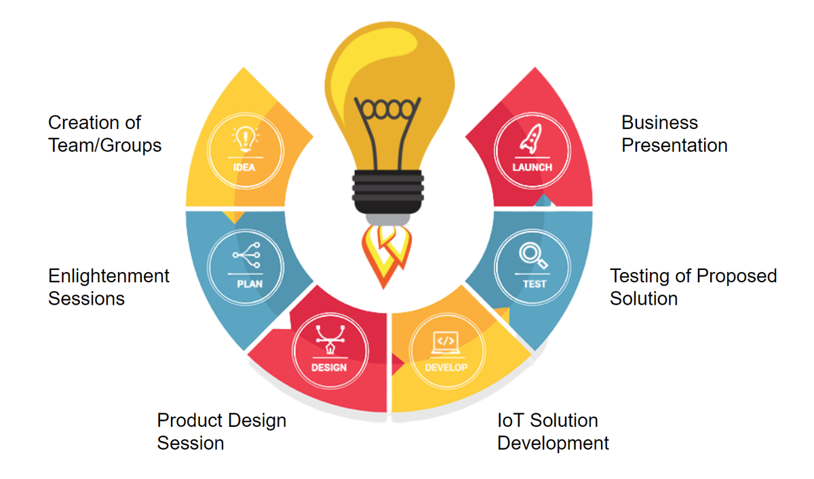

## Webinar

**Date:** January 8th, 2024
**Time:**  10AM, CET

This hackathon will kick-off the accelerator program!
We will present the objectives, the plan and showcasing the technology/business solutions to the participating entrepreneurs.

The African Hub will select the best proposals in terms of:
- Innovation ideas
- Feasibility
- Impact on the territory/vertical
- In terms of commitment and interest to continue participating in the AP

