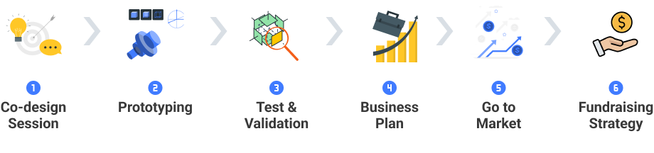
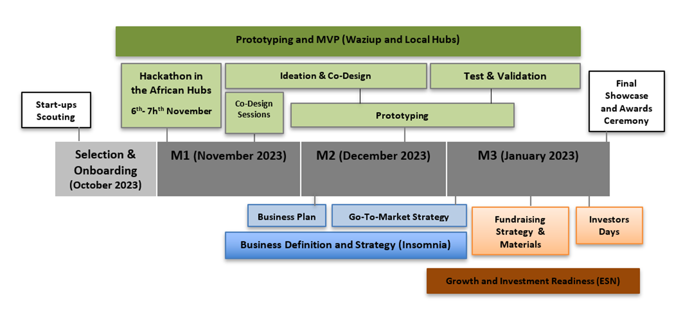
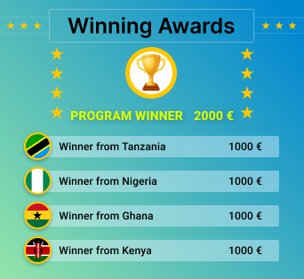

# Join the Hubiquitous Accelerator Program

Hubiquitous Accelerator Program is a dynamic 3-month initiative designed to empower entrepreneurs with processes, tools, methodologies, and technical know-how, fostering the growth of businesses and creating investment opportunities. The program places a strong emphasis on hands-on technical development, urging startups to actively advance their prototypes in alignment with the program's technical requirements. This not only reinforces the proposed technology methodology but also serves as a foundation for evaluating participants' self-sustainability and innovation capacities. The acquired technical proficiency seamlessly integrates with the broader business accelerator program, complemented by ongoing coaching provided by a team of 4 mentors and 4 trainers for each Hub/country. Join us on this transformative journey where technical expertise converges with business acceleration.

<!-- 
The HUBIquitous Accelerator Program is a **3 month program** aiming at improving your **IoT prototype and business model**. -->

## Program Objectives
- Improve entrepreneurs´ knowledge of the IoT.
- Improve the IoT prototyping or development skills of the entrepreneurs.
- Foster synergies between the selected participants, the mentoring network, and partners, contributing to a joint Africa-Europe ecosystem
- Foster networking and learning between professionals, enthusiasts, individuals, and companies
- Support the evolution of entrepreneurial projects.
- Facilitate accelerated business growth.
- Improve the technical skills of African technology/professional communities to increase the innovation capacity of the local ecosystem.

## Participants

Entrepreneurs with bold visions, startups fueled by passion, scaleups poised for growth, and SMEs seeking to elevate their ventures – our program welcomes all from the dynamic landscapes of **Ghana**, **Nigeria**, **Tanzania**, and **Kenya**.

## Program Overview

This program is devided into 6 units through out three months. During each unit of the program, you will complete sevral hands-on activities through out different courses and real world problems.

- **Co-design Sessions** will be conducted with each startup to precisely design your products.
- **Prototyping** is the focal point of the accelerator program, encouraging participants to complete essential courses at their own pace and begin the prototyping phase with guidance from local hub partners.
- **Test and Validation** phase involves validating your prototype and preparing for the final demo, with an organized session to validate the prototypes in the lab and build accompanying documentation.
- **Business Plan** will help you to set goals, outlining strategies, and creating a roadmap for your company's future. 
- **Go to Market** unit will help to make strategy in step-by-step plan designed to bring your product to market and drive demand. We will also help you identifying a target audience, outline marketing and sales strategies, and align key stakeholders.
- **Fundraising Strategy** unit help you to understand the basics of finance and business support services to boost digitally enabled entrepreneurship.

### Become Job Ready

## Timeline

This is the timeline of the program:

## Winning Prize

# Documentation

Download the [accelerator handbook](https://hubiquitous.eu/wp-content/uploads/2022/05/Hubiquitous-1st-Open-Call-Guide-for-Applicants.pdf)!
