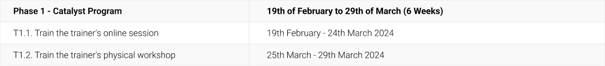
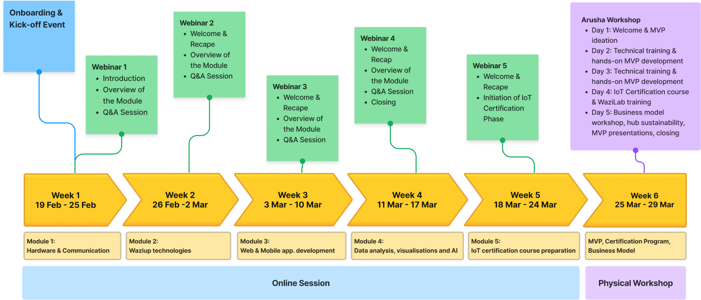

<!--  -->

### Overview

<!-- | **Level**             | Beginner                                                               |
|-----------------------|------------------------------------------------------------------------|
| **Course**            | 10 Courses                                                             |
| **Duration**          | 6 Weeks                                                                |
| **Getting Certified** | Complete all courses and participate the physical workshop in the end  | -->

The Techub Catalyst Program intends to bring at least 10 African Tech Hubs to a higher level in IoT and emerging technologies. The program will focus on increasing the hubs' IoT capabilities as well as boosting the development of sustainable value-added services.

- Acquire intensive IoT training through "Train-the-Trainers" sessions.
- Engage in both virtual and in-person training on cutting-edge technologies.
- Receive a "Solution Box" package for setting up or upgrading in-house IoT labs.
- Launch a community IoT certification course with a pre-designed program and a hackathon.
- Develop or enhance two Minimal Viable Products using IoT technologies.

### Timeline
<!-- | Phase 1 - Catalyst Program                    | 19th of February to 29th of March - 1.5 months |
|---------------------------------------------- |------------------------------------------------|
| T1.1. Train the trainer's online session    	| 19th Feb - 24th Mar 2024                       |
| T1.2. Train the trainer's physical workshop 	| 25th Mar - 29th Mar, 2024                      | -->

<!-- ## Awards

## Program Outline
**Timeline: 19th of February to 25th of March**

 -->

### Documentation

Download the [accelerator handbook](https://hubiquitous.eu/wp-content/uploads/2022/05/Hubiquitous-1st-Open-Call-Guide-for-Applicants.pdf)

