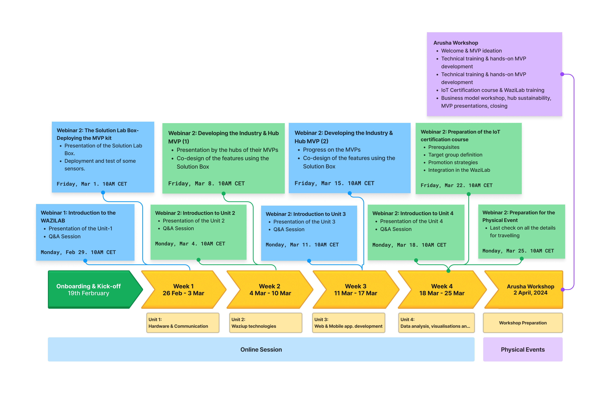

<!--  -->

# Overview

The Techub Catalyst Program intends to bring at least 10 African Tech Hubs to a higher level in IoT and emerging technologies. The program will focus on increasing the hubs' IoT capabilities as well as boosting the development of sustainable value-added services. The hubs will:

- Acquire IoT skills and knowledge.
- Engage in both virtual and in-person training.
- Receive a "Solution Box" package for setting up or upgrading an in-house IoT labs.
- Launch a community "IoT Certification Course".
- Develop or enhance two Minimal Viable Products using IoT technologies.

# Timeline

# More infos

Please see the [Catalyst Program webpage](https://hubiquitous.eu/techhub-catalyst-program/)

