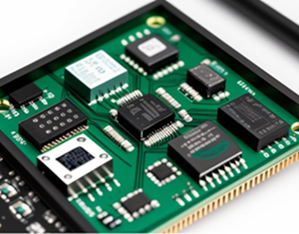

<!--  -->

In this part of the program, participants will delve into the fundamentals of electronic devices, microcontrollers, sensors, and actuators. The unit provides an insightful exploration of communication protocols, such as the Internet Protocol (IP) suite, and delves into wireless communication, featuring WiFi, Bluetooth, and LoRaWAN. This comprehensive course equips participants with essential knowledge to understand the intricacies of hardware components and communication technologies.

## The fundamentals

Let's start with something soft: [Introduction to IoT](/courses/aOJfma3yr1Q). 

**You need to click on the "Start Now" button in the courses below, so that the course is added to your courses.**
This is very important: if you don't do that, your course progress will not be registered in the program!

At the end of each course topics, **you need to click on the button "Mark as done" to register your progress.**
Please be honest! :)

PS. You can skip this one if you are already familiar with IoT!

## Electronics

Two courses await you on electronics:
- Basics of electronics for IoT
- Advanced electronics for IoT

**Please do the exercice in the Basics of electronics and Advanced electronics.**
****You need to take a photo of your prototype and upload it the corresponding Drive folder**.

Don't forget to click "Mark topic done" when you have finished.

## Boards and sensors

Once you have finished with the basic electronics, you can move on to the boards and sensors, with the following courses:
- Overview of boards and peripherals
- Wiring and programming sensors
- Arduino Programming

With those courses, you will have the basic knowledge to create and program you first IoT prototypes!

Please do the exercice in the "Wiring and programming sensors" and the "Arduino programming" courses.
Don't forget to click "Mark topic done" when you have finished.

## Radio communications and networking

To complete a full IoT prototype, you also need to know about long range communications.
We will cover the following course:
- Wireless communication essentials
- Wifi radio communications
- LoRa radio communications

Please do the Wifi exercice, and the LoRa exercice.
Don't forget to click "Mark topic done" when you have finished.

