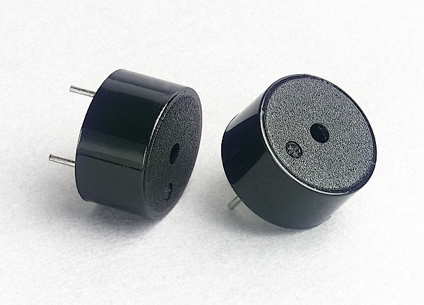

# Introduction
In simplest terms, a piezo buzzer is a type of electronic device that’s used to produce a tone, alarm or sound. It’s lightweight with a simple construction, and it’s typically a low-cost product. Yet at the same time, depending on the piezo ceramic buzzer specifications, it’s also reliable and can be constructed in a wide range of sizes that work across varying frequencies to produce different sound outputs.

The use of the piezo ceramic buzzer was discovered thanks to an inversion of the piezoelectricity principle that was discovered by Jacques and Pierre Curie back in 1880. They found that electricity could be generated when a mechanical pressure was applied to particular materials and the inverse was true as well.

So when certain piezoelectric materials are subjected to an alternating field of electricity, the piezo buzzer element often a manmade piezoceramic material stretches and compresses in sequence with the frequency of the current. As a result, it produces an audible sound.




# Wiring

**Note:** Piezo buzzers have a + marking on top of their package to indicate which terminal is positive.

# Code example
This code sample activates and deactivates the buzzer at a one second interval between each state.

```c
//buzzer connected to pin 9 of arduino
int buzzer = 9;

// the setup function runs once when you press reset or power the board
void setup() {
  // initialize digital pin LED_BUILTIN as an output.
  pinMode(buzzer, OUTPUT);
}

// the loop function runs over and over again forever
void loop() {
  digitalWrite(buzzer, HIGH);   // turn the buzzer on (HIGH is the voltage level)
  delay(1000);                       // wait for a second
  digitalWrite(buzzer, LOW);    // turn the buzzer off by making the voltage LOW
  delay(1000);                       // wait for a second
}
```

# Further documentation
Read more about the operation of buzzers [here](https://www.americanpiezo.com/standard-products/buzzers.html#:~:text=What%20Is%20A%20Piezo%20Buzzer,typically%20a%20low%2Dcost%20product.).