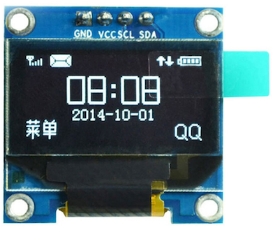

# Introduction

Typical OLED screen uses I2C type communication with SCL (clock) and SDA (data). The one presented here is a small 0.96" screen with 128x64 definition. There are other size if you need it for your project.



# Connecting to Arduino

We will connect as follows, using default I2C pin A5 for SCL (clock) and A4 for SDA (data).


# Code example

For connecting a small OLED screen to an Arduino, we will first take a simple "hello" example. For a regular Arduino board, we take A4 (SDA) and A5 (SCL) pins as described above. In text mode, with the selected font size, we will have 8 lines (0 to 7) of 16 characters.

There are many software libraries for those OLED screens. We use here the `U8G2` very generic library that has the main advantage to provide possibility to re-define the SCL and SDA pins as it will be shown later on.


``` arduino
#define OLED
#ifdef OLED
#include <U8x8lib.h>
//you can also power the OLED screen with a digital pin, here pin 8
#define OLED_PWR_PIN 8
// connection may depend on the board. Use A5/A4 for most Arduino boards. 
//On ESP8266-based board we use GPI05 and GPI04. Heltec ESP32 has embedded OLED.
#if defined ARDUINO_Heltec_WIFI_LoRa_32 || defined ARDUINO_WIFI_LoRa_32 || defined HELTEC_LORA
U8X8_SSD1306_128X64_NONAME_SW_I2C u8x8(/* clock=*/ 15, /* data=*/ 4, /* reset=*/ 16);
#elif defined ESP8266 || defined ARDUINO_ESP8266_ESP01
U8X8_SSD1306_128X64_NONAME_SW_I2C u8x8(/* clock=*/ 12, /* data=*/ 14, /* reset=*/ U8X8_PIN_NONE);
#else
//reset is not used
U8X8_SSD1306_128X64_NONAME_SW_I2C u8x8(/* clock=*/ A5, /* data=*/ A4, /* reset=*/ U8X8_PIN_NONE);
#endif
char oled_msg[20];
#endif

int i=1;
    
void setup() {

  delay(2000);
  Serial.begin(38400);

#ifdef OLED    
#ifdef OLED_PWR_PIN
  pinMode(OLED_PWR_PIN, OUTPUT);
  digitalWrite(OLED_PWR_PIN, HIGH);
#endif
  u8x8.begin();
  u8x8.setFont(u8x8_font_pxplustandynewtv_r);
  u8x8.drawString(0, 0, "Hello friend");
  u8x8.drawString(0, 1, "How are you"); 
#endif  

  Serial.println("Hello friend"); 
}

void loop() {

  delay(500);
  delay(1000);
    
  if (i== 10) {
    Serial.println("Please answer me my friend...");
    i=1;
  }
  else
    i++;

  Serial.println("What can I do for you...?"); 
    
#ifdef OLED
  u8x8.drawString(0, 2, "What can I do   "); 
  u8x8.drawString(0, 3, "for you         ");
  u8x8.drawString(0, 4, "today?          "); 
#endif 

  delay(1000);

#ifdef OLED 
  u8x8.clearLine(2);
  u8x8.drawString(0, 2, "****************"); 
  u8x8.drawString(0, 3, "++++++++++++++++");
  u8x8.clearLine(4);
  u8x8.drawString(0, 5, "////////////////");
  u8x8.drawString(0, 6, "----------------"); 
  u8x8.drawString(0, 7, "////////////////"); 
#endif     

  delay(1000);
}
```


The raw source of the sketch example is visible [here](src/sketch/Arduino_hello_oled/Arduino_hello_oled.ino).


As you can see, the sketch first includes the required library to control the OLED screen, here it is the `U8x8lib` library, included in the `U8G2` library. The regular Arduino boards such as Uno or Pro Mini will use pins A4 (for SDA=data) and A5 (for SCL=clock) to communicate with the OLED screen.

Then the OLED screen can be initialized and the font selected. Note how the sketch displays a string on the OLED screen with the `u8x8.drawString()` function which takes 3 arguments: the starting column, the starting line and the text itself. The origin (0,0) is the top left corner.

As you can also see in the code above, we power the OLED screen with a digital pin (here digital pin 8 in the code), instead of the Arduino 5V power pin. This configuration provides more flexibility in addition to the possibility of switch the OLED screen ON and OFF is this is necessary. So if you connected OLED VCC to the Arduino 5V as illustrated in the figure, you can change to digital pin 8 instead and reboot your board.

## Using different pins for SCL and SDA

It is possible to use other pins on the Arduino board for the SCL and SDA pins. For instance, as most of the small OLED screen from Chinese manufacturers have GND, VCC, SCL and SDA pins in a row (from left to right) then it is convenient to use on the Arduino board (for instance the Arduino Nano or the Arduino ProMini) 4 consecutive pins such as GND, D2, D3 and D4 as illustrated in the figure below for the Arduino Nano.


Here for instance, OLED VCC is connected to digital pin 2 of the Arduino therefore `OLED_PWR_PIN` should be defined as:

	#define OLED_PWR_PIN 2

Then change the definition of the screen object as follows:

	U8X8_SSD1306_128X64_NONAME_SW_I2C u8x8(/* clock=*/ 3, /* data=*/ 4, /* reset=*/ U8X8_PIN_NONE);                 	     

If you look at the raw source of the [hello](src/sketch/Arduino_hello_oled/Arduino_hello_oled.ino) example previously presented you will see a list of `#define` statements at the beginning. They are commented as shown below:

``` arduino
// choose Arduino pin for OLED pin GND, VCC, SCL and SDA 
// suitable for Arduino Nano
//#define OLED_GND234
// suitable for Arduino Nano as well, pin 9 as GND
//#define OLED_9GND876
// suitable for Arduino Uno & Arduino MEGA2560, pin 7 as GND
//#define OLED_7GND654
// suitable for Arduino Uno & Arduino MEGA2560
//#define OLED_GND13_12_11
```

Uncomment the configuration that is suitable for you. For instance, if you want to use the previous configuration described for the Arduino Nano, i.e. 4 consecutive Arduino pins such as GND, D2, D3 and D4 for respectively OLED GND, VCC, SCL and SDA, then uncomment `//#define OLED_GND234`. You can also use an Arduino digital pin as GND pin by setting this pin to LOW level. `#define OLED_9GND876` and `#define OLED_7GND654` use for instance pin 9 or pin 7 for GND. See in the code how we do that:

``` arduino
#ifdef OLED
#ifdef OLED_PWR_PIN
  pinMode(OLED_PWR_PIN, OUTPUT);
  digitalWrite(OLED_PWR_PIN, HIGH);
#ifdef OLED_9GND876
  //use pin 9 as ground
  pinMode(9, OUTPUT);
  digitalWrite(9, LOW);
#elif defined OLED_7GND654
  //use pin 7 as ground
  pinMode(7, OUTPUT);
  digitalWrite(7, LOW);
#endif  
#endif
```

Note that this trick with GND is valid only for an OLED screen that draws very few current.

Now, we are going to use a more complex example taking the `Sensirion SHT` example that has been previously shown in the `Advanced T/H` section. You can easily take another example by adding the parts that are related to the OLED screen. These parts are identified by `#ifdef OLED ... #endif`.

## Adding OLED to the SHT example

The OLED screen will we connected using the previous setting: Arduino pins such as GND, D2, D3 and D4 for respectively OLED GND, VCC, SCL and SDA. This is useful here as A4 and A5 are already used for the SHT sensor. So the definition for the OLED screen is:

	U8X8_SSD1306_128X64_NONAME_SW_I2C u8x8(/* clock=*/ 3, /* data=*/ 4, /* reset=*/ U8X8_PIN_NONE);

```c
#include "Sensirion.h"

#define SHTD_PIN A4
#define SHTC_PIN A5
#define SHT2x

//we can also power the SHT with a digital pin, here pin 9
#define PIN_POWER 9

#ifdef SHT2x
Sensirion sht = Sensirion(SHTD_PIN, SHTC_PIN, 0x40);
#else
Sensirion sht = Sensirion(SHTD_PIN, SHTC_PIN);
#endif

#define OLED
#ifdef OLED
//you can also power the OLED screen with a digital pin, here pin 8
#define OLED_PWR_PIN 2
#include <U8x8lib.h>
// connection may depend on the board. Use A5/A4 for most Arduino boards. 
//On ESP8266-based board we use GPI05 and GPI04. Heltec ESP32 has embedded OLED.
#if defined ARDUINO_Heltec_WIFI_LoRa_32 || defined ARDUINO_WIFI_LoRa_32 || defined HELTEC_LORA
U8X8_SSD1306_128X64_NONAME_SW_I2C u8x8(/* clock=*/ 15, /* data=*/ 4, /* reset=*/ 16);
#elif defined ESP8266 || defined ARDUINO_ESP8266_ESP01
U8X8_SSD1306_128X64_NONAME_SW_I2C u8x8(/* clock=*/ 12, /* data=*/ 14, /* reset=*/ U8X8_PIN_NONE);
#else
//reset is not used
U8X8_SSD1306_128X64_NONAME_SW_I2C u8x8(/* clock=*/ 3, /* data=*/ 4, /* reset=*/ U8X8_PIN_NONE);
#endif
char oled_msg[20];
#endif

float h;
float t;
int ret;
int retry=0;
    
void setup() {

  delay(3000);
  Serial.begin(38400);
  //and to power the temperature sensor
  pinMode(PIN_POWER,OUTPUT);
    
#ifdef OLED_PWR_PIN
  pinMode(OLED_PWR_PIN, OUTPUT);
  digitalWrite(OLED_PWR_PIN, HIGH);
#endif

#ifdef OLED
  u8x8.begin();
  u8x8.setFont(u8x8_font_chroma48medium8_r);
  u8x8.drawString(0, 1, "Arduino SHT"); 
#endif   
}

void loop() {

    digitalWrite(PIN_POWER,HIGH);
    delay(1000);
    
    while ( (ret != S_Meas_Rdy) ) {
      ret=sht.measure(&t, &h);
      retry++;
      Serial.print("[");
      Serial.print(ret);
      Serial.print(":");
      Serial.print(retry);
      Serial.print("] ");
    }

    if (ret != S_Meas_Rdy) {
    Serial.println("Failed to read from SHT sensor!"); 
    
#ifdef OLED
        u8x8.clearLine(4);
        u8x8.clearLine(5);
        u8x8.drawString(0, 4, "error SHT...");  
#endif 
    }
    else {
        Serial.print("Temperature: ");
        Serial.print(t);
        Serial.print(" degrees Celcius Humidity: ");
        Serial.print(h);
        Serial.println("%"); 

#ifdef OLED
        String tString=String(t);
        String hString=String(h);
        u8x8.clearLine(4);
        sprintf(oled_msg, "t=%s h=%s", tString.c_str(), hString.c_str()); 
        u8x8.drawString(0, 4, oled_msg); 
#endif      
    }
    
    digitalWrite(PIN_POWER,LOW);
    ret=0;
    retry=0;
    delay(5000);
}
```


We added a char array (`char oled_msg[20]`) as a text buffer where complex output can be converted in characters with the `sprintf()` function. This is convenient because the OLED library can only display simple text buffer, therefore if you need to display complex text with values from variables of your program, use the `sprintf()` as shown at the end of the above example.


