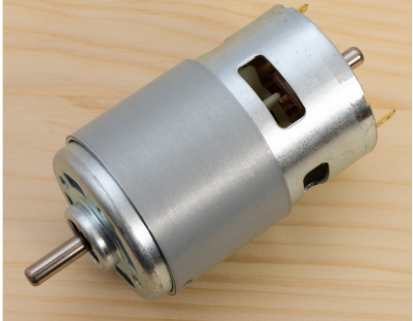
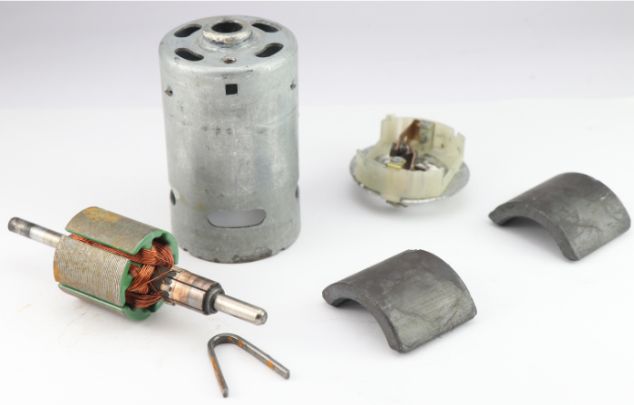

# Introduction

There are several types of motor availables according to the rate of voltage at which the motor operates. For instance, let's consider the 12V DC motor.

A 12V DC motor is a widely used electric motor that operates on a 12-volt direct current (DC) power supply. These motors convert electrical energy into mechanical energy through the interaction of magnetic fields and conductors, providing rotational motion. Due to their versatility, reliability, and relatively simple control mechanisms, 12V DC motors are prevalent in a wide range of applications from household appliances to automotive systems and robotics.

# Characteristics

- **Voltage Rating:** Specifically designed to operate at 12 volts, ensuring compatibility with many standard power supplies and battery systems.
- **Type:** Typically brushed or brushless, each type having its own advantages. Brushed motors are simpler and cheaper, while brushless motors offer higher efficiency and longer lifespan.
- **Torque and Speed:** These motors are available in various torque and speed ratings, making them suitable for different tasks requiring varying levels of force and rotational speed.
- **Size and Form Factor:** Available in various sizes and shapes to fit different design requirements and space constraints.
- **Efficiency:** Generally efficient in converting electrical power to mechanical power, though efficiency varies by design and load conditions.

# Use cases

- **Automotive:** Used in power windows, windshield wipers, seat adjusters, and HVAC systems.
- **Household Appliances:** Found in electric fans, vacuum cleaners, food processors, and washing machines.
- Robotics: Provide precise control for the movement of robot arms, wheels, and other components.
- **Industrial Equipment:** Used in conveyor belts, automated machinery, and tools requiring reliable rotational motion.
- **Electric Vehicles:** Serve as traction motors for electric scooters, bicycles, and small electric vehicles.
- **DIY Projects:** Popular among hobbyists for creating various gadgets, remote-controlled vehicles, and mechanical systems.