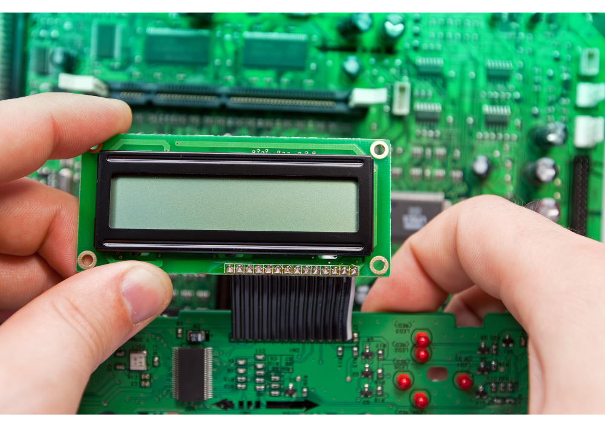
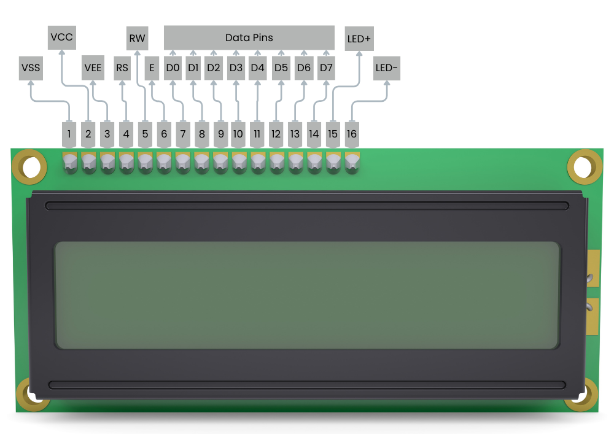

# Introduction
A 16x2 LCD (Liquid Cristal Display) display is a type of alphanumeric LCD screen capable of displaying 16 characters per line on two lines, for example, can display 32 ASCII characters across two rows. These displays are widely used in various electronic projects and devices due to their simplicity, versatility, and cost-effectiveness. They are commonly used to display basic information, such as status messages, sensor readings, or user prompts.
The 16x2 LCD display is a versatile and widely used component in both professional and hobbyist electronics. Its straightforward interface and ability to display clear alphanumeric characters make it an essential tool for conveying information in a variety of applications. By understanding its features, working principles, and use cases, developers can effectively integrate these displays into their projects to enhance user interaction and information display.

# Pinouts
A standard character LCD has 16 pins (except for an RGB LCD, which has 18 pins).

`VSS` is the ground pin.

`VCC` is the LCD’s power supply and is typically connected to 5 volts.

`VEE` (LCD Contrast) pin controls the contrast of the LCD. Using a simple voltage divider network and a potentiometer, we can make precise contrast adjustments.

`RS` (Register Select) pin is used to separate the commands (such as setting the cursor to a specific location, clearing the screen, etc.) from the data. The RS pin is set to LOW when sending commands to the LCD and HIGH when sending data.

`RW` (Read/Write) pin allows you to read data from or write data to the LCD. Since the LCD is only used as an output device, this pin is typically held low. This forces the LCD into WRITE mode.

`E` (Enable) pin is used to enable the display. When this pin is set to LOW, the LCD ignores activity on the R/W, RS, and data bus lines; when it is set to HIGH, the LCD processes the incoming data.

`D0-D7` (Data Bus) pins carry the 8 bit data we send to the display. To see an uppercase ‘A’ character on the display, for example, we set these pins to 0100 0001 (as per the ASCII table).

`LED+` pin is used to control the backlight LED pin (positive terminal).

`LED-` pin is used to control the backlight LED pin (negative terminal).

# Use Cases

- **Embedded Systems:** Displaying system status, error messages, and sensor data in embedded applications.
- **Consumer Electronics:** Used in household appliances like microwaves, washing machines, and coffee makers to show settings and timers.
- **Industrial Control Panels:** Displaying parameters, system states, and operator instructions.
- **Prototyping and Development:** Popular in DIY electronics projects, hobbyist kits, and prototyping boards like Arduino and Raspberry Pi for debugging and user interfaces.
- **Medical Devices:** Displaying readings and settings in portable medical equipment.
- **Automotive Applications:** Used in dashboard displays, infotainment systems, and diagnostic tools.

# Specification

- Operating Voltage is 4.7V to 5.3V
- Current consumption is 1mA without backlight
- LCD display module, meaning can display alphabets and numbers
- Consists of two rows and each row can print 16 characters.
- Each character is build by a 5×8 pixel box
- Can work on both 8-bit and 4-bit mode
- It can also display any custom generated characters
- Available in Green and Blue Backlight