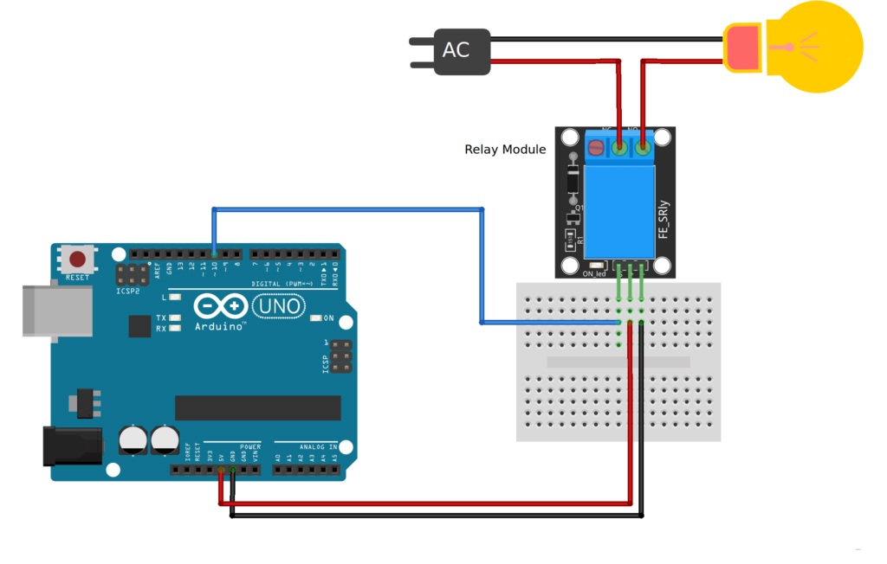

# Introduction

You may occasionally wish your Arduino to manage appliances with AC power, such as lamps, fans, and other home appliances. The Arduino, however, cannot directly control these higher voltage devices because it runs on 5 volts.

This is where the relay comes into play. You can use an Arduino to control the relay and the relay module to control the AC mains.
                    


                 
# Connecting to Arduino



Module interface:
1. VCC: Connect to the positive pole of the power supply (voltage is 5V)
2. GND: Connect to the negative pole of the power supply
3. IN: Connect to Arduino control pin


Relay output:
1. NO: Relay normally open interface, it will be shorted to COM after relay is closed
2. COM: Relay Common Interface(power source to be controlled is connected here)
3. NC: Normally closed relay interface. Before the relay is closed, it is short-circuited with COM.
                    
# Code example

```c
/********************
 *  Program:  Relay Tester
 ********************/

//Declaring pin 10 as the control pin    
int RelayPin = 10;

void setup() {
  //Set RelayPin as an output pin
  pinMode(RelayPin, OUTPUT);
}

void loop() {
  // Let's turn on the relay...
  digitalWrite(RelayPin, LOW);

  //Lets wait for 5 seconds
  delay(5000);
	
  //Let's turn off the relay...
  digitalWrite(RelayPin, HIGH);

  //Lets wait for another 5 seconds
  delay(5000);
}
```

# Specifications

- Contact Rating: AC 250V/10A, DC 30V/10A
- Control Pin: 5mA trigger current
- Supply Voltage: 3.75V to 6V
- Quiescent Current: 2mA
- Active Current: ~70mA

# Further documentation

Documentation for this sensor is available [here](https://lastminuteengineers.com/one-channel-relay-module-arduino-tutorial/) 
Learn more about how relays work [here](https://components101.com/switches/5v-single-channel-relay-module-pinout-features-applications-working-datasheet)
