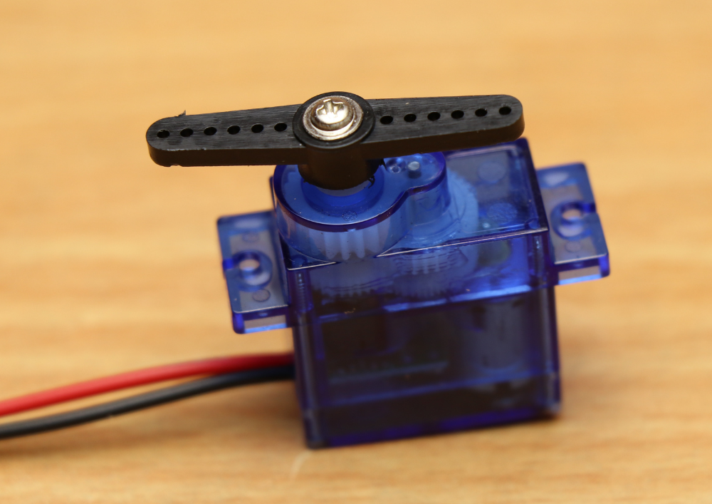

# Introduction

A servo motor is a specialized motor designed for precise control of angular or linear position, velocity, and acceleration. It is widely used in applications requiring high precision and reliability, such as robotics, CNC machinery, and automation systems. Servo motors are typically equipped with a feedback mechanism to provide closed-loop control, ensuring accurate performance and positioning.

# Types of Servo Motors
- **DC Servo Motor:** Uses a direct current power supply and is commonly found in small to medium-sized applications.
- **AC Servo Motor:** Uses an alternating current power supply and is suitable for high power and high-performance applications.
- **Brushless Servo Motor:** Utilizes electronic commutation instead of brushes, offering higher efficiency, reliability, and longevity.

# Use cases

- **Robotics:** Used for precise control of robotic arms, joints, and other moving parts.
- **CNC Machinery:** Provides accurate control for cutting, milling, and engraving operations.
- **Automation Systems:** Integral in automated manufacturing processes, conveyor systems, and assembly lines.
- **Aerospace:** Employed in control surfaces of aircraft, such as ailerons, elevators, and rudders.
- **Medical Devices:** Used in diagnostic and surgical equipment for precise movements.
- **Radio-Controlled Models:** Commonly used in RC cars, planes, and boats for steering and throttle control.
- **Camera Stabilization:** Employed in gimbal systems to stabilize cameras and provide smooth motion.