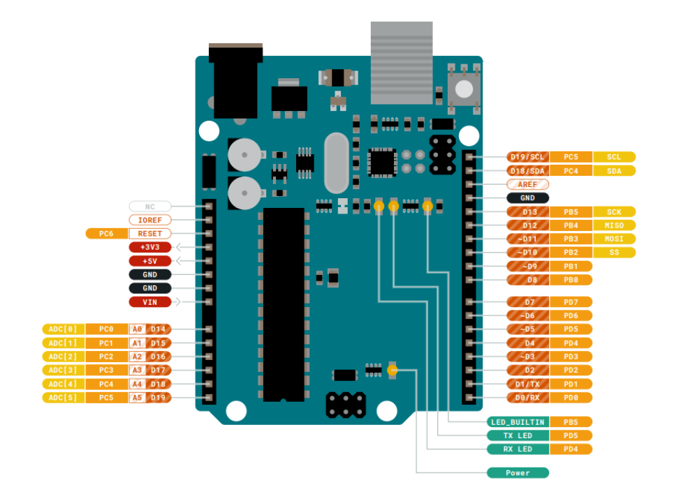

# Introduction
Arduino Uno is a microcontroller board based on the ATmega328P (datasheet). It has 14 digital input/output pins (of which 6 can be used as PWM outputs), 6 analog inputs, a 16 MHz ceramic resonator (CSTCE16M0V53-R0), a USB connection, a power jack, an ICSP header and a reset button. It contains everything needed to support the microcontroller; simply connect it to a computer with a USB cable or power it with a AC-to-DC adapter or battery to get started.. You can tinker with your Uno without worrying too much about doing something wrong, worst case scenario you can replace the chip for a few dollars and start over again.

**"Uno"** means one in Italian and was chosen to mark the release of Arduino Software (IDE) 1.0. The Uno board and version 1.0 of Arduino Software (IDE) were the reference versions of Arduino, now evolved to newer releases. The Uno board is the first in a series of USB Arduino boards, and the reference model for the Arduino platform; for an extensive list of current, past or outdated boards see the Arduino index of boards.

# Wiring - Pinouts

Download the full pinout diagram as PDF [here](https://content.arduino.cc/assets/A000066-full-pinout.pdf)

# Further documentation
Find the datasheet of the Arduino Uno [here](https://docs.arduino.cc/resources/datasheets/A000066-datasheet.pdf) 
Also find further details [here](https://store.arduino.cc/products/arduino-uno-rev3)
