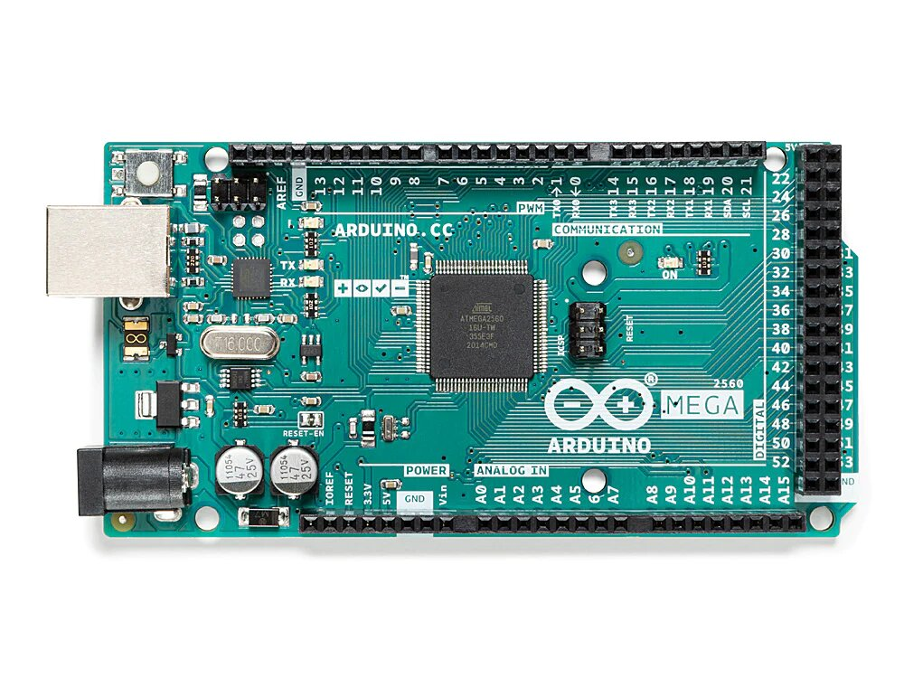
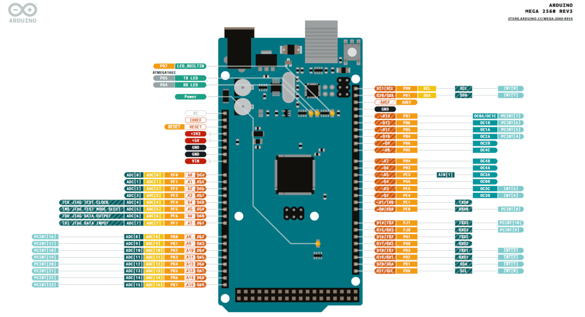

# Introduction
The Arduino Mega 2560 is a microcontroller board based on the ATmega2560. It has 54 digital input/output pins (of which 15 can be used as PWM outputs), 16 analog inputs, 4 UARTs (hardware serial ports), a 16 MHz crystal oscillator, a USB connection, a power jack, an ICSP header, and a reset button. 

It contains everything needed to support the microcontroller, simply connect it to a computer with a USB cable or power it with a AC-to-DC adapter or battery to get started. 

The Mega 2560 board is compatible with most shields designed for the Uno and the former boards Duemilanove or Diecimila.

# Wiring - Pinouts

Download the full schematic diagram as PDF [here](https://content.arduino.cc/assets/MEGA2560_Rev3e_sch.pdf)
