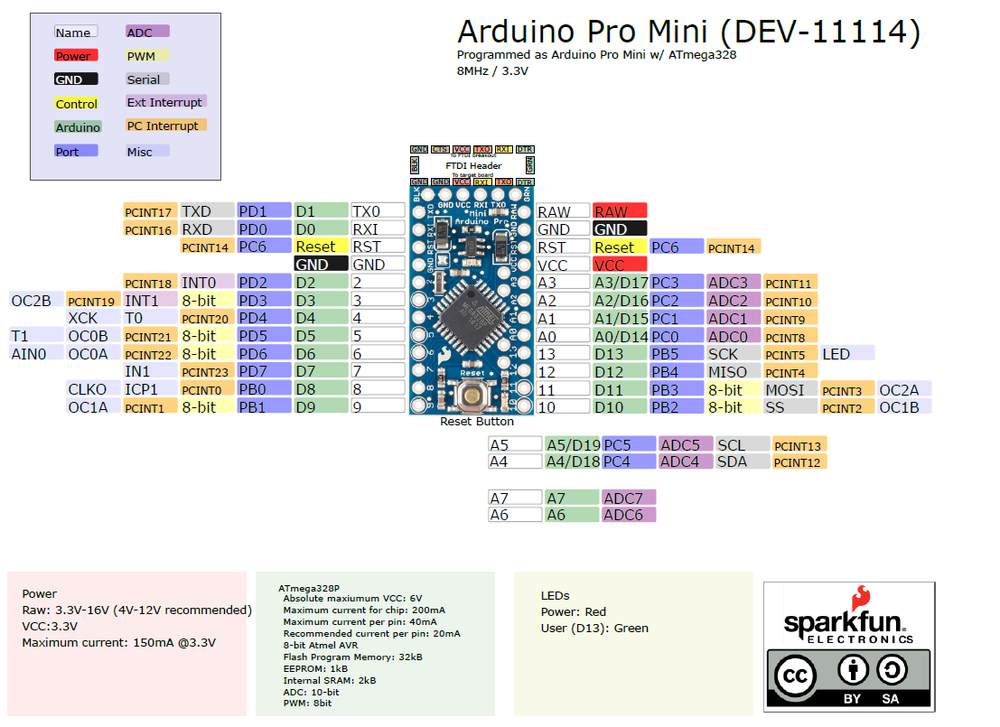

# Introduction
This board was developed for applications and installations where space is premium and projects are made as permanent set ups. Small, available in 3.3 V and 5 V versions, powered by ATmega328P.

It has 14 digital input/output pins (of which 6 can be used as PWM outputs), 6 analog inputs, an on-board resonator, a reset button, and holes for mounting pin headers. A six pin header can be connected to an FTDI cable or Sparkfun breakout board to provide USB power and communication to the board.

The Arduino Pro Mini is intended for semi-permanent installation in objects or exhibitions. The board comes without pre-mounted headers, allowing the use of various types of connectors or direct soldering of wires. The pin layout is compatible with the Arduino Mini.

There are two version of the Pro Mini. One runs at 3.3V and 8 MHz, the other at 5V and 16 MHz.

The Arduino Pro Mini was designed and is manufactured by SparkFun Electronics.

# Wiring - Pinouts

Download the full schematic diagram as PDF [here](https://www.arduino.cc/en/uploads/Main/Arduino-Pro-Mini-schematic.pdf)

# Further documentation
Documentation for this board is available [here](https://learn.sparkfun.com/tutorials/using-the-arduino-pro-mini-33v/all).