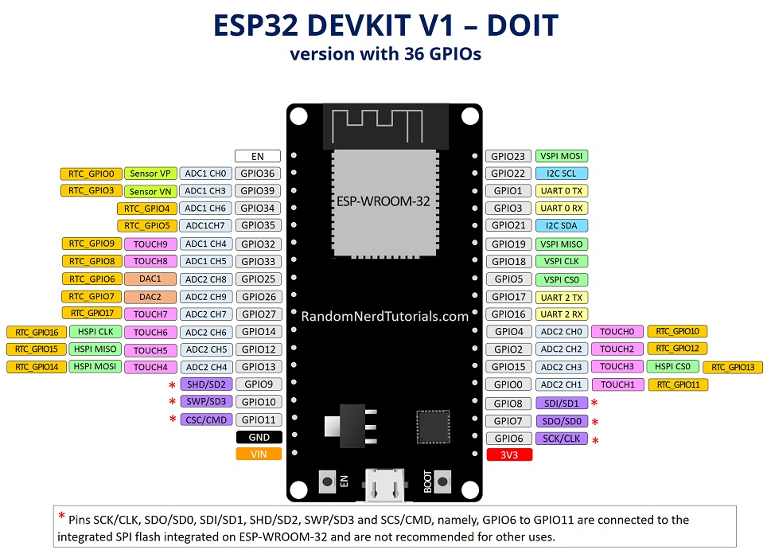

# Introduction

The ESP32 is a powerful, low-cost Wi-Fi and Bluetooth-enabled microcontroller that is widely used in IoT applications due to its versatility and processing power.

# Key Features:
- Dual-core Xtensa processor, clocked at up to 240 MHz.
- Built-in Wi-Fi and Bluetooth (Classic and BLE).
- Multiple GPIO pins, ADC, DAC, SPI, I2C, and PWM support.
- Low-power consumption modes, making it ideal for battery-powered IoT devices.

# Applications:
IoT hubs, smart homes, wearables, and industrial automation systems.