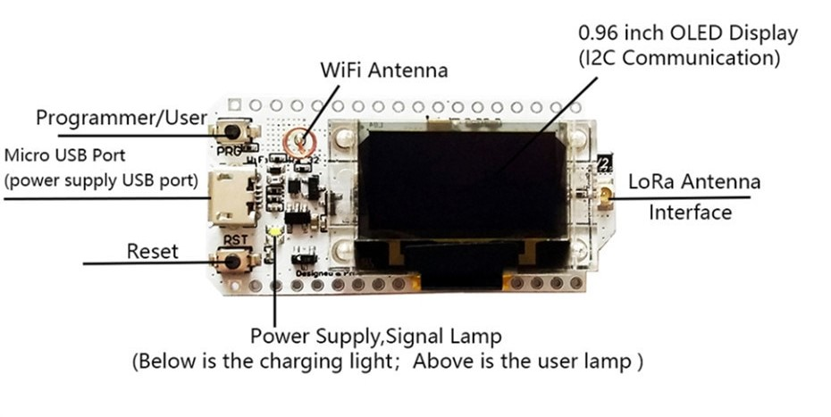
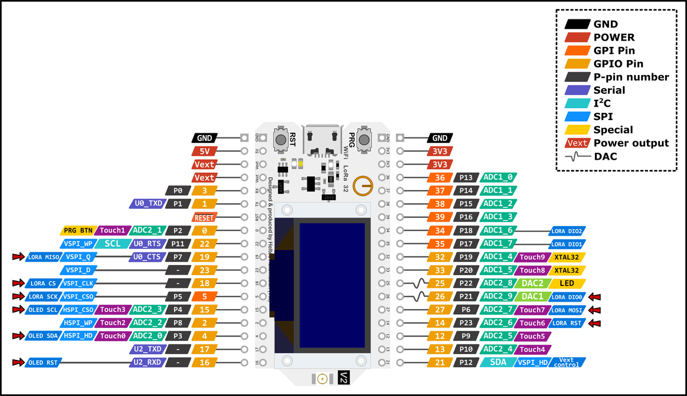

# Introduction

WiFi LoRa 32 is a classic IoT dev-board based on ESP32 + SX127x, it has Wi-Fi, BLE, LoRa functions. It also comes with a Li-Po battery management system and 0.96″ OLED. This makes the heltec WiFi LoRA 32 suitable for smart cities, smart farms, smart home, and IoT applications.

                 
# Layout

# Further documentation

Documentation for this board is available [here](https://heltec.org/project/wifi-lora-32/).

# Specs
Technical specifications

Electrical Characteristics

