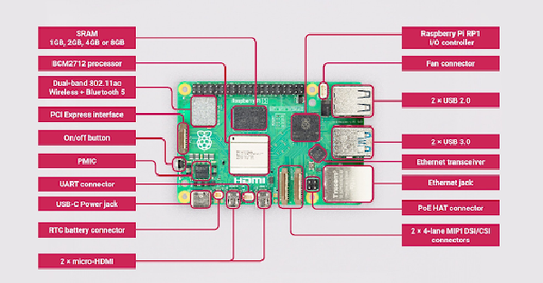

# Introduction

The Raspberry Pi is a tiny yet powerful technology that allows hobbyists, enthusiasts, and amateurs to explore a wide range of opportunities. This credit card-sized computer was created by the Raspberry Pi Foundation with accessibility, affordability, and versatility in mind.

Fundamentally, the Raspberry Pi is a platform that promotes exploration and innovation rather than merely a tiny computer. The Raspberry Pi offers an easy way to get started with electronics, whether you want to learn to program, make electronic projects, set up a media center, or even build your own mini-server.

With its many features, including HDMI outputs, USB ports, and GPIO (General Purpose Input/Output) pins, the Raspberry Pi is like an empty canvas just waiting for your artistic interpretation. 

# Features 

On initial interaction with Raspberry Pi designs, an inexperienced computer user may find them slightly confusing. The board has a number of embedded features, each with a unique purpose. In general, the many features regulate the characteristics of a typical computer in the twenty-first century, including peripheral port connectivity, Bluetooth, processor quality and speed, and software compatibility. All things are made possible by the characteristics of Raspberry Pi computers.

# Specifications

- Broadcom BCM2712 2.4GHz quad-core 64-bit Arm Cortex-A76 CPU, with cryptography extensions, 512KB per-core L2 caches and a 2MB shared L3 cache
VideoCore VII GPU, supporting OpenGL ES 3.1, Vulkan 1.2
- Dual 4Kp60 HDMI® display output with HDR support
4Kp60 HEVC decoder
- LPDDR4X-4267 SDRAM (4GB and 8GB SKUs available at launch)
- Dual-band 802.11ac Wi-Fi®
- Bluetooth 5.0 / Bluetooth Low Energy (BLE)
microSD card slot, with support for high-speed SDR104 mode
- 2 × USB 3.0 ports, supporting simultaneous 5Gbps operation
- 2 × USB 2.0 ports
Gigabit Ethernet, with PoE+ support (requires separate PoE+ HAT)
- 2 × 4-lane MIPI camera/display transceivers
PCIe 2.0 x1 interface for fast peripherals (requires separate M.2 HAT or other adapter)
- 5V/5A DC power via USB-C, with Power Delivery support
- Raspberry Pi standard 40-pin header
- Real-time clock (RTC), powered from external battery
- Power button

# Existing Models of Raspberry Pie

The Raspberry Pi has continually evolved, providing a range of options catering to various needs, from simple educational projects to more complex applications. Understanding the differences between the versions helps users choose the right Raspberry Pi for their specific requirements.

### Models
- Raspberry Pi 5
- Raspberry Pi 4
- Raspberry Pi 3
- Raspberry Pi 2
- Raspberry Pi 1 Model B+
- Raspberry Pi 1 Model A+
- Raspberry Pi Zero

# Raspberry Pi as Wazigate
WaziGate is an IoT LoRaWAN Gateway, ideal for all your remote IoT applications. To learn more on how to use Raspberry Pi as Wazigate , click [here](https://lab.waziup.io/resources/waziup/wazigate).

# Learn more
If this is your first time with Raspberry Pi then click [here](https://www.raspberrypi.com/documentation/computers/getting-started.html) to learn more on how to get started with RPi from their official Raspberry Pie documentation.

