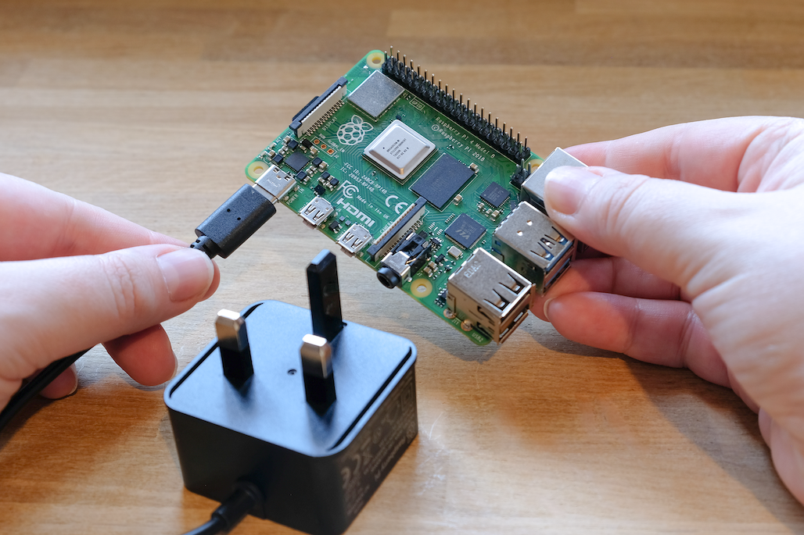

# Introduction

The Raspberry Pi is a tiny yet powerful technology that allows hobbyists, enthusiasts, and amateurs to explore a wide range of opportunities. This credit card-sized computer was created by the Raspberry Pi Foundation with accessibility, affordability, and versatility in mind.

Fundamentally, the Raspberry Pi is a platform that promotes exploration and innovation rather than merely a tiny computer. The Raspberry Pi offers an easy way to get started with electronics, whether you want to learn to program, make electronic projects, set up a media center, or even build your own mini-server.

With its many features, including HDMI outputs, USB ports, and GPIO (General Purpose Input/Output) pins, the Raspberry Pi is like an empty canvas just waiting for your artistic interpretation. 

# Existing Models of Raspberry Pie
## Raspberry Pi 1 Series
   
### Raspberry Pi Model A
   *Release Date: February 2013*

Key Features:
- Processor: Broadcom BCM2835 SoC
- Memory: 256MB RAM
- Connectivity: 1x USB 2.0 port, HDMI and composite video output
- Expansion: GPIO (General Purpose Input/Output) pins for hardware interfacing

### Raspberry Pi Model B
*Release Date: February 2013*

Additional Features:
- Processor: Broadcom BCM2835 SoC
- Memory: 512MB RAM
- Connectivity: 2x USB 2.0 ports, 10/100 Ethernet port
- Expansion: GPIO pins, DSI (Display Serial Interface), CSI (Camera Serial Interface)

## Raspberry Pi 2 Series

### Raspberry Pi 2 Model B
*Release Date: February 2015*

Key Upgrades:
- Processor: Quad-core ARM Cortex-A7 CPU
- Memory: 1GB RAM
- Connectivity: 4x USB 2.0 ports, HDMI, DSI, CSI
- Expansion: GPIO pins

## Raspberry Pi 3 Series

### Raspberry Pi 3 Model B
*Release Date: February 2016*

Notable Features:
- Processor: Quad-core ARM Cortex-A53 CPU
- Memory: 1GB RAM
- Connectivity: 4x USB 2.0 ports, HDMI, DSI, CSI
- Wireless: Built-in Wi-Fi (802.11n) and Bluetooth 4.1
- Expansion: GPIO pins, 40-pin header

### Raspberry Pi 3 Model B+
*Release Date: March 2018*

Enhancements:
- Processor: Quad-core ARM Cortex-A53 CPU
- Memory: 1GB RAM
- Connectivity: 4x USB 2.0 ports, HDMI, DSI, CSI
- Wireless: Dual-band Wi-Fi (802.11ac) and Bluetooth 4.2
- Networking: Gigabit Ethernet
- Expansion: GPIO pins, 40-pin header

## Raspberry Pi 4 Series

### Raspberry Pi 4 Model B
*Release Date: June 2019*

Significant Upgrades:
- Processor: Quad-core Cortex-A72 CPU
- Memory: Options for 2GB, 4GB, or 8GB LPDDR4 RAM
- Connectivity: 2x USB 3.0 ports, 2x USB 2.0 ports, 2x micro HDMI ports for dual 4K display support, USB-C for power
- Networking: True Gigabit Ethernet
- Expansion: GPIO pins, 40-pin header

## Raspberry Pi Pico
*Release Date: January 2021*

- Microcontroller Board:
- Microcontroller: RP2040 dual-core ARM Cortex-M0+
- Memory: 264KB RAM
- Connectivity: 26x GPIO pins, 3x ADC channels, 2x UART, I2C, SPI
- Features: Programmable I/O, flexible clock frequency
  

The Raspberry Pi has continually evolved, providing a range of options catering to various needs, from simple educational projects to more complex applications. Understanding the differences between the versions helps users choose the right Raspberry Pi for their specific requirements.

# Features of Raspberry Pie

On initial interaction with Raspberry Pi designs, an inexperienced computer user may find them slightly confusing. The board has a number of embedded features, each with a unique purpose. In general, the many features regulate the characteristics of a typical computer in the twenty-first century, including peripheral port connectivity, Bluetooth, processor quality and speed, and software compatibility. All things are made possible by the characteristics of Raspberry Pi computers.

# Getting Started with Raspberry Pi
If this is your first time with Raspberry Pie then click [here](https://www.raspberrypi.com/documentation/computers/getting-started.html) to learn more on how to get started with RPi from their official raspberry Pie documentation.
