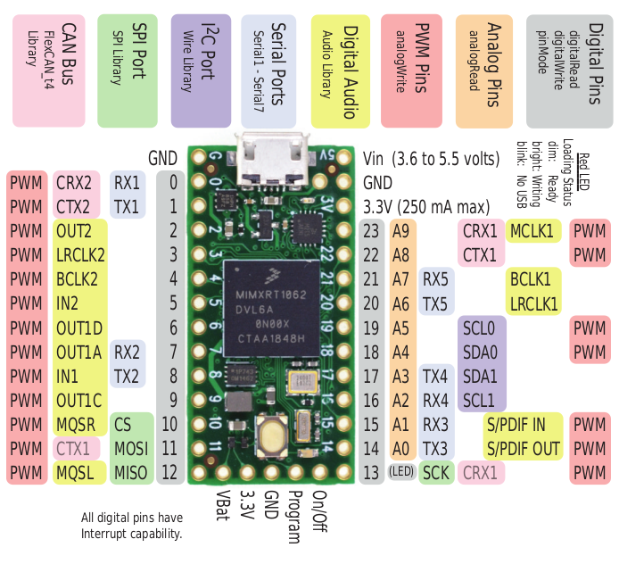

# Introduction

Teensy 4.0 is an ARM Cortex-M7 development board at 600 MHz for projects that require more processing power. The teensy lineup is great for situations involving complex realtime applications such as flight simulations, input/output etc,..

The Teensy 4.0 has a ton of PWM, analog and digital pins with an onboard Real Time clock. This makes it suitable for use with any sensor for countless applications.

                 
# Layout

# Further documentation

Documentation for this board is available [here](https://www.pjrc.com/store/teensy40.html).