# 1. Introduction

IoT enhances precision agriculture, livestock management, and environmental monitoring by enabling real-time data collection, remote control, and predictive analytics. 

This empowers farmers to optimize resource usage, ensure animal welfare, and make informed decisions for sustainable practices, ultimately boosting yields and conserving resources. In view of this, the WaziSense series of boards were developed. 

The WaziSense v2 is designed for MVP,  proof of concept and field deployment purposes. It will be used in conditions where resources like **power and internet access is limited.**

The users include:

* **AgriTech-Startups **looking at developing a new product.
* **Small and Medium Enterprise Agri-businesses/Farmers** looking to add IoT functionality to an existing infrastructures, products or test new IoT product ideas.
* **Researchers or Environmental Agencies **looking to collect data in urban or remote areas to reveal useful insights.
* **Hobbyists, students** or people with some engineering or technical background, looking to learn something new or build on an existing skill.


# 2. Board Overview

The WaziSense v2 is a low-power development board specifically designed to address the unique challenges of agricultural and environmental monitoring applications in harsh outdoor deployment conditions.

Equipped with solar battery charging capacity, low power long range communication and several ports for easy connection to a wide range of digital and analog sensors, the WaziSense v2 empowers farmers, researchers, agricultural experts and hobbyists with a versatile platform to monitor, control, and optimize their operations seamlessly.


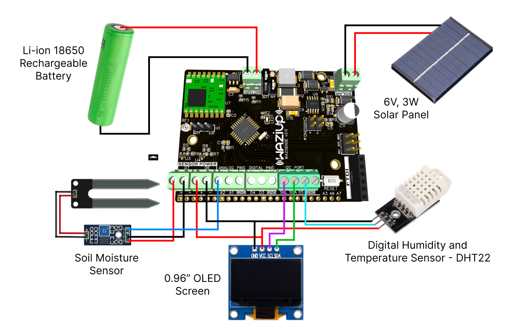


_Figure 1:_ WaziSense v2 in an environmental monitoring use case 


# 3. Hardware Specifications


## 3.1. Lora

The WaziSense v2  LoRa module is an **RFM95W (SX1276)**. The wiring of the lora module to the ATmega328p is as follows:

| ATmega328p Pin | LoRa RFM95W |
|----------------|-------------|
| D13            | SCK         |
| D12            | MISO        |
| D11            | MOSI        |
| D10            | NSS         |
| D9             | RESET       |
| D2             | DIO0        |

Since the RFM95W is a 3.3v module, it is powered from the 3.3v output of the onboard regulator. The following table shows the SX1276 module power consumption specifications.


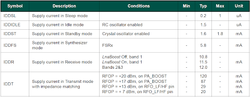


_Figure 2:_ SX1276 power consumption details


## 3.2. Microcontroller

The microcontroller on the WaziSense v2 is a **3.3v 8MHz ATmega328p**. The pin designations and specifications are as follows:


* Flash Memory: 32 KB
* SRAM:2 KB
* EEPROM: 1 KB
* Digital Pins: 3 (D2, D3, D5)
* Analog Pins: 7 (A1,A2,A3,A4.A5,A6,A7)
* External Interrupt Pin: D3
* PWM Pin: D3, D5
* Serial Communication: 1x (UART, SPI, I2C)
* Operating voltage: 3.3v
* Operating Temperature: -40°C to 85°C

Specification | Value/Pin
--------------|----------
Flash Memory   | 32 KB
SRAM           | 2 KB
EEPROM         | 1 KB
Digital Pins   | D2, D3, D5
Analog Pins    | A1, A2, A3, A4, A5, A6, A7
External Interrupt Pin | D3
PWM Pin        | D3, D5
Serial Communication | 1x (UART, SPI, I2C)
Operating voltage | 3.3v
Operating Temperature | -40°C to 85°C


## 3.3. Regulator

The 3.3v voltage regulator has part number HE2031A33MPR and is labeled U2 on the WaziSense v2.

The package type of the 3.3v voltage regulator on the WaziSense v2 is SOT89. The regulator has the following electrical characteristics:

* Low voltage drop: 0.18V@100mA
* Input voltage: 3.5v to 25v max
* Low temperature coefficient
* Output Current: >400mA
* Low Quiescent Current: 2.0µA
* Output voltage accuracy: tolerance ±1%
* Built-in current limiter


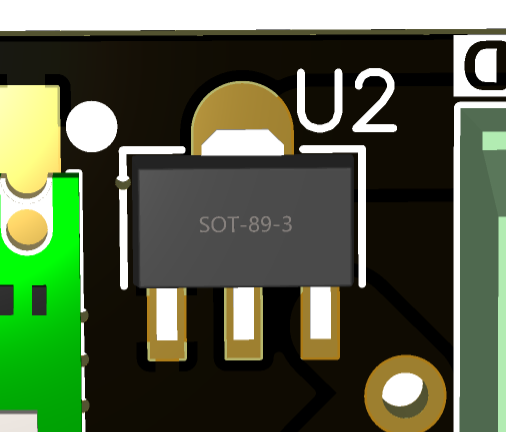


_Figure 3:_ 3.3v regulator on WaziSense v2


## 3.4. Battery and Solar Charging

The solar and battery charging system is built around a **CN3791 **IC. The CN3791 is a highly integrated solar power management IC designed specifically for solar-powered applications. It provides a comprehensive solution for harvesting and managing energy from solar panels efficiently. Here are a some of its specifications with respect to WaziSense v2 design:


* Photovoltaic Cell Maximum Power Point Tracking
* Wide Input Voltage: **5.2v to 28**
* Complete Charge Controller for single cell Lithium-ion Battery
* Charge Current Up to 4A (depending on the solar panel connected and battery state of charge)
* Constant Voltage: 4.2V±1%
* Automatic Recharge
* Charging Status Indication
* Soft Start
* Battery Overvoltage Protection
* Operating Ambient Temperature: -40℃ to ＋85℃


## 3.5. Sensor Power Ports

The sensor power ports on the WaziSense v2 are built around two TPM2102BC3 N-channel mosfets capable of handling up to 20v @ 2.5A Max with VGS of 2.5v. This mechanism allows users to digitally turn ON sensors only when needed to conserve energy.


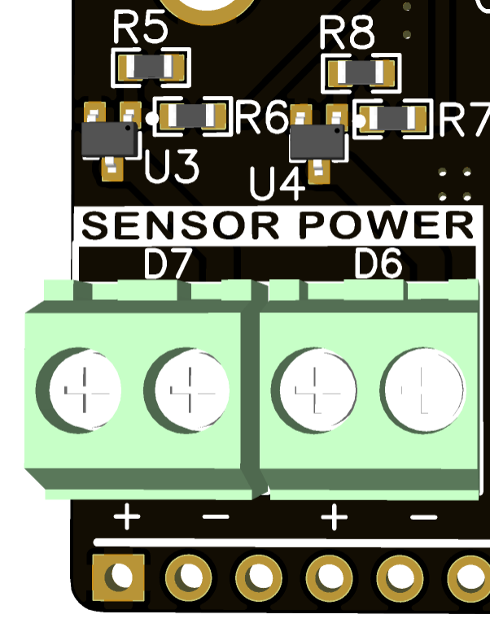


_Figure 4:_ Sensor Power section of WaziSense v2


## 3.6. Board Dimensions

The WaziSense v2 board dimensions are as follows.

| Section | Dimensions (mm) |
|---------|------------------|
| A       | 70.358           |
| B       | 13.462           |
| C       | 2.413            |
| D       | 52.832           |
| E       | 13.970           |
| F       | 9.906            |
| G       | 5.080            |
| H       | 23.368           |
| I       | 11.700           |
| J       | 3.2              |
| K       | 1.6              |
| Mounting Holes | 3mm Diameter |


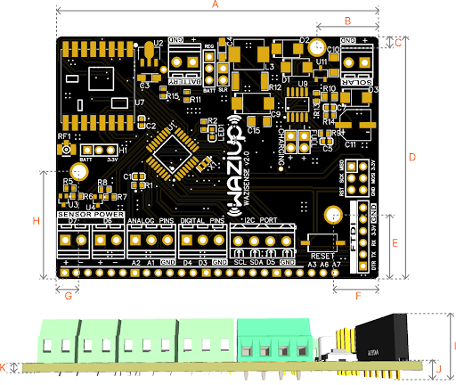


_Figure 5:_ WaziSense v2 dimensions


# 4. Getting Started


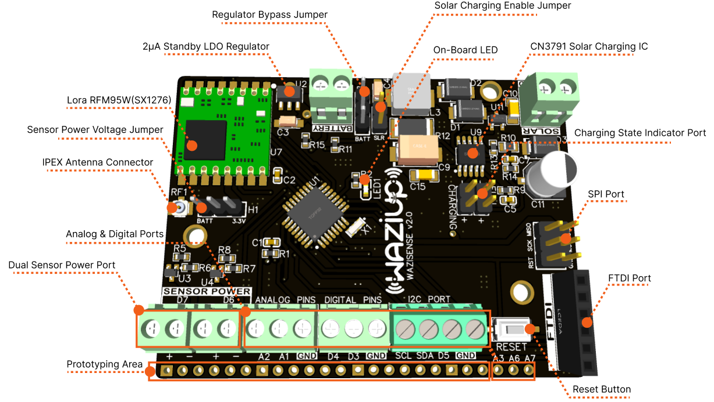


_Figure 6:_ Features of the WaziSense v2 board


## 4.1. Adding Waziup Resources to Arduino IDE

In order to be able to program and use the WaziSense v2 with Lora, sensors and related peripherals, we need to configure the arduino environment.


1. First visit the arduino website [here](https://www.arduino.cc/en/software), download and install the arduino IDE.


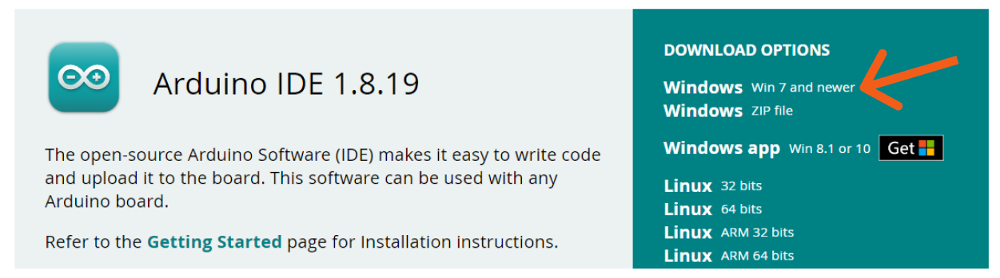


_Figure 7:_ Arduino website software page


2. Next click [here](https://github.com/Waziup/WaziDev/archive/refs/heads/master.zip) to download the Waziup resources zip file from Github.
3. Next unzip the downloaded file and install the WaziSense v2 driver named “CH341SER.EXE” inside the file path “…WaziDev-master\drivers”


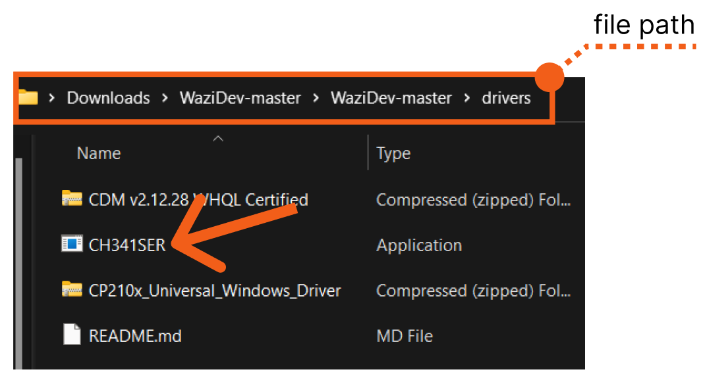


_Figure 8:_ locating the driver for WaziSense FTDI


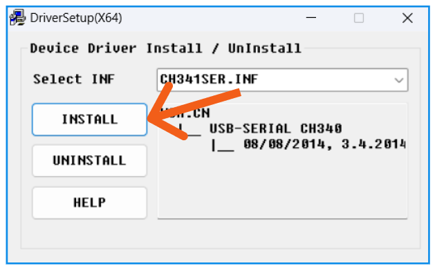


_Figure 9:_ Installing the driver for WaziSense FTDI

**NOTE:** If the FTDI to be used does not belong to the FT323 chip family, then make sure to install the needed drivers for your specific FTDI.


4. Copy the “libraries” and “examples” folder in the unzipped file to your arduino folder.


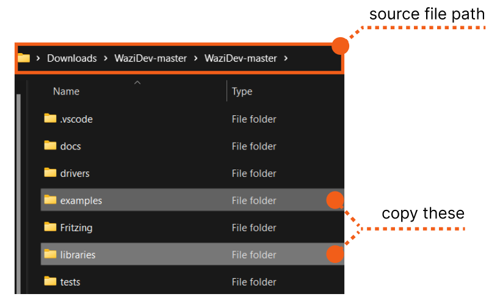


_Figure 10:_ Copying the examples and libraries folders from the unzipped folder.


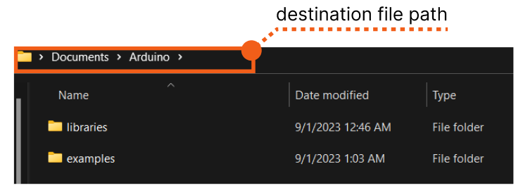


_Figure 11:_ Pasted libraries and example files in Arduino folder


5. Open your Arduino IDE and navigate to Sketchbook under the File Menu. Here the Waziup Lora, Sensors, Actuator and related sketch examples should show.


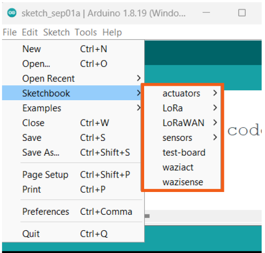


_Figure 12:_ Waziup resources showing in Arduino IDE


6. Select the resource sketch example and make changes where required for the preferred use case.


## 4.2. Uploading to the Right Board

The microcontroller on the WaziSense is a 3.3v 8MHz ATmega328p, as such, users need navigate to the “**Tools Menu**” and select “**Arduino Pro or Pro Mini**” under “**Board**:” and “**ATmega328p (3.3V, 8MHz)**” under “**Processor:**”.


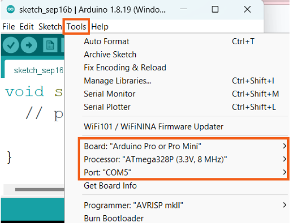


_Figure 13:_ Selecting the right board parameters for the WaziSense

**Note:** Make sure to select the correct “**Communication Port Number**” of your FTDI.


## 4.3. Lora

To use the WaziSense v2 with lora, you first need to add all relevant Waziup resources to your arduino IDE as demonstrated in “**Section 4.1**” above.


1. Open your Arduino IDE and navigate to Sketchbook under the File Menu. Locate and open the **Actuation **sketch sample under LoRaWAN.


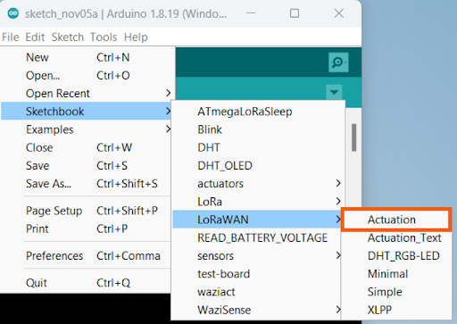


_Figure 14:_ Locating Actuation sketch sample in Waziup resources


2. The Actuation sketch sample should look like the following.

```c
#include <WaziDev.h>
#include <xlpp.h>
#include <Base64.h>

// NwkSKey (Network Session Key) and Appkey (AppKey) are used for securing LoRaWAN transmissions.
// You need to copy them from/to your LoRaWAN server or gateway.
// You need to configure also the devAddr. DevAddr need to be different for each devices!!
// Copy'n'paste the DevAddr (Device Address): 26011D00
unsigned char devAddr[4] = {0x26, 0x01, 0x1D, 0x00};

// Copy'n'paste the key to your Wazigate: 23158D3BBC31E6AF670D195B5AED5525
unsigned char appSkey[16] = {0x23, 0x15, 0x8D, 0x3B, 0xBC, 0x31, 0xE6, 0xAF, 0x67, 0x0D, 0x19, 0x5B, 0x5A, 0xED, 0x55, 0x25};

// Copy'n'paste the key to your Wazigate: 23158D3BBC31E6AF670D195B5AED5525
unsigned char nwkSkey[16] = {0x23, 0x15, 0x8D, 0x3B, 0xBC, 0x31, 0xE6, 0xAF, 0x67, 0x0D, 0x19, 0x5B, 0x5A, 0xED, 0x55, 0x25};

WaziDev wazidev;

void setup()
{
  Serial.begin(38400);
  wazidev.setupLoRaWAN(devAddr, appSkey, nwkSkey);
}

XLPP xlpp(120);

void loop(void)
{
  // 1
  // Create xlpp payload.
  xlpp.reset();
  xlpp.addTemperature(1, 45.7); // °C

  // 2.
  // Send paload with LoRaWAN.
  serialPrintf("LoRaWAN send ... ");
  uint8_t e = wazidev.sendLoRaWAN(xlpp.buf, xlpp.len);
  if (e != 0)
  {
    serialPrintf("Err %d\n", e);
    delay(60000);
    return;
  }
  serialPrintf("OK\n");
  
  // 3.
  // Receive LoRaWAN message (waiting for 6 seconds only).
  serialPrintf("LoRa receive ... ");
  uint8_t offs = 0;
  long startSend = millis();
  e = wazidev.receiveLoRaWAN(xlpp.buf, &xlpp.offset, &xlpp.len, 6000);
  long endSend = millis();
  if (e != 0)
  {
    if (e == ERR_LORA_TIMEOUT){
      serialPrintf("nothing received\n");
    }
    else
    {
      serialPrintf("Err %d\n", e);
    }
    delay(60000);
    return;
  }
  serialPrintf("OK\n");
  
  serialPrintf("Time On Air: %d ms\n", endSend-startSend);
  serialPrintf("LoRa SNR: %d\n", wazidev.loRaSNR);
  serialPrintf("LoRa RSSI: %d\n", wazidev.loRaRSSI);
  serialPrintf("LoRaWAN frame size: %d\n", xlpp.offset+xlpp.len);
  serialPrintf("LoRaWAN payload len: %d\n", xlpp.len);
  serialPrintf("Payload: ");
  char payload[100];
  base64_decode(payload, xlpp.getBuffer(), xlpp.len); 
  serialPrintf(payload);
  serialPrintf("\n");
  
  delay(60000);
}
```


3. In the void loop section, there is a dummy temperature value of “**45.7**”. This value will be transmitted to the gateway. Replace this value with actual temperature sensor variables, if you have a sensor attached to the Wazisense. You will need to add the required sketch for your specific sensor to the provided lora sample sketch above. Also make sure to add the relevant libraries required for your specific sensor to your arduino IDE.


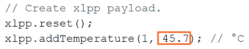


_Figure 15:_ hard coded dummy temperature value in sketch sample


4. Take note of the device address, network and app session keys provided in the lora sketch sample. It will be needed later when binding the wazisense board to the gateway.


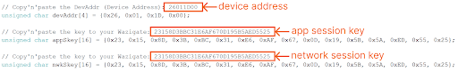


_Figure 16:_ Needed keys for device LoraWAN configuration.


5. At this point we need to set up this Wazisense board as a LoraWAN device on the gateway. See [here](https://lab.waziup.io/courses/waziup/waziup/wazigate) for instructions on what you need and how to set up a new gateway for the first time.

     
On your gateway dashboard, add a new device by clicking on the “**+**” sign at the lower right corner of the screen.


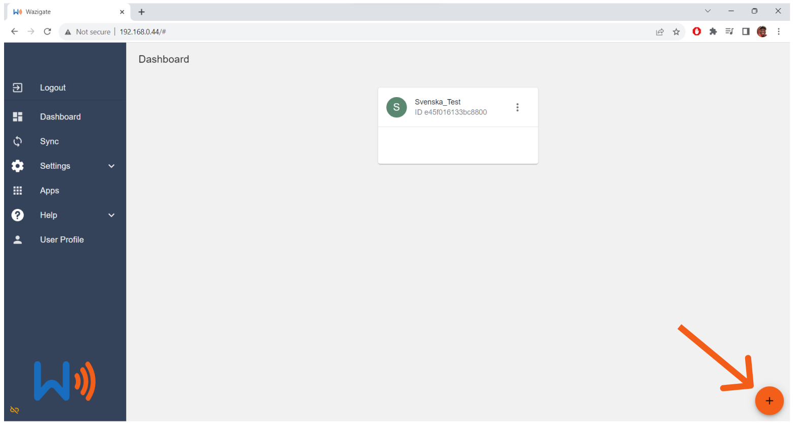


_Figure 17:_ Creating a new sensor device


6. Give your new sensor a name and click “**ok**”.


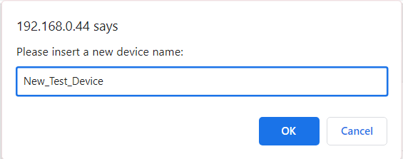


_Figure 18:_ Creating a device named “New_Test_Device”

Upon clicking “ok” a new sensor card is created on your dashboard.


_Figure 19:_ New device created


7. Click on the new device you just created to configure it. In the device interface, click on the three dotted menu


 and select “Make LoRaWAN”.


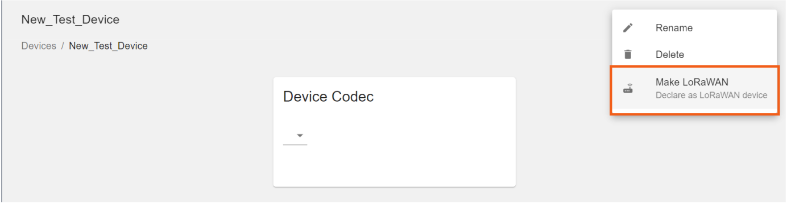


_Figure 20:_ Making device LoRaWAN


8. Copy and paste the device address, network and app session keys in LoRa sketch sample in the relevant spaces and Save the configurations as shown.


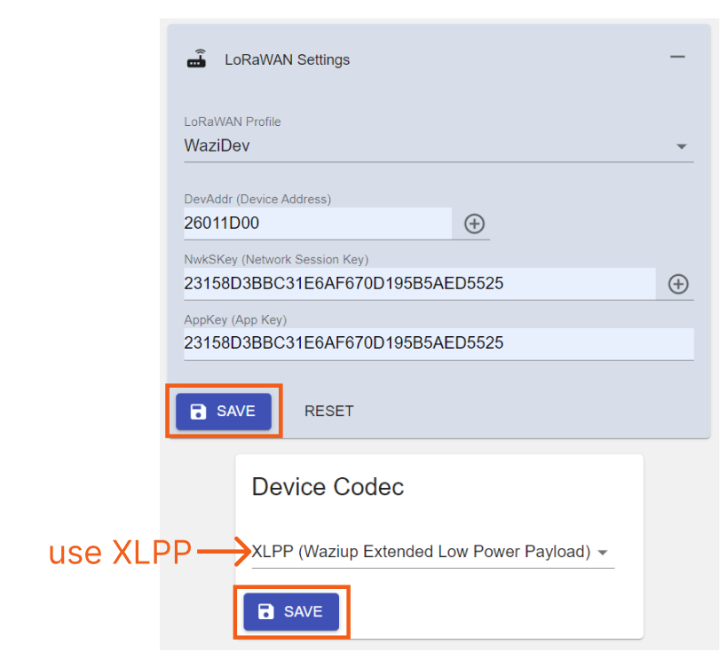

_Figure 21:_ Making device LoRaWAN

9. At this point, you can upload your lora sketch sample to your WaziSense board. You can also view device lora communication details via the arduino serial monitor. Make sure the serial monitor baud rate is **38400 **(to match the uploaded sketch example)


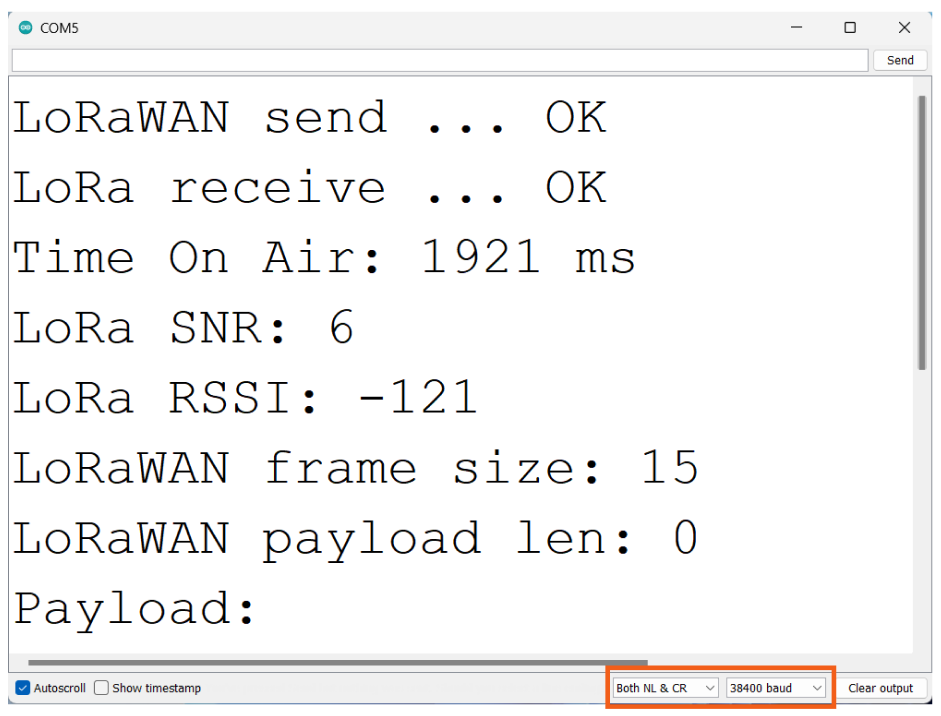


    _Figure 22:_ Lora communication in Serial Monitor


The Wazigate dashboard should also receive and indicate the dummy date transmitted accordingly.


    _Figure 23:_ Wazigate dashboard showing received sensor value.


## 4.4. Regulator and Input Voltage Configuration

The WaziSense v2 supports the use of different types of batteries at different voltages. For instance, two AA batteries in series will amount to 3v, and a lithium-ion/polymer battery will output about 4.2v when fully charged. 

To use voltages above 3.3v, one must set the input jumper to the **REG **position to allow the regulator to chop down the input voltage to 3.3v. 

With voltages below 3.3v such as that from two AA batteries in series, users can bypass the regulator by setting the input jumper to the **BATT **position. See below some illustrations of possible configurations.


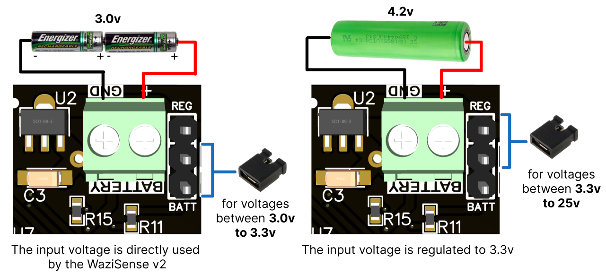


_Figure 24:_ shows the 2 Input voltage configuration

**Note:** Leaving the input voltage jumper in the **BATT **position may damage your board, if a voltage sufficiently above 3.3v is applied.


## 4.5. Battery Charging with Solar

The solar battery charging circuit supports input voltages between 5.2v to 28v and output 4.2v at 4A max. This means that the WaziSense can be used together with most readily available solar panels on the market and the rate of battery charging depends on the solar panel connected.

Users can isolate the solar circuit from the rest of the WaziSense board, in situations where the solar functionality isn't needed or used. This conserves a little more battery power.


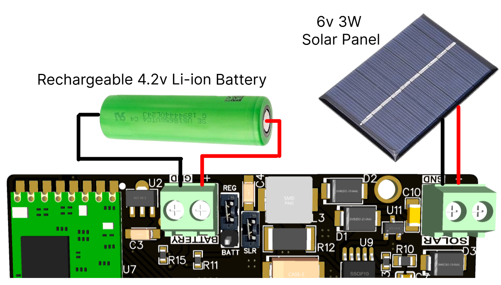


_Figure 25:_ how to connect a rechargeable battery and solar panel

**Note:** When using a solar panel, make sure the battery connected is rechargeable.


## 4.6. Sensor Power Ports

In order to conserve battery energy, sensors can be digitally turned on or off using the sensor power port.

To attach a sensor to the power power port, connect the sensors +/VCC pin to the port labeled + on one of the sensor power terminal blocks. Connect the -/GND pin of the sensor to the port labeled - on the same sensor power terminal block as before.

Users must declare the mosfet control pin to be used, as an OUTPUT pin by pinMode(mosfetPin, OUTPUT);. After pin declaration, perform a digitalWrite(mosfetPin, HIGH);To turn a sensor ON and digitalWrite(mosfetPin, LOW); to turn sensors OFF as shown below


_Figure 16:_ how to declare mosfet pin


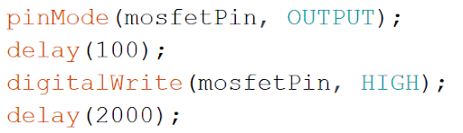


_Figure 26:_ how to turn the power port D6 ON

**NOTE: **


1. **mosfetPin **is a variable for either digital pin** 6 **or **7**
2. Perform at least **2 seconds delay** after turning ON sensors. This will allow enough time for the sensors to be ready and respond to queries.


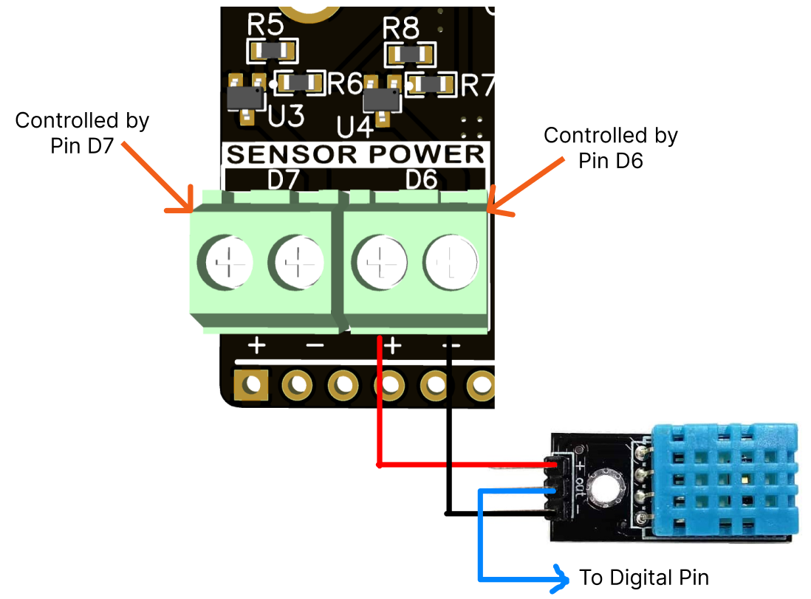


_Figure 27:_ how to connect a sensor to the power ports


### 4.6.1. Output Voltage For Sensor Power Port 


    Occasionally users might want to connect sensors or peripherals that may draw high sudden currents during operation. The high sudden currents can be provided by the connected battery or power source directly by configuring the **H1** sensor power jumper. 
 
By setting the H1 jumper to the **BATT **position, sensors or peripherals attached to both sensor power terminal blocks will directly access the voltage of the battery or power source connected to the board. For sensors that need 3.3v volts, the H1 jumper can then be set to the **3.3v** position.


     
**NOTE:** make sure attached sensors or peripherals can handle the voltage supplied to the WaziSense when the H1 jumper is set to the **BATT **position.


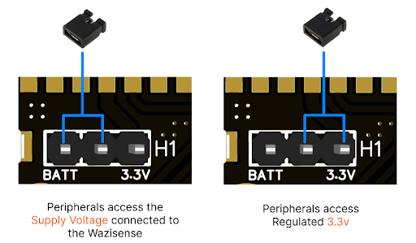


    _Figure 28:_ how to configure H1 jumper for sensors or peripherals


## 4.7. Analog and Digital Sensor Ports


### 4.7.1. Using Digital Sensors

To use a digital sensor such as a DH11 with the WaziSense v2:


1. First connect your sensor's power pin to a sensor power port.
2. Then connect the signal output of the sensor to a digital pin of your choice.

    


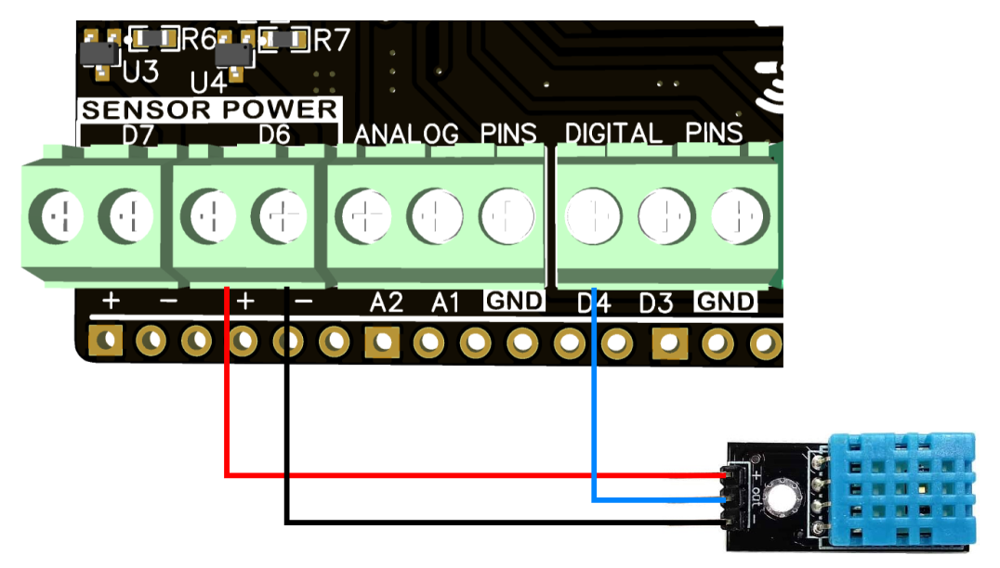


    _Figure 29:_ DH11 in use on digital pin 4 and power port D6

3. Connect an FTDI programmer to the FTDI port of the WaziSense v2. See “section 7.2” under “Peripheral Interfaces” of this documentation to learn about using an FTDI
4. Open the sketch for the sensor in question and make the necessary sketch modifications to match the pin used(there are some sample sketches for sensors in the Waziup Resources)


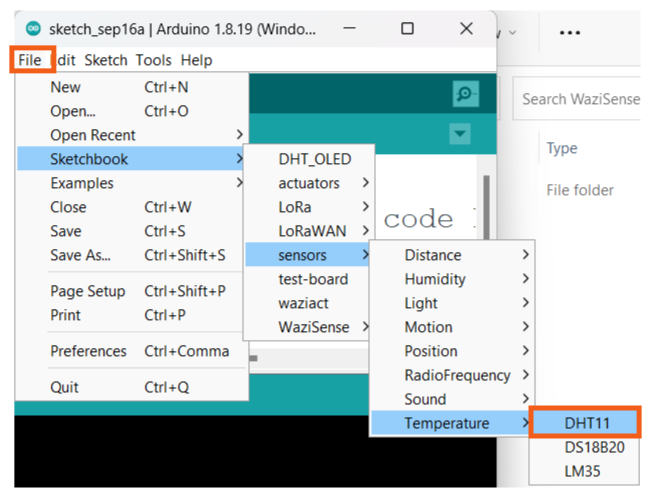


    _Figure 30:_ Loading up DH11 sketch from Waziup Resources

5. Add the needed commands for turning ON the Sensor Power Port in use as specified under section “**4.6 Sensor Power Ports**”
6. Install the needed libraries for the sensor in question. In this case, the DHT11 by using the Arduino “**Libraries Manager**”.

    


    _Figure 31:_ Loading up the Arduino Libraries Manager


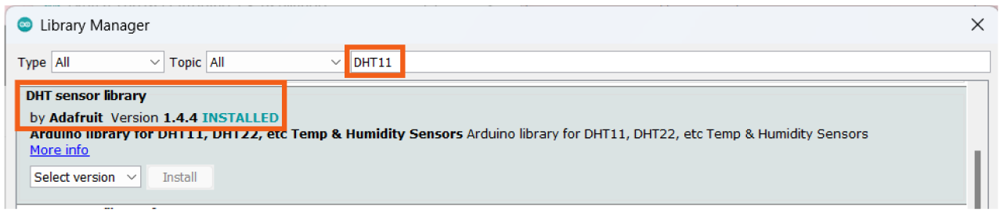


    _Figure 32:_ Searching for and Installing the DHT11 library by Adafruit

7. Make sure the correct target board is selected as specified under section “4.2 Uploading to the Right Board“ of this documentation.
8. Finally, upload your sketch to the WaziSense.

    The final code for the DHT11 connection in figure 20 above should look like this.


 ```c
#include "DHT.h"

DHT dht(4, DHT11);
int mosfetPin = 6;

void setup() {
  Serial.begin(9600);

  pinMode(mosfetPin, OUTPUT);
  delay(100);
  digitalWrite(mosfetPin, HIGH);
  delay(2000);

  dht.begin();
}

void loop() {
  // Wait a few seconds between measurements.
  delay(2000);

  float h = dht.readHumidity();
  float t = dht.readTemperature();
  
  // Check if any reads failed and exit early (to try again).
  if (isnan(h) || isnan(t)) {
    Serial.println(F("Failed to read from DHT sensor!"));
    return;
  }

  Serial.print("Hum: ");
  Serial.print(h);
  Serial.print("%  Temp: ");
  Serial.print(t);
  Serial.println("°C ");
}
```


    After uploading the above sketch, the serial monitor should begin to display temperature and humidity sensor data at a 2 seconds interval.


    _Figure 33:_ Serial monitor showing DHT11 sensor data


### 4.7.2. Using Analog Sensors


    To use an analog sensor such as a soil moisture sensor with the WaziSense v2


1. First connect your sensor's power pin to a sensor power port.
2. Then connect the signal output of the sensor to an analog pin of your choice.

    


    _Figure 34:_ DH11 in use on digital pin 4 and power port D6

3. Connect an FTDI programmer to the FTDI port of the WaziSense v2. See “section 7.2” under “Peripheral Interfaces” of this documentation to learn about using an FTDI
4. Open the sketch for the sensor in question and make the necessary sketch modifications to match the pin used(there are some sample sketches for sensors in the Waziup Resources)

    


    _Figure 35:_ Loading up Soil Moisture sketch from Waziup Resources

5. Add the needed commands for turning ON the Sensor Power Port in use as specified under section “**4.6 Sensor Power Ports**”.
6. Make sure the correct target board is selected as specified under section “**4.2 Uploading to the Right Board**“ of this documentation.
7. Finally, upload your sketch to the WaziSense.

    The final code for the Analog Sensor connection in figure 25 above should look like this.


```c
/********************
 * Soil humidity sensor tester
 * Read soil humidity by measuring its resistance.
 ********************/

int sensorPin = A2;
const int mosfetPin = 6;

void setup() {
  Serial.begin(9600); 
  
  pinMode(mosfetPin, OUTPUT);
  delay(100);
  digitalWrite(mosfetPin, HIGH);
  delay(2000);
}

void loop() {
  float soilHumidity = analogRead(sensorPin);
  
  //The Higher the analog reading, the less water.
  //1023 for DRY
  //0 for So Much Water

  Serial.println(soilHumidity);
  delay(1000);
}
```


    After uploading the above sketch, the serial monitor should begin to display soil moisture data at 1 second intervals.


    


    _Figure 36:_ Serial monitor showing soil moisture sensor data


    _Figure 37:_ 3 extra analog pins A3, A6 and A7 on the WaziSense


## 4.8. Onboard LED

The OnBoard LED is attached to digital pin 8. As such it can triggered by using any generic blink sketch as shown below;


```c
const int onboardLED = 8;

void setup() {
  // initialize digital pin LED_BUILTIN as an output.
  pinMode(onboardLED, OUTPUT);
}

// the loop function runs over and over again forever
void loop() {
  digitalWrite(onboardLED, HIGH);   // turn the LED on
  delay(1000);                      // wait for a second
  digitalWrite(onboardLED, LOW);    // turn the LED off 
  delay(1000);                      // wait for a second
}
```


_Figure 38:_ WaziSense onboard LED blinking


## 4.9. Reading Battery Voltage

The WaziSense v2 can read the voltage of any battery connected to it. There are two approaches as shown in_ figure 29 _below.


1. Set the input voltage jumper to **REG **position as illustrated by setup **B** in _figure 29_ below, if the battery to be used is rechargeable and has an output voltage higher than 3.3v when fully charged. Otherwise setup A can be used.


_Figure 39:_ 2 AA or Rechargeable batteries connected to WaziSense board


2. Add the “**Arduino_Vcc**” library [here](https://github.com/NerdBishop/Arduino/tree/9a5891c8b253b1183a5c4502010e7921c17b52a5/READ_BATTERY_VOLTAGE) to your arduino libraries folder.

    


_Figure 40:_ Arduino_Vcc library in local Arduino libraries folder


3. Add the READ_BATTERY_VOLTAGE file to the local Arduino examples folder

    


_Figure 41:_ Read_Battery_Voltage sketch in local Arduino examples folder


4. Under the File Menu, navigate to Sketchbook, locate and open the READ_BATTERY_VOLTAGE sketch sample.

    


_Figure 42:_ using the provided sample sketch to read battery voltage

The sketch should look like this.


```c
////////////////////////////////////////////////
//This code was inspired by:
//https://github.com/Yveaux/Arduino_Vcc
//I made a few modifications to read out the voltage of batteries attached to the arduino.
//The positive terminal of the battery should be connected to Analog pin A0 through a voltage divider(both R1 & R2 are 10k ohms each)
//NOTE: 1. Always make sure both R1 & R2 resistors have the same ohm values(even if you use resistor values of your choice)
//      2. Add the Vcc.h and Vcc.cpp files to your Arduino libraries folder before uploading
//visit https://www.youtube.com/delali to learn more about electronics and building smart things from scratch
////////////////////////////////////////////////

#include <Vcc.h>

//MORE DECIMAL PLACES LEAD TO MUCH ACCURATE BATTERY READING(thus for VccMax and VccCorrection)
const float VccMin   = 0.0;           // Minimum expected Vcc level, in Volts.
const float VccMax   = 3.319;         // Maximum expected Vcc level, in Volts(Use a multimeter to measure the maximum output voltage of your regulator. Thus when you connect a fully charged battery to it).
const float VccCorrection = 0.9825;  // Tweak this value until the output of "v" on line 38 is the same as what you measured with your multimeter above for VccMax

const float lowBat = 2.9; //Indicate the value your battery manufacturer states as absolutely dead battery
const float fullBat = 4.2; //Indicate the value your fully charged battery will be at

Vcc vcc(VccCorrection);

//BATTERY IS CONNECTED TO A0
int batt_pin = A0;

void setup() {
  Serial.begin(9600);
}

void loop() {
  //READ CURRENT REGULATOR OUTPUT VOLTAGE(VCC)
  //COLLECT 100 VCC VOLTAGE SAMPLES
  int j;
  float v = 0;
  for (j = 0; j < 100; j++) {
    v += vcc.Read_Volts();
    delay(5);
  }

  //FIND AVERAGE OF 100 VCC VOLTAGE SAMPLES
  v = v / j;

  //PRINTING AVERAGE OF 100 VCC VOLTAGE SAMPLES TO 3 DECIMAL PLACES
  Serial.println();
  Serial.print("VCC: ");
  Serial.println(v, 3);

  
  //COLLECT 100 BATTERY VOLTAGE SAMPLES
  int i;
  float batt_volt = 0;
  for (i = 0; i < 100; i++) {
    //USING THE CURRENT VCC VOLTAGE AS REFERENCE TO CALCULATE BATTERY VOLTAGE
    batt_volt += ((analogRead(batt_pin) * (v / 1023.0)) * 2);
    delay(5);
  }

  //FIND AVERAGE OF 100 BATTERY VOLTAGE SAMPLES
  batt_volt = batt_volt / i;

  Serial.print("Battery: ");
  Serial.print(batt_volt, 2);
  Serial.print("V ");
  //CONVERTING BATTERY VOLTAGE TO PERCENTAGE ASSUMING 4.19V AS THE FULL CHARGE VALUE
  Serial.print(((batt_volt - lowBat )/ (fullBat - lowBat)) * 100);
  Serial.println("%");

  delay(100);
}
```


5. Make sure to set the low and full battery voltage in the sketch sample provided above. 


_Figure 43:_ low and full battery voltages of Li-ion or Li-po battery set in sketch


6. The arduino serial monitor will begin to print out the attached battery voltage with corresponding state of charge percentage as shown below.


_Figure 44:_ Arduino serial monitor displaying battery voltage and percentage


# 5. Peripheral Interfaces


## 5.1. I2C Port

The I2C SDA and SCL terminal block is wired to the pins A4 and A5 of the Atmega328p respectively. 


_Figure 45:_ I2C Port pinout on WaziSense

**NOTE:** The SDA and SCL ports can be used as regular analog pins. That is A4 and A5 as shown in figure 29 above.


## 5.2. FTDI Port

The FTDI port is used to program the ATmega328p microcontroller. It is advised to use an **FT232RL **FTDI programmer because its pins are already aligned with the WaziSense v2 FTDI port.

**NOTE: **Make sure to set the FTDI modules’ voltage output to 3.3v, using the provided jumper on the FTDI board. The ATmega328p on the WaziSense v2 is **NOT **5v tolerant.


_Figure 46:_ how to connect an FTDI to the WaziSense

**Alternately**, If users don't have an FT232RL FTDI programmer, they can still use any other TTL to USB programmer. The wiring should be connected as shown below:


_Figure 47:_ how to use other FTDIs with the WaziSense


## 5.3. SPI Port

The WaziSense v2 SPI layout is similar to what is found on many development boards, including the arduino uno, mega etc.. Therefore the WaziSense v2 SPI header is compatible with existing modules in the arduino ecosystem.


_Figure 48:_ Wazisense SPI header layout

The onboard LoRa RFM95W communicates with the ATmega328p over SPI, therefore users who wish to use SPI port with the ATmega328p chip, need to remove the lead/solder material bridging each pair of pads to open the MI_J, MO_J and SCK_J jumpers connections located on the back of the WaziSense v2.


_Figure 49:_ Wazisense ATmega328p SPI to RFM95W connection pads


## 5.4. IPEX Antenna Port

To use the WaziSense for Lora communication, there is a need to connect an antenna. A **Female UFL to Female SMA** connector and** **an **antenna with a Male SMA** connector is needed. The aforementioned parts need to be connected to the Wazisense as shown below. 
 


_Figure 50:_ How to connect an antenna to the WaziSense


## 5.5. Prototyping Area

The prototyping area on the WaziSense v2 serves as a simple way to add extra components such as resistors, diodes etc.. to the WaziSense v2 board during prototyping/testing/deployment.

All the **square-shaped** holes are connected to ground. However every other hole in the prototyping area isn't connected to anything. The user decides what to connect the holes to or how to use them.


_Figure 51:_ WaziSense Prototyping area highlighted in orange rectangle
