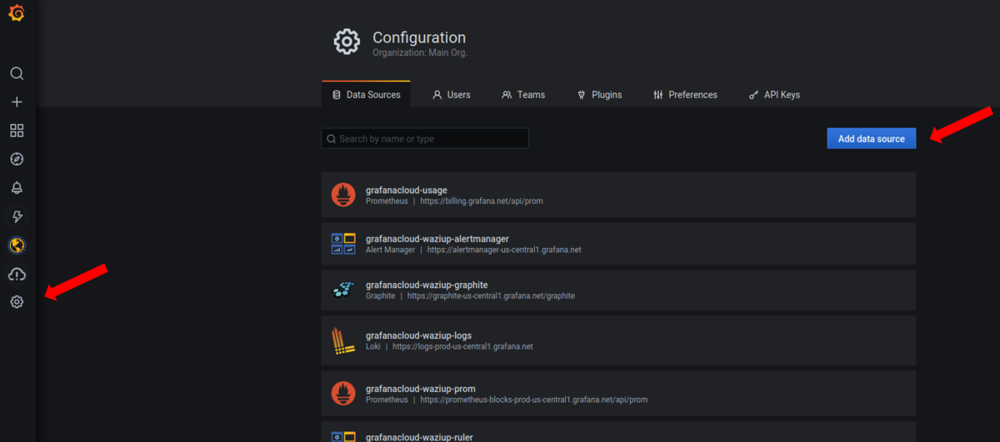
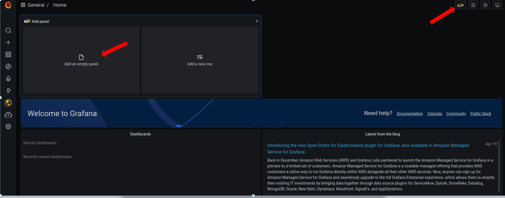
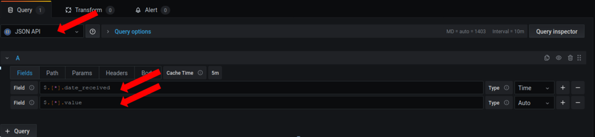
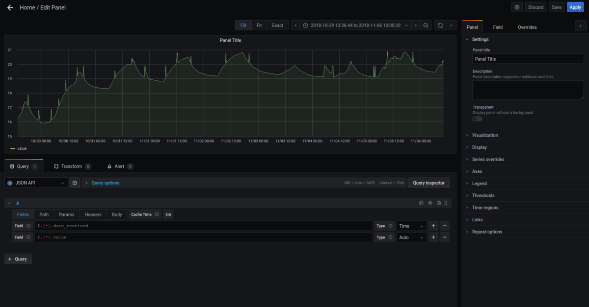
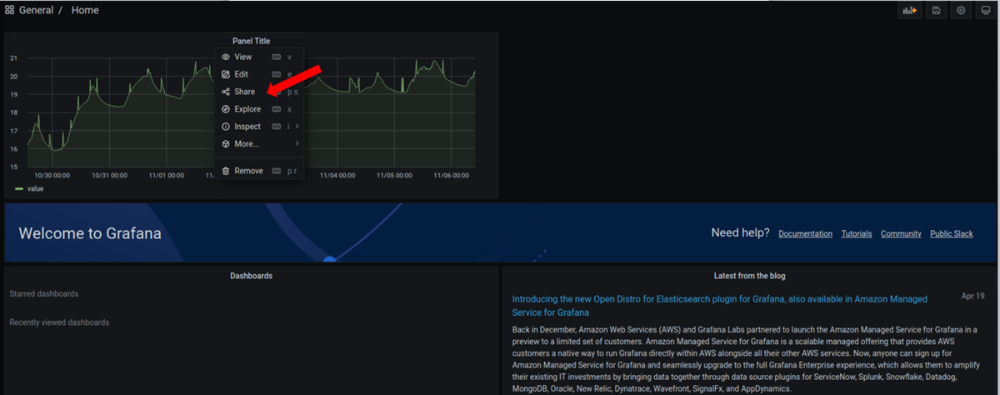

# Introduction

In this tutorial, we will connect an external Cloud to WaziCloud API.

# Grafana

## Data source

https://api.waziup.io/api/v2/devices/UPPA-TESTS_Sensor3/sensors/TC2/values

## Panel

## Embbeding

