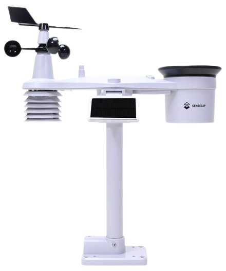

# Introduction

Starting Feb. 2023 Waziup started collecting weather data from a weather station in Sbeitla, Tunisia. The data is collected every 5 minutes from a remote wather station and transmitted to a [WaziGate](https://lab.waziup.io/resources/waziup/wazigate) nearby. The data is available for free for everyone.

## Installation of Waziup e.V.'s sensor system on Farms in Tunisia

As part of the Osirris project, Dr.-Ing. Abdur Rahim, Felix Markwordt and Dr.-Ing. Corentin Dupont visited Tunisia in December 2022 to install Waziup e.V. ’s sensor system on two farms. Each farm received one WaziGate and four microcontrollers equipped with sensors to collect and temporarily store data, which was later sent to WaziCloud for further analysis. These data were essential to train regression models.

The first installation took place in Sidi Thabet, where durum wheat was grown, followed by the Agricultural Training center of Sbeitla CFPA, where several apple varieties were cultivated. However, the sensor readings could not be used until the beginning of February due to power outages and other issues. Additionally, the lack of Wi-Fi at the Cherfech farm made it challenging to synchronize with waziCloud.

Although the installation of WaziGate was a great success, the team has decided to establish a GSM connection in future deployment to enhance internet connectivity and achieve better results and readings.

Adding a GSM connection to WaziGate can help to improve connectivity, increase data throughput and expand the reach of IoT solutions. With the right setup and configuration one can ensure that WaziGate is always connected and ready for insights and data you need to drive your project/business forward.

During the first visit to Tunisia, in December 2022, Dr.-Ing Abdur Rahim, Felix Markwordt, and Dr.-Ing Corentin Dupont installed the system on two different farms. For this purpose, one WaziGate and four microcontrollers with the corresponding sensors developed by Waziup e.V. were installed on each farm. In this way, the values can be temporarily stored on the WaziGate and sent to WaziCloud. This data must be collected in order to train regression models. The deployments took place firstly in Sidi Thabet in Cherfech, where durum wheat is grown. Secondly, in the "Agricultural Training Center of Sbeïtla CFPA", where different apple varieties are cultivated for the most part.

As previously mentioned, the two systems were installed on the farms to collect sensor readings. These data are part of the training data to build regression models. Since some problems, for example power outages, occurred, the data can only be used from the beginning of February.

https://www.waziup.io/research-innovation/projects/osirris/

# SenseCAP S2120 Weather Station

SenseCAP LoRaWAN S2120 Weather Station collects and uploads air temperature, humidity, wind speed/direction, Rainfall Intensity, light intensity, UV index, and barometric pressure data supported by worldwide LoRaWAN networks. The S2120 weather station is suitable for applications in gardens, agriculture, meteorology, urban environmental monitoring, and other scenarios. It also enables low maintenance cost for its ultra-low power consumption, reliable performance, built-in Bluetooth for OTA configuration and remote device management.

https://www.seeedstudio.com/sensecap-s2120-lorawan-8-in-1-weather-sensor-p-5436.html

# Location

Sbeitla or Sufetula is a small town in west-central Tunisia. Nearby are the Byzantine ruins of Sufetula, containing the best preserved Byzantine forum temples in Tunisia. It was the entry point of the Muslim conquest of North Africa.

Sbeitla is the capital of the largest delegation in Kasserine Governorate with an area of 1133.5 km². It is located in 33 km in the west of the governorate, and 264 km to Tunis. It has a population of 23,844 (2014 estimate). Sbeitla is mentioned in Norman Douglas's Fountains in the Sand as being wooded by junipers and Aleppo pines as late as the 19th century, though he found them "bleak and bare" in the early 20th century.

https://www.google.de/maps/place/Sbeitla,+Tunesien

# Data Files

Data has been binned to a 10 minute interval. It is available as CSV file.

- [Sbeitla CSV Dataset File 2023](dataset.csv)

Temperatures are in `°C`, Soil Tension in `hPa`.
