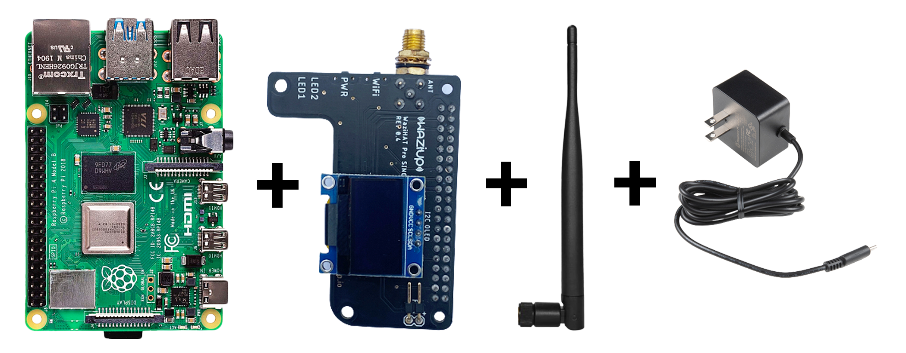

# Introduction
WaziGate is a IoT LoRa Gateway, ideal for all your remote IoT applications. The Gateway can cover up to 100 IoT Sensors and actuator nodes using LoRa radio network: Weather stations, soil monitoring, GPS applications… The possibilities are endless! The Gateway can also control your actuators, such as electro-valves. You can host your own applications directly in the gateway, and connect to it through WiFi. The gateway can easily work without Internet connectivity and still provides data to end-users through its embedded database and web-based visualization module. The WaziGate features:



You can find all the WaziGate documentation here:

Quick start
Installation
LoRaWAN
WaziGate Apps

Overview
========

This document will guide you through the steps to assemble your Wazigate and configure it in order to connect to the Waziup Cloud.
This documentation is available in [PDF format](/docs/WaziGate_User_Manual-V1.0.pdf).

Prepare the Gateway Hardware
============================

If you have a Raspberry PI and want to setup your WaziGate yourself this section is for you.
If you already have your Wazigate in a box, just [skip](#flash-the-wazigate) this section.

What do you need to start?
--------------------------

You need the following *hardware* to start:

- A Raspberry Pi (Model 3B+ is recommended)
- An SD card (minimum 8 GB)
- A power supply for the raspberry pi (usually 5.1V, 2+A)
- A LoRa antenna
- A LoRa Hat such as WaziHat


You also need the following *software*:
 
- [Wazigate ISO image](https://downloads.waziup.io/WaziGate_latest.zip)
- [Balena Etcher](https://www.balena.io/etcher/)

Assemble the WaziGate
---------------------

There are only two simple steps to assemble your WaziGate.

{}
**Step \#1:** Attach the heat sinks. 
{}

As WaziGate can perform Edge processing on you data, it is always a good idea to attach heat sinks in order to avoid overheating.
Raspberry PI can have 3 heatsinks, on the 3 processors.


{}
**Step \#2:** Mount a WaziHat on the Raspberry PI.
{}

Be careful to align correctly the pins in the arrays.


{}
**Note:** If you do not have a ***Wazihat*** board and want to use your own LoRa module, please refer to [this documentation](https://github.com/CongducPham/tutorials/blob/master/Low-cost-LoRa-GW-step-by-step.pdf).
{}


Flash the WaziGate 
------------------

{}
**Step \#1:** Download the latest version of the [Wazigate ISO image](https://downloads.waziup.io/WaziGate_latest.zip).
{}


{}
**Step \#2:** Download [Balena Etcher](https://www.balena.io/etcher/) and install it on your PC.
{}


{}
**Step \#3:** Open the ***Balena Etcher*** tool and select the downloaded zip file.
{}


{}
**Step \#4:** Insert your SD card to your PC and when appear, select it in **Etcher**
{}


{}
 **Warning:** Your Micro SD card must be at least **8 GB**. **16 GB** is better.     
{}
          
If your laptop does not have the SD card reader, you need a USB adapter to connect your Micro SD card to your PC.  

{}
**Step \#5:** Click on **Flash** to start flashing.
{}


{}
**Step \#6:** When Flashing is done, remove your Micro SD card and insert it into your raspberry pi.
{}


Congratulations! Your hardware is now ready.


Powering up Wazigate
--------------------

{}
**Step \#1:** Attach the antenna
{}

{}
**Very Important**: always connect the antenna first, before powering up your device.
{}


{}
**Step \#2:** Plug the power cable (micro usb) into the gateway and plug the adapter to the outlet.
{}


You should see a light is on and another light next to it is actively blinking.


Configuration
=============

Find the Wazigate Web UI
------------------------

{}
**Step \#1:** Find the wazigate hotspot
{}

When you power up Wazigate for the first time, it usually does some self-configs and reboots itself.
So, be patient, it might take a couple of minutes for you to see the Wazigate WiFi hotspot to connect to.                  
                                
The WiFi hotspot has a similar name of what you see in the photo: ***WAZIGATE\_XXXXX***. 
XXXXX usually is the ID of your gateway.                   


{}
**Step \#2:** Connect to the Wazigate WiFi hotspot
{}


The default password for the hotspot is ***loragateway***            
Enter the password and click on connect.                        
                                
{}
**Step \#3:** Open the Wazigate Web UI.
{}

Wazigate is configured through a web user interface.
When you connect to the Wazigate hotspot, you need to open your browser and go to one of the following addresses:

- [http://10.42.0.1](http://10.42.0.1)
- [http://wazigate.local/](http://wazigate.local/)

Then you should see something like this.


Please enter the default username and password and click on **Login**.

{}
For security reasons, please change the default password as soon as you can see the profile page.
This page can be found in the "User Profile" menu.
{}


Connecting to the Internet
--------------------------

{}
**Step \#1:** Select menu Settings/Wifi.
{}

A list of available Wifi networks will show up:


Once Wazigate found all the available WiFi networks in range, click on the network that you want to connect to.

{}
**Step \#2:** Enter the password for that network and click on "connect".
{}


{}
**Warning:** Once you setup your WaziGate to connect to a WiFi network, you will lose the Hotspot connection.
{}

If you enter your WiFi password correctly and the internet is available, after a few minutes you will be able to see it in your WaziCloud dashboard.

{}
**Note:** If Wazigate does not manage to connect to your WiFi due to wrong credentials or not being in the range of the WiFi router, it will rollback to the hotspot mode and you need to connect to it again and start over. *This might take a few minutes depending on the router.*
{}

Registration with the Cloud
---------------------------

{}
If you do not have an account on [Waziup dashboard](https://dashboard.waziup.io/), you need to create one first.
{}

A Waziup account enables you to receive all your sensor data in your dashboard and manage your Wazigate remotely.

{}
**Step \#1:** Clik on the **Sync** menu.
{}


{}
**Step \#2:** Enter you Cloud Username and Password and click Save.
{}

{}
You need to enter your CLOUD login/password, collected on https://dashboard.waziup.io/. 
Do not enter your gateway password here.
{}


{}
**Step \#3:** Flip the Active Sync ON.
{}


If you receive an error message, it mean either you enter a wrong login/password, or you are not connected to internet.

Connect to your gateway
-----------------------

At this stage, your gateway should have access to internet. However in order to connect to it,we need to find its IP.
If you have OLED installed on raspberry pi the IP will be shown directly on the screen


Otherwise you can find it by following this simple tutorial:
- Download AngryIP Scanner [here](https://angryip.org/download)
- Connect your PC/Laptop on the same Wi-Fi that the raspberry pi is connected to
- Scan the IPs

The IP of the gateway should be in the result


Use a web browser on your laptop and open http://<gateway IP>

Verify Gateway Registration
---------------------------

{}
**Step \#1:** Open the waziup dashboard
{}

Go to the [Waziup](https://waziup.io) website.


{}
**Step \#2:** Click on "Go to Dashboard" and enter your credentials and Login.
{}


{}
**Step \#3:** Click on Gateways.
{}


If everything went well so far, you should see your gateway in the list.

{}
**Step \#4:** Click on your gateway.
{}

Your gateway details will open.

{}
**Step \#5:** Then click on the "Remote access" button.
{}


{}
**Step \#5:** Logging into your Wazigate.
{}


If you see something like this, then Congratulations! :) You made it.                   
Now you can simply manage your gateway remotely through your Waziup dashboard.

Annex
=====

Connect with Ethernet cable to PC
---------------------------------

This section will guide you to connect your Wazigate to your PC using an Ethernet cable.
**This is needed only if you want to connect your gateway to your PC directly with an ethernet cable**.

You should have the following hardware:

- A Waziup gateway with power cable (mini USB)
- A laptop/PC with an RJ45 slot or adapter
- A RJ45 cable (simple network cable)
- Internet access on your laptop/PC

First, connect the RJ45 cable between your laptop/PC and the WaziGate.

In order to connect from your computer to the WaziGate, we need to activate the DHCP service on your computer.
The local DHCP will attribute an IP address to the WaziGate.
This option is usually called "Share the internet connection" on your computer.
The following sections show the procedure for Windows, Mac and Linux.

### Windows

On Windows, do the following:

{}
**Step \#1:** Open Control panel.
{}

Press  shortcut key combination Windows + R , type “control” and click ok button


Here click on "Network and Internet" menu and then "Network and sharing center".

{}
**Step \#2:** Select sharing connection.
{}

Click on your internet connection and go to “Properties”.


{}
**Step \#3:** Allow sharing connection.
{}

Switch to the “Sharing” tab and check the box to allow other users to connect to the internet through your computer.


The WaziGate should now have an IP. You can connect to it using this link: http://wazigate.local.


### Linux

On Linux, do the following:

{}
**Step \#1:** Open connection editor.
{}

Open the connection editor  through the terminal using the comand:
```
  nm-connection-editor
```
<br>

If `nm-connection-editor` if not present, you need to install it.

{}
**Step \#2:** Sharing connection.
{}

When it opens, select the wired connection item, clicking the edit button. In that menu, switch to the IPv4 tab, and select the method: ‘shared to other computers’


After that, save everything and connect your cable if you haven’t already, and DHCP should kick-in and set everything up for you.

The WaziGate should now have an IP. You can connect to it using this link: http://wazigate.local.

**Note:** if you need to get the IP address of the connection, you can use ifconfig. You’ll only need this if DHCP doesn’t automatically configure everything.

### Mac

On Mac, do the following:

{}
**Step \#1:** Open Sharing menu.
{}

-	Open System Preferences. It’s typically found on your dock, if not, it’s in your Applications folder.
-	In System Preferences, under Internet & Wireless, go into the Sharing menu.

{}
**Step \#2:** Sharing connection.
{}

In the Sharing menu, choose Internet Sharing from the list on the left. You will see Internet Sharing options.


Select to share your connection from Wi-Fi, to computers using Ethernet.
After that, click on the Internet Sharing checkbox to enable the service.

The WaziGate should now have an IP. You can connect to it using this link: http://wazigate.local.

Sensor Device preparation
==================

Once your gateway is all setup, let's receive and send LoRaWAN messages!
You need a LoRa capable device, such as WaziDev.
With WaziDev, you need to install the WaziDev sketchbook, as instructed [here](/documentation/wazidev/user-manual/).

In Arduino IDE, select the `File ▸ Sketchbook ▸ LoRaWAN ▸ Actuation` to open the LoRaWAN Actuation example sketch. You can find this and other Arduino example sketches on our public open-source [Wazidev GitHub repository](https://github.com/Waziup/WaziDev/tree/master/examples) too.

This sketch uses the following technologies and features:

- Creating compact payload from sensor data with XLPP
- Sending data with LoRaWAN encrypted
- Receiving data with LoRaWAN (for actuation)
- Reading LoRaWAN statistics (SNR, RSSI, Time-on-air)

LoRaWAN is a low-power wireless networking protocol with very long range. Sending and receiving data is encrypted, thus requiring you to generate (random) keys for your devices. The Wazidev has a LoRaWAN-chip and a LoRaWAN antenna build in. 

The code looks like this:


You can see 3 values: `DevAddr` (Device Address), `AppSkey` (Application Session Key), `NetSkey` (Network Session Key). They need to be copied in the WaziGate to be recognized.

⚠️ Every device needs to have it's unique `DevAddr` - two devices must not have the same. Change the `DevAddr` digits to a new value for each new device.

⚠️ `AppSkey` and `NetSkey` make your communication secure. Although both keys can be the same, you should select new random keys for each device. Use the Wazigate dashboard to generate new random keys.

Now you can flash this sketch on your Wazidev device.

Don't close the Arduino IDE yet, you will need to copy these 3 values to the Wazigate dashboard next.

Sensing
=======

Once flashed, open the WaziGate UI on http://wazigate.local and first select the "Dashboard" menu entry.
Click on the "Plus" icon at the bottom right:


Enter a device name of your choice:


Once your device is created, click on it to enter that device.
We now need to tell WaziGate that this device is LoRaWAN-able.
Then click on the "three dots" at the top right of the screen, and select "Make LoRaWAN".


Once the device is converted, fill in the three keys, so they are identical with the keys in you sketch.
Once the keys filled in, save.


{}
You need to make 100% sure that the keys are equal. In particular, check that `AppSkey` and `NwkSkey` are not swapped.
{}
Please also make sure that the `DevAddr` is unique, i.e. you don't have two devices with the same `DevAddr`.

You should also select XLPP (or the older LPP) as the payload encoding, as we recommend these low-power payloads for use with the Wazidev. Have a look at our [Arduino XLPP library](https://github.com/Waziup/arduino-xlpp) for example sketches, or check out the [CayenneLPP Arduino library from TheThingsNetwork](https://www.thethingsnetwork.org/docs/devices/arduino/api/cayennelpp/).

Go back to the "Dashboard" main page.


If you device sketch is running, you should already see the value there! Congratulations!

Let's now open the [Cloud dashboard](http://dashboard.waziup.io) and look for you device.
In the "Devices" menu entry, search for you device using the filters.


Here it is! Double congratulations! 
Next steps:
- [develop a Web app reading your sensor](/documentation/wazicloud/customapp/)
- [develop a gateway app](/documentation/wazigate/v2/waziapps/)
- try some actuation (keep reading).

Actuation
=========

Actuation with WaziGate is very easy.
On the WaziDev side, we can keep the same sketch.

First, come back on the device that wen added, click on the bottom right "plus" sign and click on "add actuator":


Select a name for your new actuator:


Your actuator is added, it has no value yet:


Let's go back on the [Cloud dashboard](http://dashboard.waziup.io).
Your actuator should already be there!


Click in and click on the "edit" symbol (a back pen):


Select an actuation type:


Coming back, you can see that the widget for the actuation trigger has changed based on the type that you selected:


For instance here, we selected a "boolean" type, so a switch with two places appeared (true or false).
Go on and trigger it. You just did an actuation! Let's check it.

Come back on the WaziGate UI. Your actuation value came back at the WaziGate:


Finally, let's check your device.
Go back to Arduino IDE and open the serial monitor. 
Your actuation is there! That was quite a ride.


It is now up to you to really make some actuation by reading this value in your code and, for example, ring a buzzer.

**Next steps:**
- [connect a real actuator](/documentation/wazidev/actuators/)
- [trigger actuation from your own app](/documentation/wazicloud/customapp/)


WaziGate Apps
=============

A full video course of some example applications is available [here](/courses/waziapps/).

A tutorial for a computer-vision application is available [here](/courses/waziapps_ai/). 

A tutorial for a Jupyterlab application is available [here](/courses/waziapps_jupyter/).