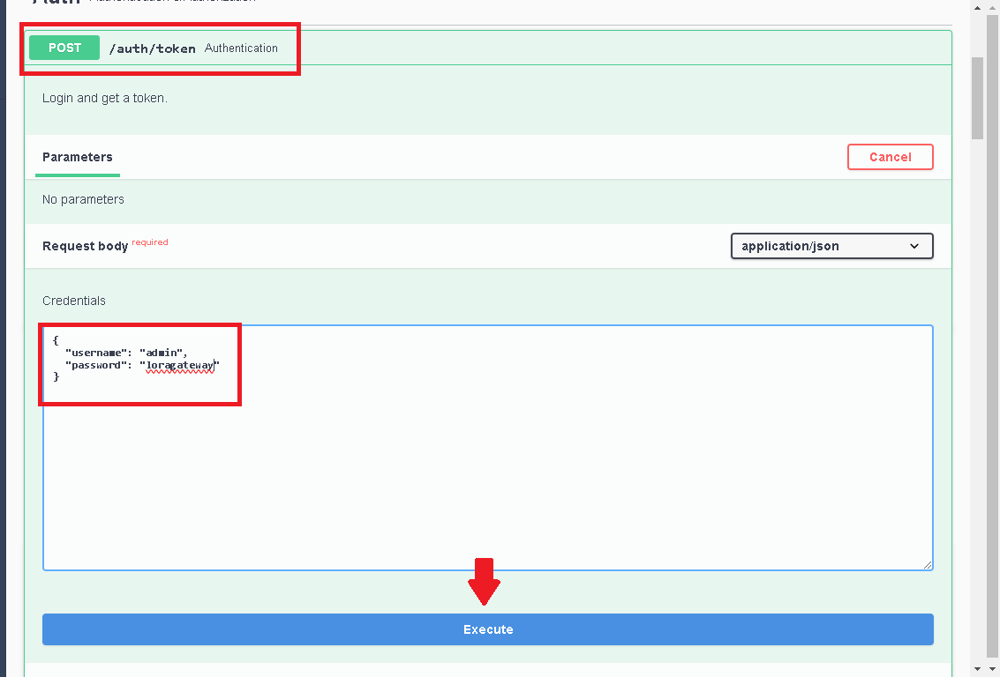
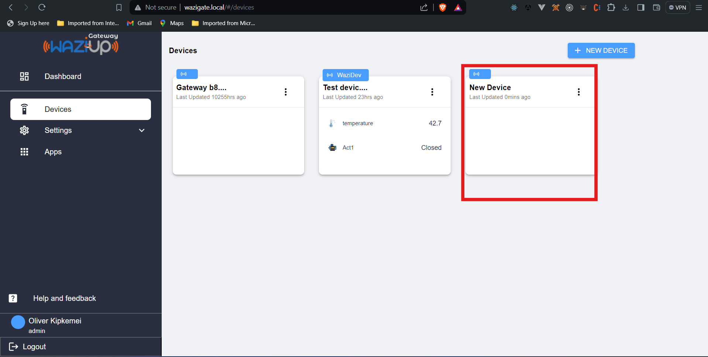
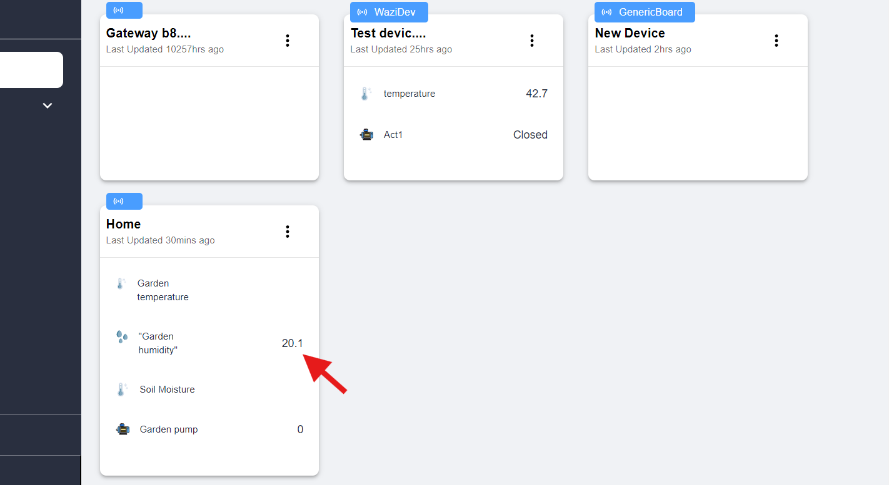
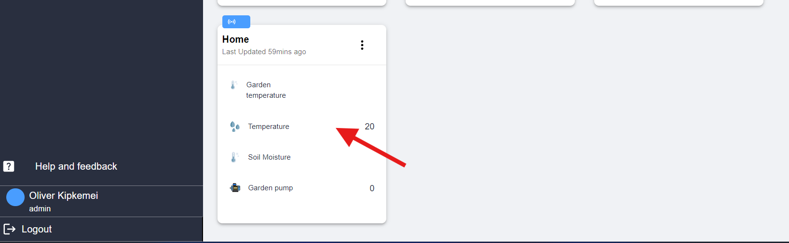

# HTTP REST

## Overview

As a developer, you may need to develop an application that runs on a WaziGate. The WaziGate software enables this by giving programmatic access to all the necessary information using open APIs. For instance, you can get the latest update from the sensors connected to the WaziGate.

The Edge API has been documented using Swagger, API documentation tool, and it is available at http://wazigate.local/#/docs/. You can access this Web UI from a computer that is connected to the same network with a WaziGate. Alternatively, on the [WaziGate Web UI](http://wazigate.local/), you can navigate to `Help` and then `Edge API docs` to access this documentation. No internet connection is required to access this page and the APIs.


On this page, you can explore and interact with all the Edge API endpoints. You can see various API endpoints for token and authorization, devices management, sensors management, actuators management, cloud synchronization management, and Docker images and containers management. These APIs enable you to get access to all the WaziGate features and you can then use them to create an application that runs on the WaziGate (WaziApp).

In this documentation, you will find some examples of how you can use the WaziGate Edge API. In practice, you can make the API calls using any programming language of your choice.


## Authentication

You can request an authentication token for a user using their `username` and `password`. As an example, we can request an authentication token for the default user as shown below.



This will return a token (a big number). This token can be included in all subsequent API calls.


The equivalent cURL command for this request is shown below:

```sh
curl -X POST "http://wazigate.local/auth/token" -H "accept: application/json" -H "Content-Type: application/json" -d "{\"username\":\"admin\",\"password\":\"loragateway\"}"
```

You can use the documentation page to execute various API calls and at the same time to also obtain the equivalent cURL command to execute a certain API. 

For the rest of the examples, we will show some of the cURL commands. However, using the Swagger docs and a programming language of your choice will do the same thing.

## Device management

### Create a device

For demonstration, we will create a device named "New Device" using this command:

```sh
curl -X POST "http://wazigate.local/devices" -H "accept: text/plain" -H "Content-Type: application/json" -d "{\"name\":\"New Device\"}"
```



There are 3 parts to this command:

- the method: `POST`
- the URL: `http://wazigate.local/devices`
- a header: `accept: application/json`
- and the data: `{"name": "New Device"}`

The HTTP protocol supports several methods. The most used are GET, PUT, POST and DELETE. They are used to act on a *resource*. The resource is identified by an URL, here `http://wazigate.local/devices`. The data is the content of the request. 

In the example, the data section contains the name of the device. Finally, the Header provide additional technical information about the request. In this case, we specify that the request data is made with JSON.

Here is another example that creates a device together with its sensors, an actuator and also specifies an [internal Codec](https://github.com/Waziup/wazigate-edge/blob/f3c77c1d12abdceb597a0b0d941c82e61f223d8b/edge/codecs/README.md#internal-codecs) that will be used to decode data in the LoRaWAN payload.

```sh
curl -X POST "http://wazigate.local/devices" -H "accept: text/plain" -H "Content-Type: application/json" -d "{\"name\":\"Garden monitor\",\"sensors\":[{\"name\":\"Garden temperature\",\"kind\":\"AirThermometer\",\"quantity\":\"AirTemperature\",\"unit\":\"DegreeCelsius\"},{\"name\":\"Garden humidity\",\"kind\":\"HumiditySensor\",\"quantity\":\"Humidity\",\"unit\":\"Percent\"}],\"actuators\":[{\"name\":\"Garden pump\"}],\"meta\":{\"codec\":\"application/x-xlpp\"}}"
```


Much more comprehensive! If you check again on the WaziGate Dashboard, you will see a new device with sensors and an actuator. In the command, we provided:

- The `name` of the end-device. As an example, we have named the device as `Garden monitor`.
- The `sensors`. The sensors are the physical sensing components that are connected to an end-device. They are the sources of the data that is transmitted to a WaziGate.
- The sensors names. We can name each sensor that an end-device has. For instance, the `Garden monitor` device has a temperature sensor which we have named as `Garden temperature`.
- The sensor `kind`, `quantity` and `unit`. These parameters are employed on both the WaziGate and WaziCloud to process the sensor readings and display them in a graspable manner on the IoT dashboards. Note that they are only used for visualization and they do not change the value of the data.
- The `actuator`. An actuator is data that is sent back to the end-device by a WaziGate. This data can be used by the end-device to say trigger an actuator such as a pump, or turn on an alarm. An actuator can have various states such as Boolean (true or false). When a WaziGate receives LoRaWAN data (uplink transmission window), it will send back data to the end-device (downlink transmission window) with a new actuator value such as a `true` or `false`. You can then program the end-device to do some operation based on this received data.
- The `codec`. Codecs are used to encode and decode the LoRaWAN data. In this example, we select the XLPP decoder codec. You can also use the Edge API to add more codecs to a WaziGate as shown in this [documentation](https://github.com/Waziup/wazigate-edge/blob/f3c77c1d12abdceb597a0b0d941c82e61f223d8b/edge/codecs/README.md).


### Read a list of devices

We just created a new device! We can get data of devices on a WaziGate by using the example command below:

```sh
curl -X GET "http://wazigate.local/devices" -H "Accept: application/json" 
```


### Read a particular device

If you want to read the data of a single device, use can use the command below:

```sh
curl -X GET "http://wazigate.local/devices/Device_ID" -H "accept: application/json"
```

Replace `Device_ID` in the URL above with the ID of a device present on the WaziGate.
This will return the full information on that particular device. Below, we can see the information of the `Garden monitor` device that was set up in the previous step.

```json
{
  "actuators": [
    {
      "created": "2023-10-30T09:58:05.756Z",
      "id": "653f7e2d26c04728683a97c1",
      "meta": {
        "kind": "Motor",
        "quantity": "Boolean"
      },
      "modified": "2023-10-30T12:45:23.421Z",
      "name": "Garden pump",
      "time": null,
      "value": null
    }
  ],
  "created": "2023-10-30T09:58:05.756Z",
  "id": "653f7e2d26c04728683a97be",
  "meta": {
    "codec": "application/x-xlpp"
  },
  "modified": "2023-10-30T09:58:05.756Z",
  "name": "Garden monitor",
  "sensors": [
    {
      "created": "2023-10-30T09:58:05.756Z",
      "id": "653f7e2d26c04728683a97bf",
      "kind": "AirThermometer",
      "meta": {
        "kind": "AirThermometer",
        "quantity": "AirTemperature",
        "unit": "DegreeCelsius"
      },
      "modified": "2023-10-30T10:00:31.271Z",
      "name": "Garden temperature",
      "quantity": "AirTemperature",
      "time": null,
      "unit": "DegreeCelsius",
      "value": null
    },
    {
      "created": "2023-10-30T09:58:05.756Z",
      "id": "653f7e2d26c04728683a97c0",
      "kind": "HumiditySensor",
      "meta": {
        "kind": "HumiditySensor",
        "quantity": "Humidity",
        "unit": "Percent"
      },
      "modified": "2023-10-30T10:00:41.4Z",
      "name": "Garden humidity",
      "quantity": "Humidity",
      "time": null,
      "unit": "Percent",
      "value": null
    }
  ]
}
```

With respect to device creation, three additional fields are returned: `created`, `modified` and `value`.
`created` and `modified` are the dates at which the device was created, and last modified, respectively.
`value` contains the information about the last data-point that was pushed to a sensor (see Section "Push data to a sensor" below).

If the device ID doesn't exist, an error "404" will be returned.

### Update your device

Let's say that you want to update the name of a device. We can use the device ID to do this. The device ID comes after "devices/" in the URL.

The command below changes the name of a device. First, we obtain a token for a WaziGate user and then we use that token in the request to update the device's name. In the command below, we rename the device (Garden monitor) that was created in the previous step.

```sh
TOKEN=`curl -X POST "http://wazigate.local/auth/token" -H "Content-Type:application/json" -d {"username":"admin","password":"loragateway"}'`
curl -X POST "http://wazigate.local/devices/653f7e2d26c04728683a97be/name" -H  "accept:application/json" -H "Authorization:Bearer $TOKEN" -H  "Content-Type:text/plain" -d "Home"
```


Notice that we used the "POST" method and added "/name" at the end of the URL. This device's name will be updated to "Home". You can modify individually any field in the device this way.

Similarly, sensors can also be modified. For this, we use the sensor ID and put it after "/sensors/" in the URL. In the example command below, we change the sensor name of the "Home" device to "Temperature":

```sh
TOKEN=`curl -X POST "http://wazigate.local/auth/token" -H "Content-Type:application/json" -d '{"username":"admin","password":"loragateway"}'`
curl -X POST "http://wazigate.local/devices/653f7e2d26c04728683a97be/sensors/653f7e2d26c04728683a97bf/name" -H  "accept:application/json" -H "Authorization:Bearer $TOKEN" -H  "Content-Type:text/plain" -d "Temperature"
```

## Sensors and actuators management

### Create sensors

Sensors can be added individually, even after the device has been created. We use the device ID to add sensors to a device.

This is an example of a sensor creation for the "Home" device that was created in the previous step:

```sh
TOKEN=`curl -X POST "http://wazigate.local/auth/token" -H "Content-Type:application/json" -d '{"username":"admin","password":"loragateway"}'`
curl -X POST "http://wazigate.local/devices/653f7e2d26c04728683a97be/sensors" -H  "accept:application/json" -H "Authorization:Bearer $TOKEN" -H  "Content-Type:application/json" -d "{\"name\":\"Soil Moisture\"}"
```


### Read a sensor

This is an example of a reading the data of a single sensor. We use the device ID and sensor ID in the URL.

```sh
curl -X GET "http://wazigate.local/devices/653f7e2d26c04728683a97be/sensors/653f7e2d26c04728683a97bf" -H "accept: application/json"
```

This will return the data for the "Temperature" sensor that is for the device named "Home", which was created in the previous step.

```json
{
  "created": "2023-10-30T09:58:05.756Z",
  "id": "653f7e2d26c04728683a97bf",
  "kind": "AirThermometer",
  "meta": {
    "kind": "AirThermometer",
    "quantity": "AirTemperature",
    "unit": "DegreeCelsius"
  },
  "modified": "2023-10-30T18:54:25.559Z",
  "name": "Temperature",
  "quantity": "AirTemperature",
  "time": null,
  "unit": "DegreeCelsius",
  "value": null
}
```

Among the data returned, you may see the last value (`value`)that the sensor received; if there is data that was pushed to that sensor. If you want to get several sensor values at once, please refer to the section "Read sensor values".

## Push data to a sensor

You can push a new data-point to a sensor.

For example, here is how you can push the value 20.1 to sensor "Temperature" of device "Home", using the JSON format:

```sh
TOKEN=`curl -X POST "http://wazigate.local/auth/token" -H "Content-Type:application/json" -d '{"username":"admin","password":"loragateway"}'`
curl -X POST "http://wazigate.local/devices/653f7e2d26c04728683a97be/sensors/653f7e2d26c04728683a97bf/value" -H  "accept:application/json" -H "Authorization:Bearer $TOKEN" -H  "Content-Type:application/json" -d "{\"value\":20.1,\"time\":\"2023-10-30T19:29:12.250Z\"}"
```



This will add a new data-point to your sensor. The `timestamp` key contains the exact date at which this measurement has been taken by your sensor. When a WaziGate obtains sensor values from an end-device, a time (server's time) will automatically be put for the sensor value. 

This `timestamp` field is optional when making the API call as shown in the example command below:

```sh
TOKEN=`curl -X POST "http://wazigate.local/auth/token" -H "Content-Type:application/json" -d '{"username":"admin","password":"loragateway"}'`
curl -X POST "http://wazigate.local/devices/653f7e2d26c04728683a97be/sensors/653f7e2d26c04728683a97bf/value" -H  "accept:application/json" -H "Authorization:Bearer $TOKEN" -H  "Content-Type:application/json" -d "20.3"
```

You can also push data-points in bulk as shown below:

```sh
TOKEN=`curl -X POST "http://wazigate.local/auth/token" -H "Content-Type:application/json" -d '{"username":"admin","password":"loragateway"}'`
curl -X POST "http://wazigate.local/devices/653f7e2d26c04728683a97be/sensors/653f7e2d26c04728683a97bf/value" -H  "accept:application/json" -H "Authorization:Bearer $TOKEN" -H  "Content-Type:application/json" -d "{\"value\": 20.3, \"value\": 20.4}"
```

### Read sensor values

Once you pushed several data-points to a sensor, it's time to read them.
This is performed by the following command:

```sh
curl -X GET "http://wazigate.local/devices/653f7e2d26c04728683a97be/sensors/653f7e2d26c04728683a97c0/values" -H "accept: application/json"
```

This will return the list of humidity value data-points, in JSON, for the "Home" device's "Garden humidity" sensor.

```json
[
  {
    "value": 76,
    "time": "2023-10-30T22:49:13+03:00"
  },
  {
    "value": 76,
    "time": "2023-10-30T22:49:20+03:00"
  },
  {
    "value": 77,
    "time": "2023-10-30T22:49:28+03:00"
  },
  {
    "value": 77,
    "time": "2023-10-30T22:49:38+03:00"
  }
]
```

An additional field is returned: `time`. It contains the date at which the value was received on the WaziGate.

However, there can be a huge number of data-points registered on your sensor!
You can filter the retrieved data-points with several query parameters: 

- *from*: only values newer (not including) than the specified time.
- *to*: only values older (including) than the specified time.
- *limit*: allows to limit the number of data-points returned.
- *size*: maximum memory size of the response.

As an example, here is how to retrieve the first 5 data-points:

```sh
curl -X GET "http://wazigate.local/devices/653f7e2d26c04728683a97be/sensors/653f7e2d26c04728683a97c0/values?limit=5" -H "accept: application/json"
```

## Get actuator value

For actuators management, they follow the same procedure as the sensors.

Here is an example command for obtaining data of the actuators for the "Home" device:

```ssh
curl -X GET "http://wazigate.local/devices/653f7e2d26c04728683a97be/actuators" -H "accept: application/json"
```

This will return the actuator data in JSON:
```json
[
  {
    "created": "2023-10-30T09:58:05.756Z",
    "id": "653f7e2d26c04728683a97c1",
    "meta": {
      "kind": "Motor",
      "quantity": "Boolean"
    },
    "modified": "2023-10-30T12:45:23.421Z",
    "name": "Garden pump",
    "time": "2023-10-30T20:09:03.944Z",
    "value": false
  }
]
```
### Delete a device

Finally, let's delete a device. We use the device ID for this operation.

Here is an example that deletes a device:

```sh
TOKEN=`curl -X POST "http://wazigate.local/auth/token" -H "Content-Type:application/json" -d '{"username":"admin","password":"loragateway"}'`
curl -X DELETE "http://wazigate.local/devices/65400c3d26c0470b5cb81574" -H "accept: */*" -H "Authorization:Bearer $TOKEN"
```

Poof! Your sensors and actuators are gone.


# MQTT

The WaziGate Edge allows you to push sensor values through MQTT, and also to subscribe to device and sensor changes. First, you need to install a [Mosquitto MQTT client](https://mosquitto.org/download/).


## PUBLISH

The first thing you can do is publishing a new value on an existing sensor.
Make sure that a device ID like the example "Home" exists on the WaziGate dashboard. Then you can push a new value as shown below:

```sh
mosquitto_pub -L "mqtt://wazigate.local/devices/653f7e2d26c04728683a97be/sensors/653f7e2d26c04728683a97bf/value" -m "{\"value\": \"20.0\"}"
```
The "Home" device's "Temperature" sensor now has a new value of 20.0 .




## SUBSCRIBE

Now, let's subscribe to the "Temperature" sensor of the "Home" device. The MQTT command for this is shown below:

```sh
mosquitto_sub -L "mqtt://wazigate.local/devices/653f7e2d26c04728683a97be/sensors/653f7e2d26c04728683a97bf/value"
```

Now, push a value say "20.2" to the sensor. Or even send data from a physical end-device to the WaziGate. You should see the value arriving in the subscription:

```json
20.2
```


You can also use wildcards "+" and "#" to subscribe to several topics.
"+" is a wildcard for a single level. For instance, this will subscribe to all sensors in device "Home":

```sh
mosquitto_sub -L "mqtt://wazigate.local/devices/653f7e2d26c04728683a97be/sensors/+/value"
```

Instead, "#" can be used for multiple levels. For instance, this will subscribe to all sensors in device "Home":

```sh
mosquitto_sub -L "mqtt://wazigate.local/devices/653f7e2d26c04728683a97be/#"
```

