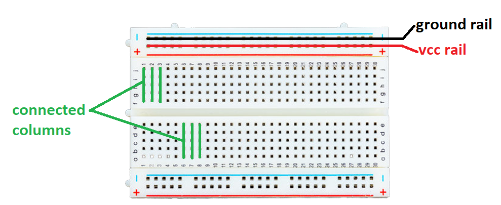

# Introduction

Breadboards are one of the most fundamental pieces when learning how to build circuits. This is because they are great units for temporary circuits, prototyping and  require absolutely no soldering.

These "solder-less" breadboards are durable, reusable and have tons of work space. Apart from holding electronics parts steady, a breadboard also has internal wiring to make connections super fast.

The most common type, the "Full Size" breadboard looks like this:

The full size breadboard is good for larger projects but there are other sizes, one of them is the half size breadboard. These are about half the length of the full size breadboard. It has 30 rows and 400 total connection points

Breadboard wiring guide

Another common use of breadboards is testing out new parts, such as Integrated circuits (ICs). When you are trying to figure out how a part works and constantly rewiring things, you don’t want to have to solder your connections each time.

Prototyping with a breadboard

# Further Documentation
For further documentation on breadboards and the sizes available, see [here](https://learn.adafruit.com/breadboards-for-beginners).
Aslso see [here](https://learn.sparkfun.com/tutorials/how-to-use-a-breadboard/all).
