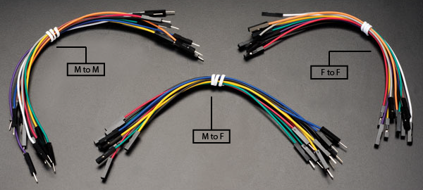

# Introduction

Typically, jumper wires are used to link parts of a prototype, test circuit, or breadboard internally or with other components or equipment without the need for soldering. There are three types of Jumper Wires available in the marketplace. These are:
1. Jumper Wires (M to M)
2. Jumper Wires (M to F)
3. Jumper Wires (F to F)

