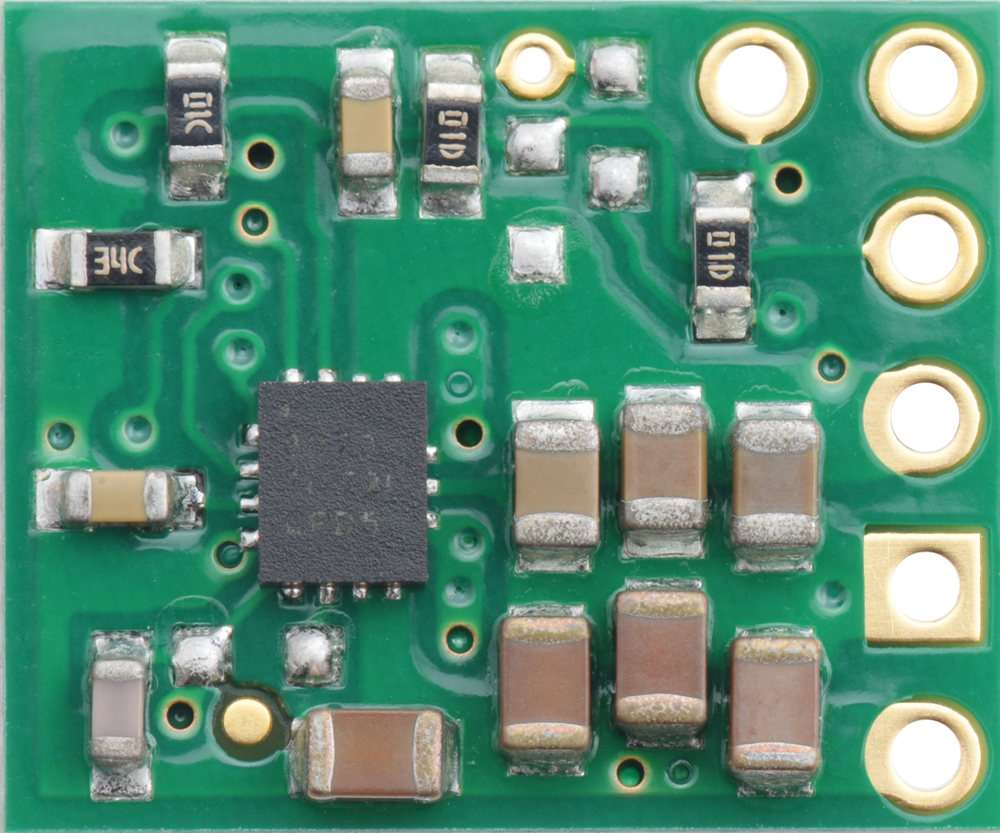
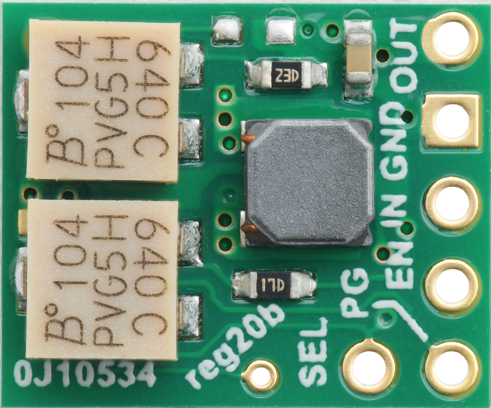
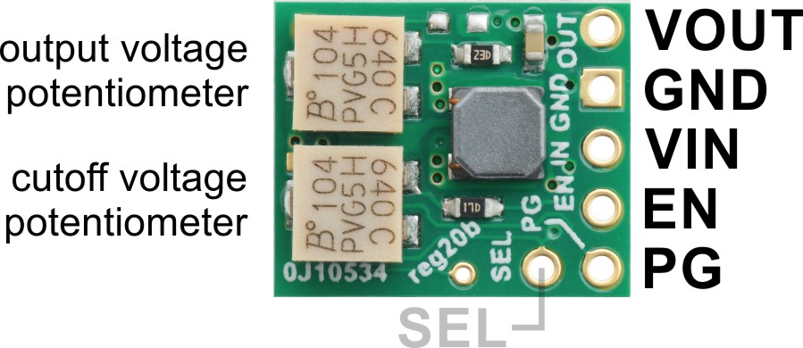

# Introduction

The S9V11MACMA switching step-up/step-down regulator efficiently produces a finely adjustable output between 2.5 V and 9 V whether it is higher or lower than the input voltage, which can range from 3 V to 16 V. The regulator also has a precision-adjustable low-voltage cutoff with hysteresis that can be used to prevent battery over-discharge.

To use this dc-dc converter, you have to hook up your power source to the VIN and VOUT to the sensor node or device to be powered.

**Note:** you need to set the output and cut off voltage of the converter by means of the potentiometers and a multimeter before connecting your sensor.

The regulator features an enable pin, EN, that can be used as a precision low-voltage cutoff thanks to its tight activation and deactivation thresholds (voltages below 0.7 V trigger a low-power sleep state, and voltages above 0.8 V re-enable the regulator). On this regulator version, EN is connected to VIN through a 12-turn potentiometer to provide a user-adjustable cutoff threshold, which is useful for battery powered applications where draining the battery below a particular voltage threshold could permanently damage it. The quiescent current draw in this sleep mode is dominated by the current in the resistor network from ENABLE to VIN, which is approximately 7 µA per volt on VIN (e.g. approximately 20 µA with 3 V in). See the Setting the cutoff voltage section below for details on how to use the built-in potentiometer to set the cutoff threshold.

# Further documentation
Documentation for this Converter is available [here](https://www.pololu.com/product/2868/specs).