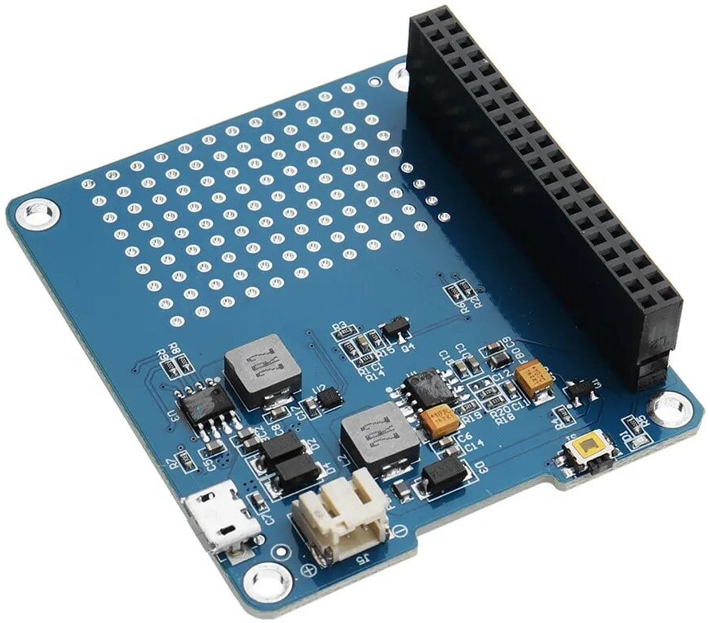

# Introduction
This is a power expansion board specially designed for Raspberry Pi. It allows the Raspberry Pi to be mobile or moveable.
It's more convenient to use external 3.7V Lithium polymer battery or 3.7V 18650 series Lithium battery.

# Wiring

This UPS board is plug and play, so all you need to do is directly sit it on top of your raspberry pi(aligned and connected to all 40 GPIOs)
Next connect a li-ion or li-po battery to the battery port of the UPS.
Finally connect the Pi's power adaptor to the UPS and hold down the UPS power button for a few seconds to power it up

