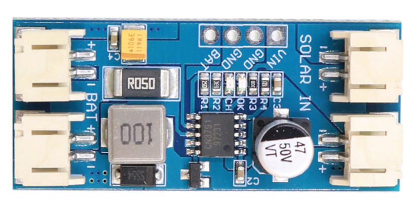
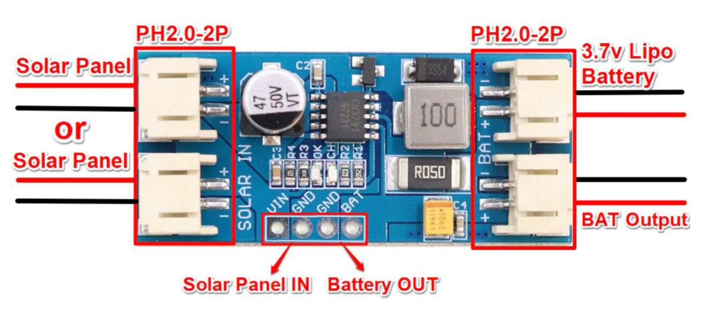

# Introduction
This is a maximum power point tracking (MPPT) solar charger for single-cell LiPo batteries. This MPPT solar charger provide you with the ability to get the most possible power out of your solar panel or other photovoltaic device and into a rechargable LiPo battery. 

Set-up is easy as well, just plug your solar panel into one side of the solar charger and your battery into the other and you are good to start charging!

# Wiring

# Further documentation
Documentation for this board is available [here](https://www.laskakit.cz/user/related_files/dse-cn3791-2.pdf).
