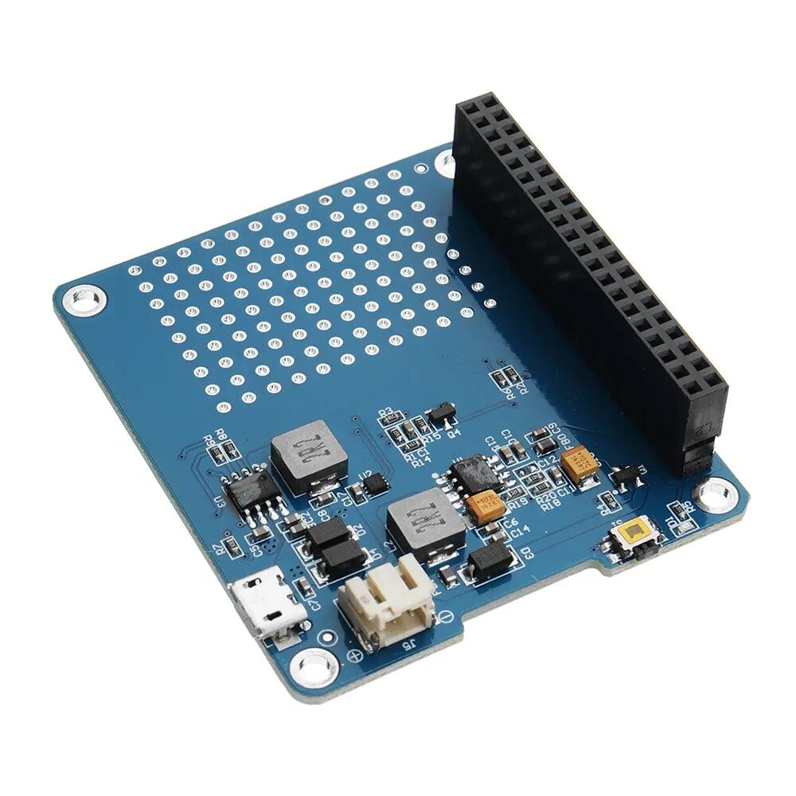
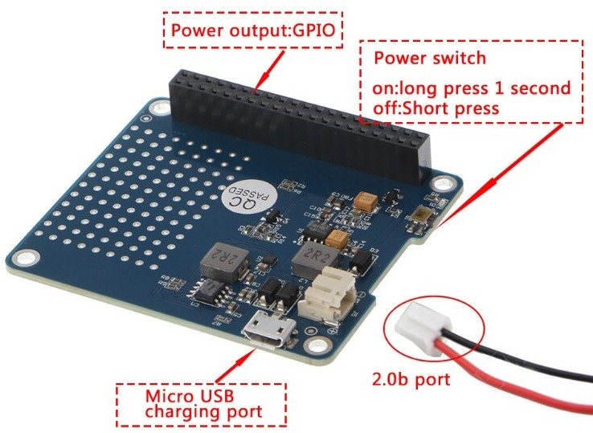
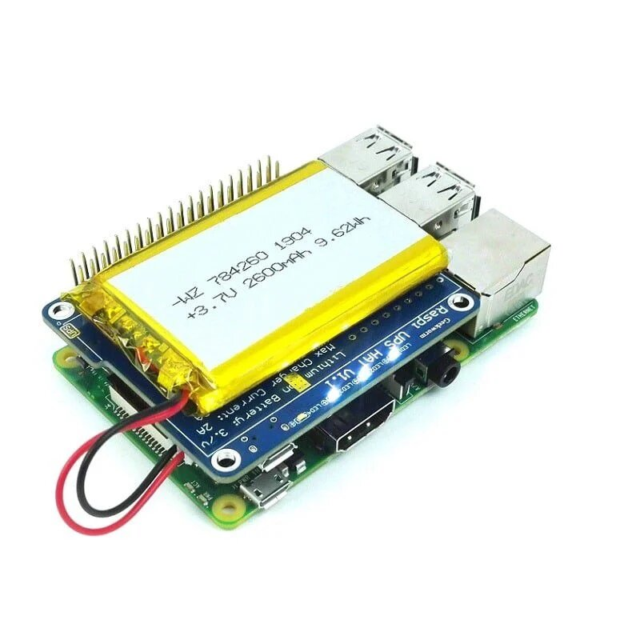

# Introduction
This is a power expansion Board especially designed for Raspberry Pi, which enables to use the Raspberry Pi with a moveable power source.
It's more convenient to use external 3.7V Lithium battery or 3.7V 18650 Lithium battery.

# Wiring

This UPS board is plug and play so all you need to do is directly sit it on top of your raspberry pi(aligned and connected to all 40 GPIOs)
Next connect a li-ion or li-po battery to the jxt battery port of the UPS.
Finally connect the Pi's power to the UPS and hold down the UPS power button for a few seconds to power it up

