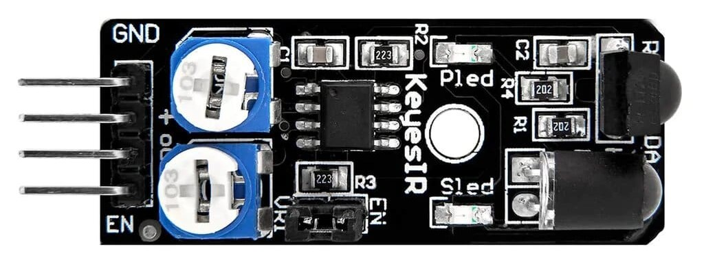

# Introduction

This IR-08H Infrared Obstacle Avoidance Sensor Module is Arduino comaptible and can be connected to related Micro controllers. An IR LED transmitter emits IR light, and any object infront of the module reflects that light back. The reflected light is then received by the IR reciever. This obstacle sensor consists of an onboard comparator circuitry that does the further processing of the signal. The Green LED indicator shows the working status of the sensor. Whereas the obstacle LED illuminates when any obstacle or hindrance is detected.

An Infrared Obstacle Avoidance IR Sensor Module works fine with 3.3 to 5V level microcontrollers. Under the normal condition, the output of the sensor indicates High status. When any hindrance or obstacle is detected, the output digital signal switches to a logic low-level signal. The onboard variable potentiometer helps to fine-adjustment over the range of operation, with the effective distance range in 2cm to 40cm with good anti-jamming capability. When Enable, EN terminal is equal to “1” when the sensor does not work, whereas equal to “0” indicates working.

This sensor is perfect for smart car obstacle avoidance, black and white line tracking, anti-drop, product counters, cutting lines, liquid level detection. Moreover, this sensor made with black and white lines tracing the car ran without a black line on white paper, available in concrete. Frequency adjustment potentiometer employed to regulate the carrier frequency of the infrared tube, because the mixing receiver is 38KHZ especially when the carrier frequency is that the most sensitive. The 502 resistors clockwise transferred do ( the launch tube at maximum brightness), then at a white wall tone 103 resistance. And transferred to the sensing distance in order that the sensor will add the simplest state.

# Wiring
xxyyzz

# Code example
xxyyzz

# Further documentation
Documentation for this xxyyzz is available [here](https://).