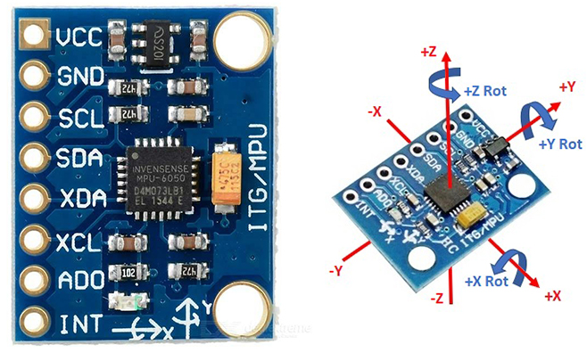

# Introduction

The MPU-6050™ parts are the world’s first MotionTracking devices designed for the low power, low cost, and high-performance requirements of smartphones, tablets and wearable sensors.
 
It captures motion in X, Y and Z axis simultaneously. MPU6050 is used in different industrial projects and electronic devices to control and detect the 3-D motion of different objects.

The MPU-6050 devices combine a 3-axis gyroscope and a 3-axis accelerometer on the same silicon die, together with an onboard Digital Motion Processor™ (DMP™), which processes complex 6-axis MotionFusion algorithms. The device can access external magnetometers or other sensors through an auxiliary master I²C bus, allowing the devices to gather a full set of sensor data without intervention from the system processor.

# Wiring

1. VCC:	5v of Arduino
2. GND:	GND of Arduino
3. SCL:	A5 of Arduino
4. SDA:	A4 of Arduino
5. INT: D2 of Arduino

xxyyzz

# Code example
xxyyzz

# Further documentation
Documentation for this xxyyzz is available [here](https://).