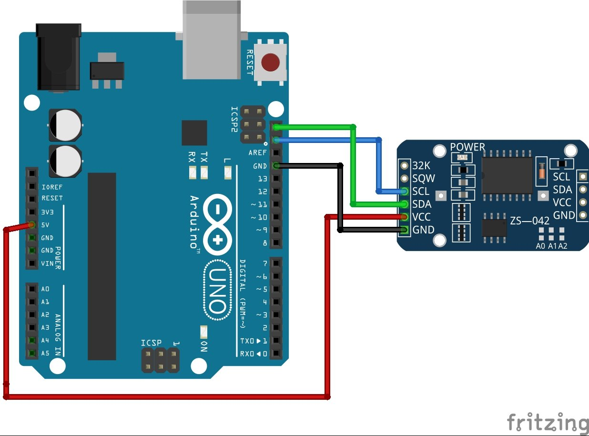
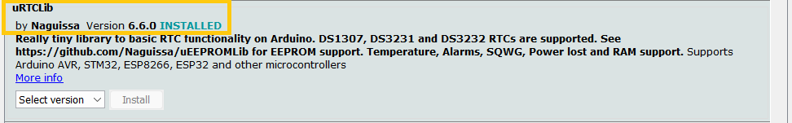
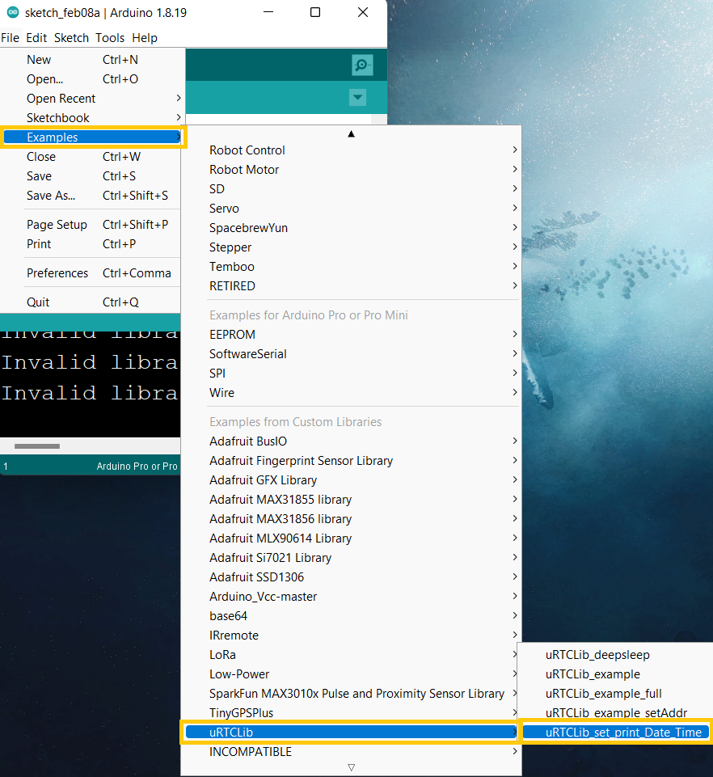
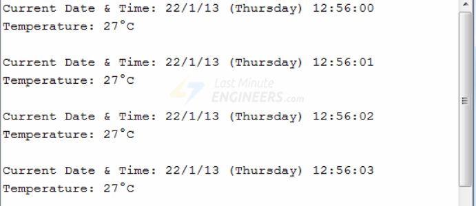

# Introduction

We are all aware that the majority of MCUs we use in our projects are time-agnostic, meaning they have no concept of the passing of time. The DS3231 Precision RTC module is useful on occasions when timing a project is crucial, but for the most of our projects, it works nicely. It can be used for a variety of tasks, such as data logging and time stamping, clocks, timers and alarms.


# Wiring



1. VCC:	5v of Arduino
2. GND:	GND of Arduino
3. SCL:	A5 of Arduino
4. SDA:	A4 of Arduino

# Installing DS3231 Library

To install the DS3231 library navigate to the Arduino library manager from the Sketch menu as shown below
Sketch > Include Library > Manage Libraries


when the library manager opens up, search for **uRTCLib** and install the version by **Naguissa** as shown


We should see the **INSTALLED** inscription after the installation is done



# Code example

Luckily for us the code for this sensor comes with the library installation.

All we have to do is navigate to File > Examples > uRTCLib > uRTCLib_set_print_Date_Time



**NOTE:** we have to set the date and time of the rtc once in order to have a correct date and time.

Setting of the time and date can be done on line 122

```c
rtc.set(0, 42, 16, 6, 2, 5, 15);
//RTCLib::set(byte second, byte minute, byte hour, byte dayOfWeek, byte dayOfMonth, byte month, byte year)
```

After setting the time and date we can now read and display the rtc data using the following code sample.

```c
#include "Arduino.h"
#include "uRTCLib.h"

// uRTCLib rtc;
uRTCLib rtc(0x68);

char daysOfTheWeek[7][12] = {"Sunday", "Monday", "Tuesday", "Wednesday", "Thursday", "Friday", "Saturday"};

void setup() {
  Serial.begin(9600);
  delay(3000); // wait for console opening

  URTCLIB_WIRE.begin();

  // Comment out below line once you set the date & time.
  // Following line sets the RTC with an explicit date & time
  // for example to set January 13 2022 at 12:56 you would call:
   //This is used to set the date and time -----> rtc.set(0, 56, 12, 5, 13, 1, 22);
  // rtc.set(second, minute, hour, dayOfWeek, dayOfMonth, month, year)
  // set day of week (1=Sunday, 7=Saturday)
}

void loop() {
  rtc.refresh();

  Serial.print("Current Date & Time: ");
  Serial.print(rtc.year());
  Serial.print('/');
  Serial.print(rtc.month());
  Serial.print('/');
  Serial.print(rtc.day());

  Serial.print(" (");
  Serial.print(daysOfTheWeek[rtc.dayOfWeek()-1]);
  Serial.print(") ");

  Serial.print(rtc.hour());
  Serial.print(':');
  Serial.print(rtc.minute());
  Serial.print(':');
  Serial.println(rtc.second());

  Serial.print("Temperature: ");
  Serial.print(rtc.temp()  / 100);
  Serial.print("\xC2\xB0");   //shows degrees character
  Serial.println("C");

  Serial.println();
  delay(1000);
}
```

Here's what the output looks like.



# Further documentation

Documentation for this xxyyzz is available [here](https://lastminuteengineers.com/ds3231-rtc-arduino-tutorial/).