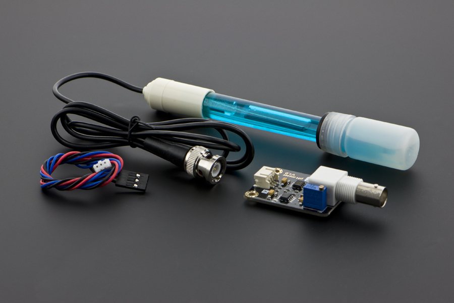
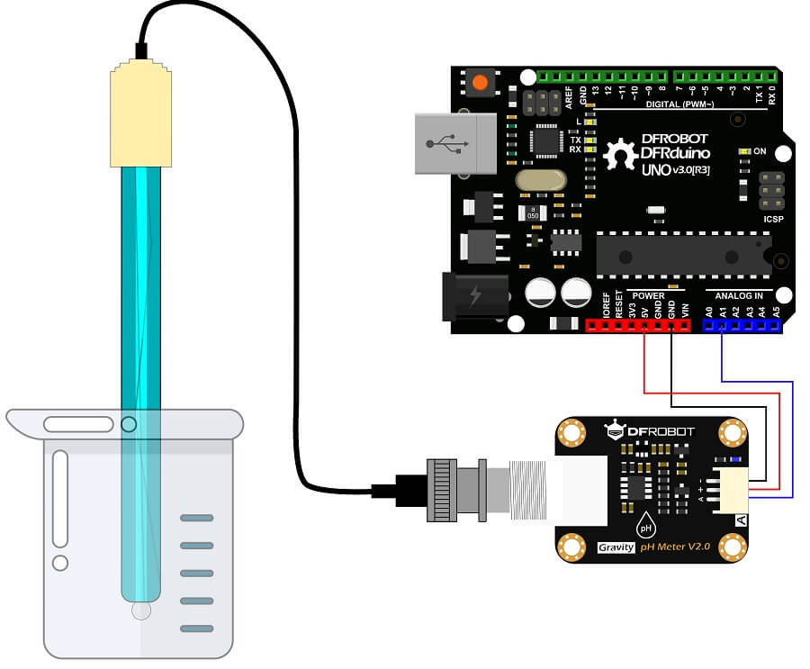

# Introduction

pH stands for the power of hydrogen, which is a measurement of the hydrogen ion concentration in a liquid. The total pH scale ranges from 1 to 14, with 7 considered to be neutral. A pH less than 7 is said to be acidic and solutions with a pH greater than 7 are basic or alkaline.

A ph sensor is commonly used in various applications such as aquaponics, aquaculture, and environmental water testing
                    



                 
# Connecting to Arduino



Module interface:
1. VCC(+): Connect to the positive pole of the power supply (voltage is 5V)
2. GND(-): Connect to the negative pole of the power supply
3. OUT(A): Connect to any Arduino analog pin(A1 in this case)
                    
# Code example

```c
/********************
 *  Program:  Analog pH Sample Code
 ********************/

#include "DFRobot_PH.h"
#include <EEPROM.h>

#define PH_PIN A1
float voltage,phValue,temperature = 25;
DFRobot_PH ph;

void setup()
{
    Serial.begin(115200);  
    ph.begin();
}

void loop()
{
    static unsigned long timepoint = millis();
    if(millis()-timepoint>1000U){                  //time interval: 1s
        timepoint = millis();
        //temperature = readTemperature();         // read your temperature sensor to execute temperature compensation
        voltage = analogRead(PH_PIN)/1024.0*5000;  // read the voltage
        phValue = ph.readPH(voltage,temperature);  // convert voltage to pH with temperature compensation
        Serial.print("temperature:");
        Serial.print(temperature,1);
        Serial.print("^C  pH:");
        Serial.println(phValue,2);
    }
    ph.calibration(voltage,temperature);           // calibration process by Serail CMD
}

float readTemperature()
{
  //add your code here to get the temperature from your temperature sensor
}
```

# Further documentation

Documentation for this sensor is available [here](https://wiki.dfrobot.com/Gravity__Analog_pH_Sensor_Meter_Kit_V2_SKU_SEN0161-V2).

See [here](https://www.youtube.com/watch?v=9EIbTbh80gA&ab_channel=DavyWybiral) for details on calibration
