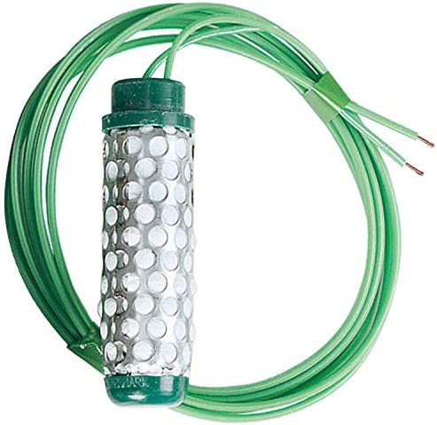

# Introduction
In use since 1978, the patented WATERMARK sensor is a solid-state electrical resistance sensing device that is used to measure soil water tension. As the tension changes with water content the resistance changes as well. That resistance can be measured using the WATERMARK Sensor. 

The sensor consists of a pair of highly corrosion resistant electrodes that are imbedded within a granular matrix. A current is applied to the WATERMARK to obtain a resistance value. The WATERMARK Meter or Monitor correlates the resistance to centibars (cb) or kilopascals (kPa) of soil water tension. 

The WATERMARK is designed to be a permanent sensor, placed in the soil to be monitored and “read” as often as necessary with a portable or stationary device. Internally installed gypsum provides some buffering for the effect of salinity levels normally found in irrigated agricultural crops and landscapes.




# Wiring


## How does it work?
    From Kirchoff’s Law we know that voltage measured over two resistors connected in series, divide according to their respective resistance values. In our sensor interface we have one known resistor (1500Ω), and one unknown resistor value (this is our gypsum sensor)

    By measuring the voltages over the known and the unknown resistor, using the analog inputs of the Arduino board, we can calculate the sensor resistance value.

# Code Example
```c
// "Vinduino" portable soil moisture sensor code V3.00
// Date December 31, 2012
// Reinier van der Lee and Theodore Kaskalis
// www.vanderleevineyard.com

#include <math.h>

#define NUM_READS 11    // Number of sensor reads for filtering

typedef struct {        // Structure to be used in percentage and resistance values matrix to be filtered (have to be in pairs)
  int moisture;
  long resistance;
} values;

// define Ohm character
byte ohm[8] = {
  B00000,
  B01110,
  B10001,
  B10001,
  B10001,
  B01010,
  B11011,
  B00000
};

const long knownResistor = 1200;  // Constant value of known resistor in Ohms

int activeDigitalPin = 6;         // 6 or 7 interchangeably
int supplyVoltageAnalogPin;       // 6-ON: A0, 7-ON: A1
int sensorVoltageAnalogPin;       // 6-ON: A1, 7-ON: A0

int supplyVoltage;                // Measured supply voltage
int sensorVoltage;                // Measured sensor voltage

values valueOf[NUM_READS];        // Calculated moisture percentages and resistances to be sorted and filtered

int i;                            // Simple index variable

void setup() {
  // initialize serial communications at 9600 bps:
  Serial.begin(9600); 

  // initialize the digital pin as an output.
  // Pin 6 is sense resistor voltage supply 1
  pinMode(6, OUTPUT);    

  // initialize the digital pin as an output.
  // Pin 7 is sense resistor voltage supply 2
  pinMode(7, OUTPUT);   

  delay(500);   
}

void loop() {

  // read sensor, filter, and calculate resistance value
  // Noise filter: median filter

  for (i=0; i<NUM_READS; i++) {

    setupCurrentPath();      // Prepare the digital and analog pin values

    // Read 1 pair of voltage values
    digitalWrite(activeDigitalPin, HIGH);                 // set the voltage supply on
    delay(10);
    supplyVoltage = analogRead(supplyVoltageAnalogPin);   // read the supply voltage
    sensorVoltage = analogRead(sensorVoltageAnalogPin);   // read the sensor voltage
    digitalWrite(activeDigitalPin, LOW);                  // set the voltage supply off  
    delay(10); 

    // Calculate resistance and moisture percentage without overshooting 100
    // the 0.5 add-term is used to round to the nearest integer
    // Tip: no need to transform 0-1023 voltage value to 0-5 range, due to following fraction
    valueOf[i].resistance = long( float(knownResistor) * ( supplyVoltage - sensorVoltage ) / sensorVoltage + 0.5 );
    valueOf[i].moisture = min( int( pow( valueOf[i].resistance/31.65 , 1.0/-1.695 ) * 400 + 0.5 ) , 100 );
//  valueOf[i].moisture = min( int( pow( valueOf[i].resistance/331.55 , 1.0/-1.695 ) * 100 + 0.5 ) , 100 );

  }

  // end of multiple read loop

  // Sort the moisture-resistance vector according to moisture
  sortMoistures();

  // Print out median values
  Serial.print("sensor resistance = ");
  Serial.println(valueOf[NUM_READS/2].resistance);

  Serial.print("Moisture: ");
  Serial.print(valueOf[NUM_READS/2].moisture);
  Serial.println(" %");

  // delay until next measurement (msec)
  delay(5000);   

}

void setupCurrentPath() {
  if ( activeDigitalPin == 6 ) {
    activeDigitalPin = 7;
    supplyVoltageAnalogPin = A1;
    sensorVoltageAnalogPin = A0;
  }
  else {
    activeDigitalPin = 6;
    supplyVoltageAnalogPin = A0;
    sensorVoltageAnalogPin = A1;
  }
}

// Selection sort algorithm
void sortMoistures() {
  int j;
  values temp;
  for(i=0; i<NUM_READS-1; i++)
    for(j=i+1; j<NUM_READS; j++)
      if ( valueOf[i].moisture > valueOf[j].moisture ) {
        temp = valueOf[i];
        valueOf[i] = valueOf[j];
        valueOf[j] = temp;
      }
}
```

# Further documentation
Documentation for this sensor is available [here](http://www.emesystems.com/watermark/documents/watermark.pdf) 
See also the datasheet [here](https://vanderleevineyard.com/1/post/2012/08/-the-vinduino-project-3-make-a-low-cost-soil-moisture-sensor-reader.html)
