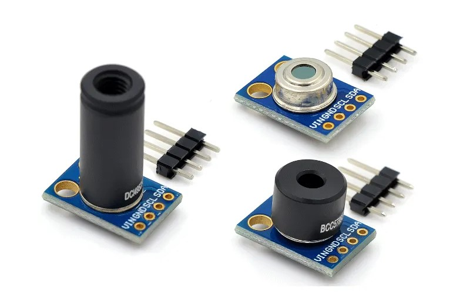

# Introduction

MLX90614 is a IR based contactless temperature sensor that can measure the temperature of a particular object between -70°C – 382.2°C and an ambient temperature of -40°C – 125°C without even making physical contact with the object under observation. It is embedded with an I2C port to communicate temperature reading to microcontrollers over an I2C bus. On top of that, it is provided with electrostatic discharge protection to avoid malfunctioning of the sensor.

The tiny device is highly accurate and precise due to its powerful ADC. A 17-bit ADC is embedded in the module to output the values with 0.14 ˚C of resolution. Melexis has introduced different versions of this sensor based on input voltage requirements i.e., 3 Volts or 5volts, However MLX90614 is a sensitive temperature sensor that has a long list of applications, especially in home automation.



# Wiring


1. VCC:	5v of Arduino
2. GND:	GND of Arduino
3. SCL:	A5 of Arduino
4. SDA:	A4 of Arduino

# Installing MLX90614 Library

To install the MLX90614 library navigate to the Arduino library manager from the Sketch menu as shown below
Sketch > Include Library > Manage Libraries


when the library manager opens up, search for **MLX90614** and install the version by Adafruit as shown


We should see the **INSTALLED** inscription after the installation is done


# Code example

Luckily for us the code for this sensor comes with the library installation.

All we have to do is navigate to File > Examples > Adafruit MLX90614 Library > mlxtest


The code sample should look something like this

```c
/***************************************************
  This is a library example for the MLX90614 Temp Sensor

  Designed specifically to work with the MLX90614 sensors in the
  adafruit shop

  These sensors use I2C to communicate, 2 pins are required to
  interface
  Adafruit invests time and resources providing this open source code,
  please support Adafruit and open-source hardware by purchasing
  products from Adafruit!

  Written by Limor Fried/Ladyada for Adafruit Industries.
  BSD license, all text above must be included in any redistribution
 ****************************************************/

#include <Adafruit_MLX90614.h>

Adafruit_MLX90614 mlx = Adafruit_MLX90614();

void setup() {
  Serial.begin(9600);
  while (!Serial);

  Serial.println("Adafruit MLX90614 test");

  if (!mlx.begin()) {
    Serial.println("Error connecting to MLX sensor. Check wiring.");
    while (1);
  };

  Serial.print("Emissivity = "); Serial.println(mlx.readEmissivity());
  Serial.println("================================================");
}

void loop() {
  Serial.print("Ambient = "); Serial.print(mlx.readAmbientTempC());
  Serial.print("*C\tObject = "); Serial.print(mlx.readObjectTempC()); Serial.println("*C");
  Serial.print("Ambient = "); Serial.print(mlx.readAmbientTempF());
  Serial.print("*F\tObject = "); Serial.print(mlx.readObjectTempF()); Serial.println("*F");

  Serial.println();
  delay(500);
}
```

# Further documentation

Further documentation for this Sensor is available [here](https://microcontrollerslab.com/mlx90614-contactless-ir-temperature-sensor-pinout-interfacing-arduino/).

# Specifications

- Package: Tube
- Product Status: Active
- Sensor Type: Digital, Infrared (IR)
- Ambient Temperature Range: -40°C – 125°C
- Object Temperature Range: -70°C – 380°C
- Output Type: PWM, SMBus
- Operating Voltage: 3.6 Volts – 5.5 Volts
- Measurement resolution: 0.02°C
- ESD Sensitivity: 2kV
- Sink/Source Current: 25mA
- ADC Resolution: 17 bits
- Features: Sleep Mode
- Accuracy - Highest (Lowest): ±0.5°C (±4°C)
- Test Condition: 0°C ~ 60°C (120°C ~ 380°C)
- Operating Temperature: -40°C ~ 85°C
- Mounting Type: Through Hole
- Package / Case: TO-39-4 Metal Can

# Features

- IR sensor is integrated with an optical filter, a DSP, and a low noise amplifier for fine output digital signals.
- Adaptable for 8-16 Volts applications and can be integrated easily.
- Supports power-saving mode and is available in single and dual versions
- It is a power-efficient and highly sensitive sensor.
