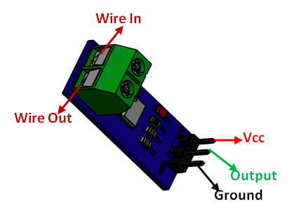

# Introduction
The ACS712-30A is a current sensor module that can detect positive and negative currents ranging from minus 30 Amps to positive 30 Amps. It operates at 5V DC and converts the current flow through the sensor to an output voltage. The output voltage starts at 1/2Vcc (or 2.5V) for no current flow and moves up 66mV per amp for positive current.

The 30A range Current Sensor Module ACS712 consists of a precise, low-offset, linear Hall Circuit with a copper conduction path located near the surface of the die. Applied current flowing through this copper conduction path generates a magnetic field in which the Hall IC converts into a proportional voltage.

Sensing and controlling current flow is a fundamental requirement in a wide variety of applications including, over-current protection circuits, battery chargers, switching mode power supplies, digital watt meters, programmable current sources, etc.

This AC721 current module is based on the ACS712 sensor, which can accurately detect AC or DC. The maximum AC or DC that can be detected can reach 30A, and the present current signal can be read via the analog I / O port of Arduino.

# Pinout

`Vcc` Input voltage is +5V for typical applications

`Output` Outputs Analog voltage proportional to current

`Ground` Connected to ground of circuit

`Wire In & Wire Out` The wire through current has to be measured is connected here

# Features

- The low-noise analog signal path
- Device bandwidth is set via the new FILTER pin
- 5 µs output rise time in response to step input current
- Small footprint, low-profile SOIC8 package
- 2.1 kV RMS minimum isolation voltage from pins 1-4 to pins 5-8
- 5.0 V, single supply operation
- 66 to 185 mV/A output sensitivity
- Output voltage proportional to AC or DC currents
- Factory-trimmed for accuracy
- Extremely stable output offset voltage
- Nearly zero magnetic hysteresis
- The ratiometric output from the supply voltage.

# General Specification
- Current sensor chip : ACS712
- Operating Voltage (V) :	4.5 ~ 5.5V DC
- Measure Current Range :	-30 ~ +30 A
- Sensitivity :	100mV/A
- Length (mm) :	31
- Width (mm) :	13
- Height (mm) :	13.5
- Weight (gm) :	5
- Shipment Weight :	0.01 kg
- Shipment Dimensions :	4 × 2 × 2 cm