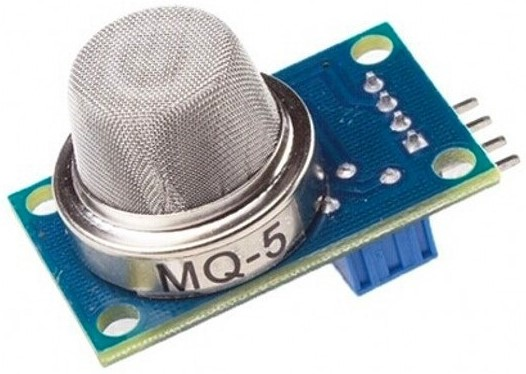
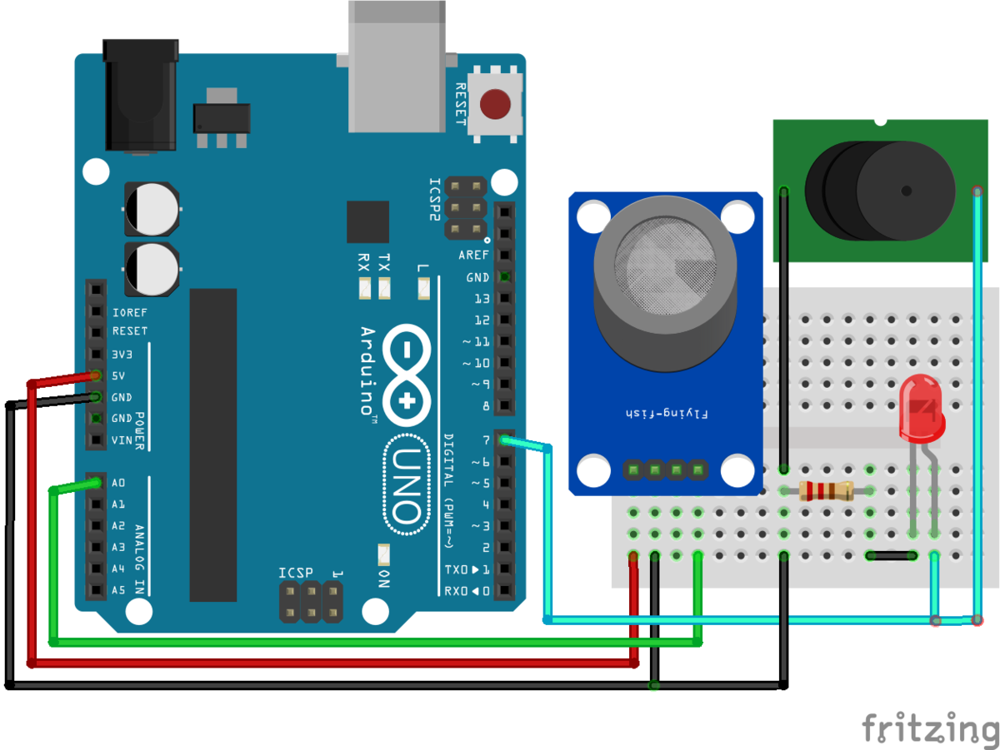

# Introduction
Nowadays, natural gasses are everywhere. They are easy to transport and provide energy for various tasks in both household and industrial use. It also possesses a significant risk of fire if not handled carefully. This is where MQ-5 Combustible Gas Sensor comes into play. 

The MQ-5 Combustible Gas Sensor can detect LPG, H2, LPG, CH4, and CO. So in this article, we are going to discuss the MQ-5 sensor, and attach that to an Arduino to see what happens when gases are moved closer to it.



# Wiring

Arduino > Sensor Wiring are as follows:
- A0 = AO (analog out)
- 5v = VCC
- GND = GND

Also pin 7 of the arduino is connected to the positive terminal of a piezo buzzer and an LED for audio-visual alert.
Connect the ground terminals of the buzzer and LED to the ground of the arduino as well.


You can adjust the potentiometer on the back of the MQ5 sensor to increase or decrease its sensitivity.



# Code example

```c
#define ledPin 7
#define sensor  A0
int gas_value;
void setup()
{
  pinMode(sensor, INPUT);
  pinMode(ledPin, OUTPUT);
  Serial.begin(9600);
  Serial.println("MQ5 Heating Up!");
  delay(20000); // allow the MQ5 to warm up
}
void loop()
{
  gas_value = analogRead(sensor);
   Serial.print("Sensor Value:");
 Serial.println(gas_value);
  if (gas_value > 250) {
    digitalWrite(ledPin, HIGH);
  }
  else{
    digitalWrite(ledPin, LOW);
  }
}
```

# Further documentation
Documentation for this Sensor is available [here](https://circuitdigest.com/microcontroller-projects/interfacing-mq5-gas-sensor-with-arduino).

# Specifications

- Item Weight: 10.0 grams
- Heater Voltage: 5.0V
- Power Supply: 5 Volts
- Interface Type: Analog & Digital
- Working Current: 150mA
- DOUT: TTL output
- AOUT: Analog output

# Features
- Can detect LPG, H2, LPG, CH4, and CO
