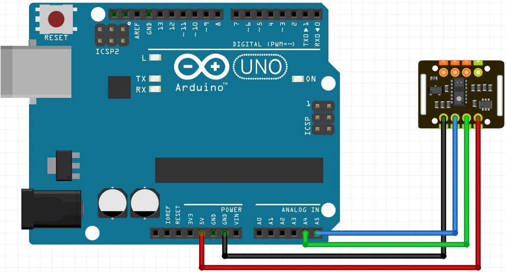
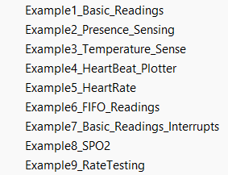

# Introduction

The MAX30102 is an integrated pulse oximetry and heart-rate monitor biosensor module. It includes internal LEDs, photodetectors, optical elements, and low-noise electronics with ambient light rejection. The MAX30102 provides a complete system solution to ease the design-in process for mobile and wearable devices.

The MAX30102 operates on a single 1.8V power supply and a separate 3.3V power supply for the internal LEDs. Communication is through a standard I2C-compatible interface. The module can be shut down through software with zero standby current, allowing the power rails to remain powered at all times.


# Heart Rate Measurement

To measure the heart rate, we do not require the Red LED, only the IR LED is needed. This is because oxygenated hemoglobin absorbs more infrared light.

The heartbeat rate is the ratio of time between two consecutive heartbeats. Similarly, when the human blood is circulated in the human body then this blood is squeezed in capillary tissues. As a result, the volume of capillary tissues is increased but this volume is decreased after each heartbeat. This change in volume of capillary tissues affects the infrared light of the sensor, which transmits light after each heartbeat.

# Installing MAX30102 Library

To install the MAX30102 library navigate to the Arduino library manager from the Sketch menu as shown below
Sketch > Include Library > Manage Libraries


when the library manager opens up, search for **MAX30102** and install the version by Adafruit as shown


We should see the **INSTALLED** inscription after the installation is done


# Wiring



1. VCC:	5v of Arduino
2. GND:	GND of Arduino
3. SCL:	A5 of Arduino
4. SDA:	A4 of Arduino

# Code example

Luckily for us the code for this sensor comes with the library installation.

All we have to do is navigate to File > Examples > Sparkfun MAX3010x Pulse and Proximity Senor Library > Example5_HeartRate


**NOTE:** There are other code samples available for use in the library....for example plotting of pulse and blood oxygen etc..



The *Example5_HeartRate* code sample should look something like this.

```c
/*
  Optical Heart Rate Detection (PBA Algorithm) using the MAX30105 Breakout
  By: Nathan Seidle @ SparkFun Electronics
  Date: October 2nd, 2016
  https://github.com/sparkfun/MAX30105_Breakout

  This is a demo to show the reading of heart rate or beats per minute (BPM) using
  a Penpheral Beat Amplitude (PBA) algorithm.

  It is best to attach the sensor to your finger using a rubber band or other tightening
  device. Humans are generally bad at applying constant pressure to a thing. When you
  press your finger against the sensor it varies enough to cause the blood in your
  finger to flow differently which causes the sensor readings to go wonky.

  Hardware Connections (Breakoutboard to Arduino):
  -5V = 5V (3.3V is allowed)
  -GND = GND
  -SDA = A4 (or SDA)
  -SCL = A5 (or SCL)
  -INT = Not connected

  The MAX30105 Breakout can handle 5V or 3.3V I2C logic. We recommend powering the board with 5V
  but it will also run at 3.3V.
*/

#include <Wire.h>
#include "MAX30105.h"

#include "heartRate.h"

MAX30105 particleSensor;

const byte RATE_SIZE = 4; //Increase this for more averaging. 4 is good.
byte rates[RATE_SIZE]; //Array of heart rates
byte rateSpot = 0;
long lastBeat = 0; //Time at which the last beat occurred

float beatsPerMinute;
int beatAvg;

void setup()
{
  Serial.begin(115200);
  Serial.println("Initializing...");

  // Initialize sensor
  if (!particleSensor.begin(Wire, I2C_SPEED_FAST)) //Use default I2C port, 400kHz speed
  {
    Serial.println("MAX30105 was not found. Please check wiring/power. ");
    while (1);
  }
  Serial.println("Place your index finger on the sensor with steady pressure.");

  particleSensor.setup(); //Configure sensor with default settings
  particleSensor.setPulseAmplitudeRed(0x0A); //Turn Red LED to low to indicate sensor is running
  particleSensor.setPulseAmplitudeGreen(0); //Turn off Green LED
}

void loop()
{
  long irValue = particleSensor.getIR();

  if (checkForBeat(irValue) == true)
  {
    //We sensed a beat!
    long delta = millis() - lastBeat;
    lastBeat = millis();

    beatsPerMinute = 60 / (delta / 1000.0);

    if (beatsPerMinute < 255 && beatsPerMinute > 20)
    {
      rates[rateSpot++] = (byte)beatsPerMinute; //Store this reading in the array
      rateSpot %= RATE_SIZE; //Wrap variable

      //Take average of readings
      beatAvg = 0;
      for (byte x = 0 ; x < RATE_SIZE ; x++)
        beatAvg += rates[x];
      beatAvg /= RATE_SIZE;
    }
  }

  Serial.print("IR=");
  Serial.print(irValue);
  Serial.print(", BPM=");
  Serial.print(beatsPerMinute);
  Serial.print(", Avg BPM=");
  Serial.print(beatAvg);

  if (irValue < 50000)
    Serial.print(" No finger?");

  Serial.println();
}

```

# Further documentation

Further documentation for this sensor is available [here](https://microcontrollerslab.com/max30102-pulse-oximeter-heart-rate-sensor-arduino/).