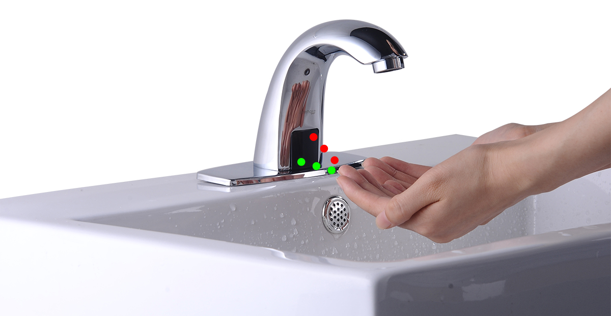
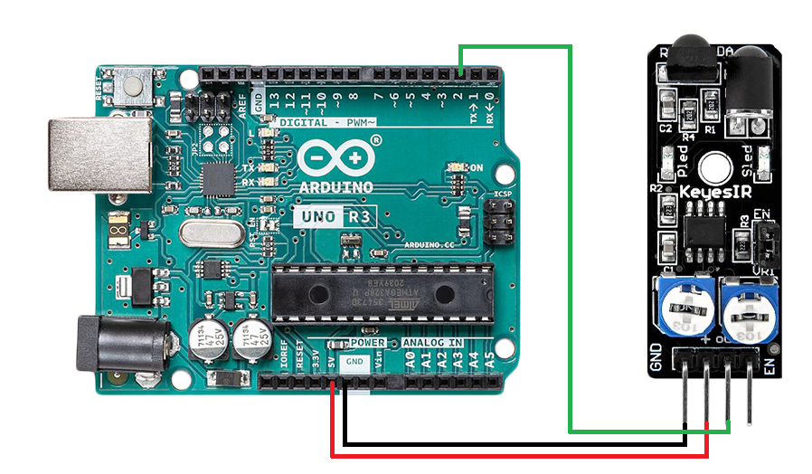

# Introduction


This IR-08H Infrared Obstacle Avoidance Sensor Module is Arduino comaptible and can be used with related Micro controllers. An IR LED transmitter emits IR light, and any object infront of the module reflects that light back. The reflected light is then received by the IR reciever. This obstacle sensor consists of an onboard comparator circuitry that does the further processing of the signal. The Green LED indicator shows the working status of the sensor. Whereas the obstacle LED illuminates when any obstacle or hindrance is detected.

This sensor is perfect for smart car obstacle avoidance, product counters, liquid level detection. The frequency adjustment potentiometer is employed to regulate the sensitivity of the module(that is how much power is emitted and received).



# Working Principle


**NOTE** When the surface of the obstacle is absorbent (e.g. black color) the IR signal isn’t reflected and the object cannot be detected by the sensor. This result would occur even if an obstacle is absent.


At the heart of the sensor is an NE555 chip configured to generate a 38kHz square wave. The 38kHz signal is used to illuminate an Infra Red (IR) LED. Light reflected from the LED is detected by a IR receiver module. The receiver module incorporates an external, optical, 950nm IR filter and an internal, electronic, 38kHz band-pass filter that make the module receptive only to IR light pulsing at that frequency.

The Infrared Obstacle Avoidance Sensor has Power, Ground, Signal, and Enable pins.

There are also 2 potentiometers, and one jumper on the board (See the Picture).

The potentiometer R5 on the picture is used to adjust how sensitive the sensor is. You can use it to adjust the distance from the object at which the sensor detects it.

The potentiometer R6 on the picture usually should not be changed. It controls the frequency of the infrared signal, and is preset with a good setting. You may need to use it if there is infrared interference with other infrared sources, but otherwise, avoid changing it.

The receiver module also includes an AGC (Automatic Gain Control) that will suppress a continuous signal of any frequency, including 38kHz. Therefore, it is absolutley necessary to use the ‘EN’ or ‘Enable’ pin for proper operation of the device. If the Enable function is used correctly, the device will achieve its maximum sensitivity.

On some versions of this device, the Infra Red (IR) LED is already covered with a small piece of black shrink tubing; but I find that additional optical shielding is required.

When the JUMPER is installed on the board, the IR LED will flicker continuously at 38kHz. If the Enable (EN) function will not be used, the jumper must be installed . When the jumper is removed, pin 4 of the 555 timer is held LOW (RESET) by R3, a 22K pull-down resistor. Then, if a HIGH condition is applied to the EN pin, the reset condition will be relieved and the 555 timer will begin to oscillate. The Enable function cannot be used if the JUMPER is in place. You must remove the jumper on the board in order to use the EN (Enable) pin.

# Wiring

Arduino > Sensor Wiring are as follows:
- D2 = OUT (analog out)
- 5v = VCC
- GND = GND



# Code example

```c
int LED = 13; // Use the onboard Uno LED
int isObstaclePin = 2;  // This is our input pin
int isObstacle = HIGH;  // HIGH MEANS NO OBSTACLE

void setup() {
  pinMode(LED, OUTPUT);
  pinMode(isObstaclePin, INPUT);
  Serial.begin(9600);  
}

void loop() {
  isObstacle = digitalRead(isObstaclePin);
  if (isObstacle == LOW){
    Serial.println("OBSTACLE!!, OBSTACLE!!");
    digitalWrite(LED, HIGH);
  }else{
    Serial.println("clear");
    digitalWrite(LED, LOW);
  }

  delay(200);
}

```

# Further documentation
Documentation for this sensor is available [here](https://osoyoo.com/2017/07/24/obstacle-avoidance-sensor/).
