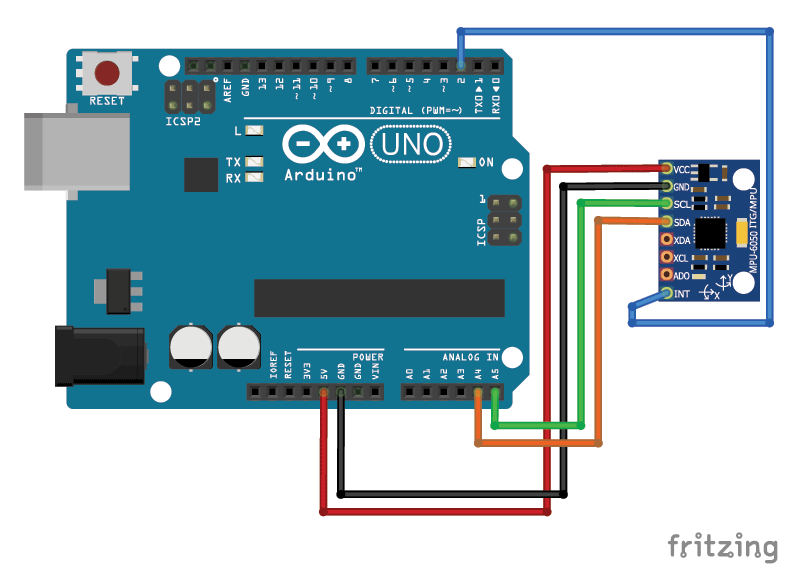

# Introduction

The MPU-6050™ parts are the world’s first MotionTracking devices designed for the low power, low cost, and high-performance requirements of smartphones, tablets and wearable sensors.
 
It captures motion in X, Y and Z axis simultaneously. MPU6050 is used in different industrial projects and electronic devices to control and detect the 3-D motion of different objects.

The MPU-6050 devices combine a 3-axis gyroscope and a 3-axis accelerometer on the same silicon die, together with an onboard Digital Motion Processor™ (DMP™), which processes complex 6-axis MotionFusion algorithms. The device can access external magnetometers or other sensors through an auxiliary master I²C bus, allowing the devices to gather a full set of sensor data without intervention from the system processor.


# Wiring



1. VCC:	5v of Arduino
2. GND:	GND of Arduino
3. SCL:	A5 of Arduino
4. SDA:	A4 of Arduino
5. INT: D2 of Arduino

# Code example

```c
/*
   Arduino and MPU6050 Accelerometer and Gyroscope Sensor Tutorial
   by Dejan, https://howtomechatronics.com
*/
#include <Wire.h>
const int MPU = 0x68; // MPU6050 I2C address
float AccX, AccY, AccZ;
float GyroX, GyroY, GyroZ;
float accAngleX, accAngleY, gyroAngleX, gyroAngleY, gyroAngleZ;
float roll, pitch, yaw;
float AccErrorX, AccErrorY, GyroErrorX, GyroErrorY, GyroErrorZ;
float elapsedTime, currentTime, previousTime;
int c = 0;
void setup() {
  Serial.begin(19200);
  Wire.begin();                      // Initialize comunication
  Wire.beginTransmission(MPU);       // Start communication with MPU6050 // MPU=0x68
  Wire.write(0x6B);                  // Talk to the register 6B
  Wire.write(0x00);                  // Make reset - place a 0 into the 6B register
  Wire.endTransmission(true);        //end the transmission
  /*
  // Configure Accelerometer Sensitivity - Full Scale Range (default +/- 2g)
  Wire.beginTransmission(MPU);
  Wire.write(0x1C);                  //Talk to the ACCEL_CONFIG register (1C hex)
  Wire.write(0x10);                  //Set the register bits as 00010000 (+/- 8g full scale range)
  Wire.endTransmission(true);
  // Configure Gyro Sensitivity - Full Scale Range (default +/- 250deg/s)
  Wire.beginTransmission(MPU);
  Wire.write(0x1B);                   // Talk to the GYRO_CONFIG register (1B hex)
  Wire.write(0x10);                   // Set the register bits as 00010000 (1000deg/s full scale)
  Wire.endTransmission(true);
  delay(20);
  */
  // Call this function if you need to get the IMU error values for your module
  calculate_IMU_error();
  delay(20);
}

void loop() {
  // === Read acceleromter data === //
  Wire.beginTransmission(MPU);
  Wire.write(0x3B); // Start with register 0x3B (ACCEL_XOUT_H)
  Wire.endTransmission(false);
  Wire.requestFrom(MPU, 6, true); // Read 6 registers total, each axis value is stored in 2 registers
  //For a range of +-2g, we need to divide the raw values by 16384, according to the datasheet
  AccX = (Wire.read() << 8 | Wire.read()) / 16384.0; // X-axis value
  AccY = (Wire.read() << 8 | Wire.read()) / 16384.0; // Y-axis value
  AccZ = (Wire.read() << 8 | Wire.read()) / 16384.0; // Z-axis value
  // Calculating Roll and Pitch from the accelerometer data
  accAngleX = (atan(AccY / sqrt(pow(AccX, 2) + pow(AccZ, 2))) * 180 / PI) - 0.58; // AccErrorX ~(0.58) See the calculate_IMU_error()custom function for more details
  accAngleY = (atan(-1 * AccX / sqrt(pow(AccY, 2) + pow(AccZ, 2))) * 180 / PI) + 1.58; // AccErrorY ~(-1.58)
  // === Read gyroscope data === //
  previousTime = currentTime;        // Previous time is stored before the actual time read
  currentTime = millis();            // Current time actual time read
  elapsedTime = (currentTime - previousTime) / 1000; // Divide by 1000 to get seconds
  Wire.beginTransmission(MPU);
  Wire.write(0x43); // Gyro data first register address 0x43
  Wire.endTransmission(false);
  Wire.requestFrom(MPU, 6, true); // Read 4 registers total, each axis value is stored in 2 registers
  GyroX = (Wire.read() << 8 | Wire.read()) / 131.0; // For a 250deg/s range we have to divide first the raw value by 131.0, according to the datasheet
  GyroY = (Wire.read() << 8 | Wire.read()) / 131.0;
  GyroZ = (Wire.read() << 8 | Wire.read()) / 131.0;
  // Correct the outputs with the calculated error values
  GyroX = GyroX + 0.56; // GyroErrorX ~(-0.56)
  GyroY = GyroY - 2; // GyroErrorY ~(2)
  GyroZ = GyroZ + 0.79; // GyroErrorZ ~ (-0.8)
  // Currently the raw values are in degrees per seconds, deg/s, so we need to multiply by sendonds (s) to get the angle in degrees
  gyroAngleX = gyroAngleX + GyroX * elapsedTime; // deg/s * s = deg
  gyroAngleY = gyroAngleY + GyroY * elapsedTime;
  yaw =  yaw + GyroZ * elapsedTime;
  // Complementary filter - combine acceleromter and gyro angle values
  roll = 0.96 * gyroAngleX + 0.04 * accAngleX;
  pitch = 0.96 * gyroAngleY + 0.04 * accAngleY;
  
  // Print the values on the serial monitor
  Serial.print(roll);
  Serial.print("/");
  Serial.print(pitch);
  Serial.print("/");
  Serial.println(yaw);
}

void calculate_IMU_error() {
  // We can call this funtion in the setup section to calculate the accelerometer and gyro data error. From here we will get the error values used in the above equations printed on the Serial Monitor.
  // Note that we should place the IMU flat in order to get the proper values, so that we then can the correct values
  // Read accelerometer values 200 times
  while (c < 200) {
    Wire.beginTransmission(MPU);
    Wire.write(0x3B);
    Wire.endTransmission(false);
    Wire.requestFrom(MPU, 6, true);
    AccX = (Wire.read() << 8 | Wire.read()) / 16384.0 ;
    AccY = (Wire.read() << 8 | Wire.read()) / 16384.0 ;
    AccZ = (Wire.read() << 8 | Wire.read()) / 16384.0 ;
    // Sum all readings
    AccErrorX = AccErrorX + ((atan((AccY) / sqrt(pow((AccX), 2) + pow((AccZ), 2))) * 180 / PI));
    AccErrorY = AccErrorY + ((atan(-1 * (AccX) / sqrt(pow((AccY), 2) + pow((AccZ), 2))) * 180 / PI));
    c++;
  }
  //Divide the sum by 200 to get the error value
  AccErrorX = AccErrorX / 200;
  AccErrorY = AccErrorY / 200;
  c = 0;
  // Read gyro values 200 times
  while (c < 200) {
    Wire.beginTransmission(MPU);
    Wire.write(0x43);
    Wire.endTransmission(false);
    Wire.requestFrom(MPU, 6, true);
    GyroX = Wire.read() << 8 | Wire.read();
    GyroY = Wire.read() << 8 | Wire.read();
    GyroZ = Wire.read() << 8 | Wire.read();
    // Sum all readings
    GyroErrorX = GyroErrorX + (GyroX / 131.0);
    GyroErrorY = GyroErrorY + (GyroY / 131.0);
    GyroErrorZ = GyroErrorZ + (GyroZ / 131.0);
    c++;
  }
  //Divide the sum by 200 to get the error value
  GyroErrorX = GyroErrorX / 200;
  GyroErrorY = GyroErrorY / 200;
  GyroErrorZ = GyroErrorZ / 200;
  // Print the error values on the Serial Monitor
  Serial.print("AccErrorX: ");
  Serial.println(AccErrorX);
  Serial.print("AccErrorY: ");
  Serial.println(AccErrorY);
  Serial.print("GyroErrorX: ");
  Serial.println(GyroErrorX);
  Serial.print("GyroErrorY: ");
  Serial.println(GyroErrorY);
  Serial.print("GyroErrorZ: ");
  Serial.println(GyroErrorZ);
}
```

Before we take a look at the results, let me quickly explain how to get the error correction values.  For calculate these errors we can call the calculate_IMU_error() custom function while the sensor is in flat still position. Here we do 200 readings for all outputs, we sum them and divide them by 200. As we are holding the sensor in flat still position, the expected output values should be 0. So, with this calculation we can get the average error the sensor makes.


Finally, using the Serial.print function we can print the Roll, Pitch and Yaw values on the serial monitor and see whether the sensor works properly.

# Further documentation
For 3D visualization and further documentation for this sensor, visit [here](https://howtomechatronics.com/tutorials/arduino/arduino-and-mpu6050-accelerometer-and-gyroscope-tutorial/).

# Specifications
- Operating temperature: -40 °C to +85 °C
- Dimensions: 25.5 × 15.2 × 2.48 mm
- Digital-output of 6-axis MotionFusion data. 9-axis fused data from Motion Processing Library
- Tri-Axis angular rate sensor (gyro) with a sensitivity up to 131 LSBs/dps and a full-scale range of ±250, ±500, ±1000, and ±2000dps
- Tri-Axis accelerometer with a programmable full scale range of ±2g, ±4g, ±8g and ±16g
- Reduced settling effects and sensor drift by elimination of board-level cross-axis alignment errors between accelerometers and gyroscopes
- Digital Motion Processing™ (DMP™) engine offloads complex MotionFusion, sensor timing synchronization and gesture detection
- MotionApps™ Platform support for Android, Linux, and Windows
- Embedded algorithms for run-time bias and compass calibration in library. No user intervention required
- Digital-output temperature sensor
- Digital input on FSYNC pin to support video Electronic Image Stabilization and GPS
- Programmable interrupt supports gesture recognition, panning, zooming, scrolling, and shake detection
- VDD Supply voltage range of 2.375V–3.46V; VLOGIC (MPU-6050) at 1.8V±5% or VDD
- Gyro operating current: 3.6mA (full power, gyro at all rates)
- Gyro + Accel operating current: 3.8mA (full power, gyro at all rates, accel at 1kHz sample rate)
- Accel low power mode operating currents: 10µA at 1Hz, 20µA at 5Hz, 70µA at 20Hz, 140µA at 40Hz
- Full Chip Idle Mode Supply Current: 5µA
- 400kHz Fast Mode I²C or up to 20MHz SPI (MPU-6000 only) serial host interfaces
- User self test
- 10,000g shock tolerant
