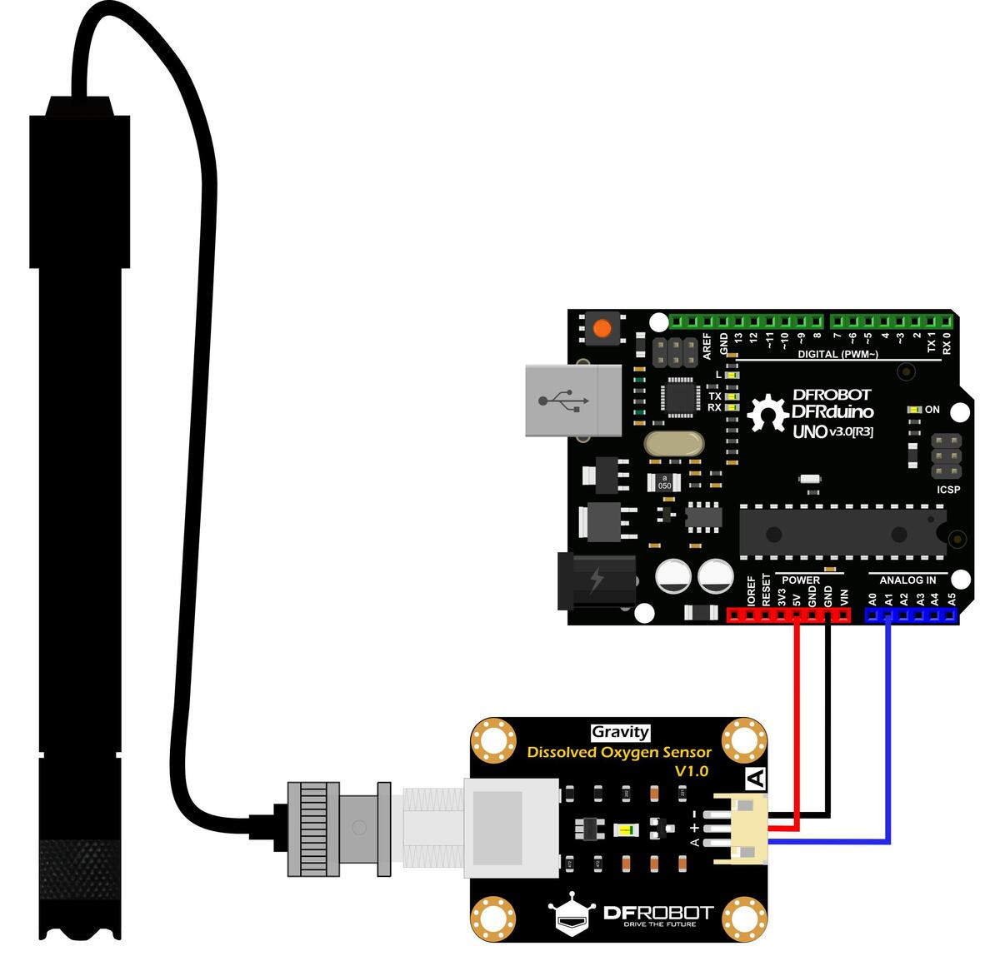

# Introduction

A dissolved oxygen meter is used to measure the dissolved oxygen in water, to reflect the water quality. It is widely applied in many water quality applications, such as aquaculture, environment monitoring, natural science, etc.
                    


   
# Connecting to Arduino



Module interface:
1. VCC(+): Connect to the positive pole of the power supply (voltage is 5V)
2. GND(-): Connect to the negative pole of the power supply
3. OUT(A): Connect to any Arduino Analog pin(A1)
                    
# Code example

``` c
/********************
 *  Program:  Dissolved Oxygen Sensor Sample Code
 ********************/
#include <Arduino.h>

#define DO_PIN A1

#define VREF 5000    //VREF (mv)
#define ADC_RES 1024 //ADC Resolution

//Single-point calibration Mode=0
//Two-point calibration Mode=1
#define TWO_POINT_CALIBRATION 0

#define READ_TEMP (25) //Current water temperature ℃, Or temperature sensor function

//Single point calibration needs to be filled CAL1_V and CAL1_T
#define CAL1_V (1600) //mv
#define CAL1_T (25)   //℃
//Two-point calibration needs to be filled CAL2_V and CAL2_T
//CAL1 High temperature point, CAL2 Low temperature point
#define CAL2_V (1300) //mv
#define CAL2_T (15)   //℃

const uint16_t DO_Table[41] = {
    14460, 14220, 13820, 13440, 13090, 12740, 12420, 12110, 11810, 11530,
    11260, 11010, 10770, 10530, 10300, 10080, 9860, 9660, 9460, 9270,
    9080, 8900, 8730, 8570, 8410, 8250, 8110, 7960, 7820, 7690,
    7560, 7430, 7300, 7180, 7070, 6950, 6840, 6730, 6630, 6530, 6410};

uint8_t Temperaturet;
uint16_t ADC_Raw;
uint16_t ADC_Voltage;
uint16_t DO;

int16_t readDO(uint32_t voltage_mv, uint8_t temperature_c)
{
#if TWO_POINT_CALIBRATION == 0
  uint16_t V_saturation = (uint32_t)CAL1_V + (uint32_t)35 * temperature_c - (uint32_t)CAL1_T * 35;
  return (voltage_mv * DO_Table[temperature_c] / V_saturation);
#else
  uint16_t V_saturation = (int16_t)((int8_t)temperature_c - CAL2_T) * ((uint16_t)CAL1_V - CAL2_V) / ((uint8_t)CAL1_T - CAL2_T) + CAL2_V;
  return (voltage_mv * DO_Table[temperature_c] / V_saturation);
#endif
}

void setup()
{
  Serial.begin(115200);
}

void loop()
{
  Temperaturet = (uint8_t)READ_TEMP;
  ADC_Raw = analogRead(DO_PIN);
  ADC_Voltage = uint32_t(VREF) * ADC_Raw / ADC_RES;

  Serial.print("Temperaturet:\t" + String(Temperaturet) + "\t");
  Serial.print("ADC RAW:\t" + String(ADC_Raw) + "\t");
  Serial.print("ADC Voltage:\t" + String(ADC_Voltage) + "\t");
  Serial.println("DO:\t" + String(readDO(ADC_Voltage, Temperaturet)) + "\t");

  delay(1000);
}
```

# Further documentation

See [here](https://wiki.dfrobot.com/Gravity__Analog_Dissolved_Oxygen_Sensor_SKU_SEN0237) for further Documentation and Calibration of this sensor.

# Specification

Dissolved Oxygen Probe
1. Type: Galvanic Probe
2. Detection Range: 0~20mg/L
3. Response Time: Up to 98% full response, within 90 seconds (25℃)
4. Pressure Range: 0~50PSI
5. Electrode Service Life: 1 year (normal use)
6. Maintenance Period: Membrane Cap Replacement Period: 1~2 months (in muddy water); 4~5 months (in clean water) Filling Solution Replacement Period: Once every month
7. Cable Length: 2 meters
8. Probe Connector: BNC

Signal Converter Board
1. Operating Voltage: 3.3~5.5V
2. Output Signal: 0~3.0V
3. Cable Connector: BNC
4. Signal Connector: Gravity Analog Interface (PH2.0-3P)
5. Dimension: 42mm * 32mm
