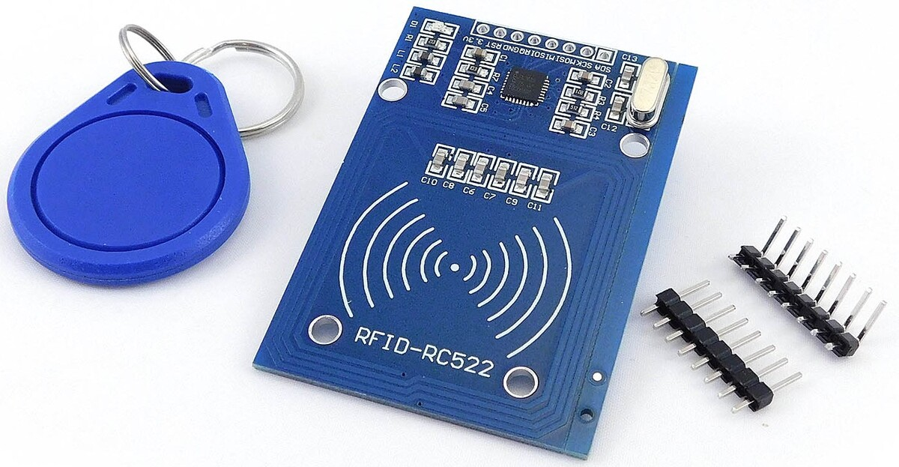

# Introduction

RFID means radio-frequency identification. RFID uses electromagnetic fields to transfer data over short distances. The RFID module 
detects the badges or magnetic cards within 10cm.

RFID or Radio Frequency Identification system consists of two main components, a transponder/tag attached to an object to be identified, and a Transceiver also known as interrogator/Reader. A Reader consists of a Radio Frequency module and an antenna which generates high frequency electromagnetic field. On the other hand, the tag is usually a passive device, meaning it doesn’t contain a battery. Instead it contains a microchip that stores and processes information, and an antenna to receive and transmit a signal.

Passing the tag near the reader, makes it possible to read the Unique Identifier (UID) of the card as well as the recorded data. One of the most commonly found low-cost RFID is the RC522.

# Connecting RC522 module to Arduino

We will connect as follows:

| RC522  | Arduino pin  |
 *             MFRC522      Arduino       Arduino   Arduino    Arduino          Arduino
 *             Reader/PCD   Uno/101       Mega      Nano v3    Leonardo/Micro   Pro Micro
 * Signal      Pin          Pin           Pin       Pin        Pin              Pin

# Specifications

- Frequency Range: 13.56 MHz ISM Band
- Host Interface: SPI / I2C / UART
- Operating Supply Voltage: 2.5 V to 3.3 V
- Max. Operating Current: 13-26mA
- Min. Current(Power down): 10µA
- Logic Inputs: 5V Tolerant
- Read Range: 5 cm
