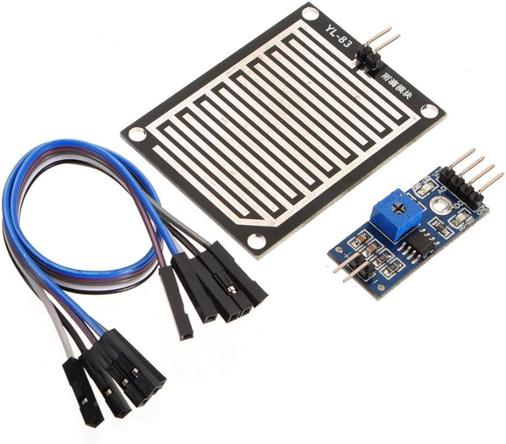
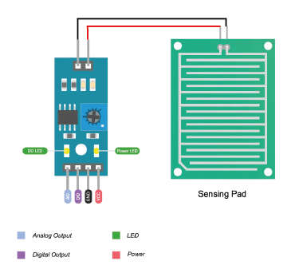

# Introduction
A rain sensor is an electronic device designed to detect the presence and intensity of rainfall. It is commonly used in various applications, such as automotive systems, irrigation control, and weather monitoring, to automate responses to changing weather conditions. By detecting rain, these sensors help to optimize water usage, enhance safety, and improve the efficiency of various systems.

# Pinout
The rain sensor is super easy to use and only has 4 pins to connect.

`AO (Analog Output)` pin gives us an analog signal between the supply value (5V) to 0V.

`DO (Digital Output)` pin gives Digital output of internal comparator circuit. You can connect it to any digital pin on an Arduino or directly to a 5V relay or similar device.

`GND` is a ground connection.

`VCC` pin supplies power for the sensor. It is recommended to power the sensor with between 3.3V – 5V. Please note that the analog output will vary depending on what voltage is provided for the sensor.

# Use cases

- **Automotive Systems:**
  - Windshield Wipers: Automatically activates windshield wipers when rain is detected, enhancing driver safety.
  - Convertible Roofs: Automatically closes convertible car roofs to prevent interior damage from rain.
- **Irrigation Systems:**
  - Water Conservation: Interrupts irrigation during rainfall to conserve water and prevent over-watering.
- **Weather Monitoring:**
  - Data Collection: Used in weather stations to collect data on rainfall patterns and intensity.
- **Home Automation:**
  - Window and Skylight Control: Automatically closes windows and skylights during rain to protect interiors.
- **Agriculture:**
  - Crop Management: Monitors rainfall to assist in irrigation planning and crop management.
- **Building Automation:**
  - HVAC Systems: Integrates with HVAC systems to control ventilation based on weather conditions.