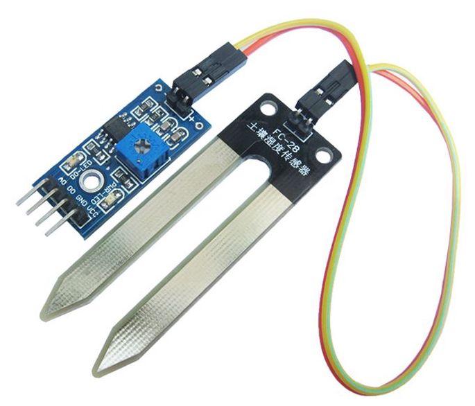
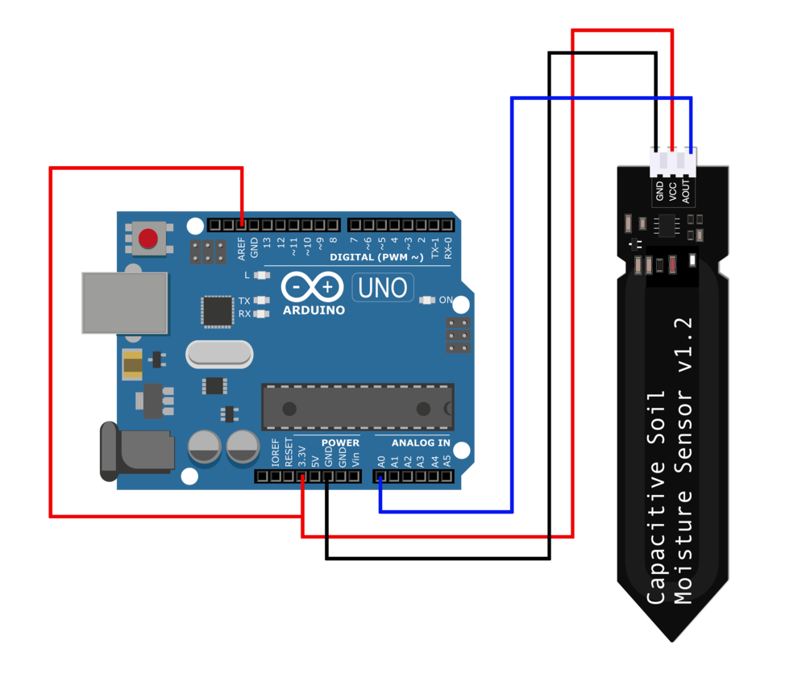

# Introduction

Soil moisture sensors measures the amount of water in the soil to maintain consistent and ideal soil conditions for plants.
They can be used to detect the moisture of soil or judge if there is water around the sensor. They can be very easy to use, 
just insert it into the soil and then read it. However, be aware that the soil-water-plant interactions are very complex and cannot simply be assessed by just a simple soil moisture measure. 





# Connecting to Arduino

There are only three pins that you need to worry about on most of these soil humidity sensors that are simple analog sensors. The common principle is to power the sensor and get the output voltage on an analog pin, e.g. A0.




# Code example

```c
/********************
 * Soil humidity sensor tester
 * Read soil humidity by measuring its resistance.
 ********************/

int sensorPin = A0;

void setup() {
  Serial.begin(38400);

}

void loop() {
  int soilHumidity = analogRead(sensorPin);
  Serial.println(soilHumidity);
  delay(100);
}
```


## Going further

Documentation for this kind sensor is available [here](http://www.mouser.com/ds/2/744/Seeed_101020008-838655.pdf).

With this kind of sensors, it is very important to have a sensor calibration procedure in order to determine the typical response of your own sensor. For users who want to go further they can also look at this very interesting Adafruit tutorial on [sensor calibration](https://learn.adafruit.com/calibrating-sensors/why-calibrate).

For the specific purpose of optimizing irrigation system, you can have a look at the [PRIMA Intel-IrriS](http://intel-irris.eu/) project which [objectives](http://intel-irris.eu/objectives) are to provide low-cost sensing yet efficient technologies for small-scale farming. To reach a high level of accuracy with low-cost sensors, the project uses advanced calibration, advanced soil-water-plant models and AI/ML technologies. See [Intel-IrriS's scientific methodology](http://intel-irris.eu/methodology) and the [project presentation](http://intel-irris.eu/wp-content/uploads/2021/12/Intel-Irris-presentation.pdf).


# Specification

- Operating Voltage: 3.3 ~ 5.5 VDC
- Output Voltage: 0 ~ 3.0VDC
- Operating Current: 5mA
- Interface: PH2.54-3P
- Dimensions mm(LxWxH): 98 x 23 x 4
- Weight (gm): 15
